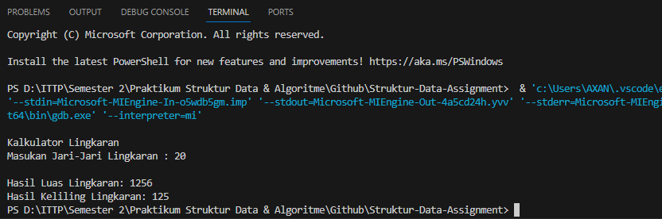
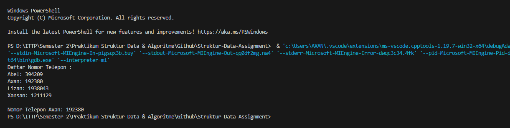
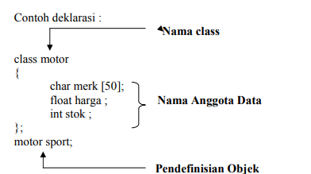
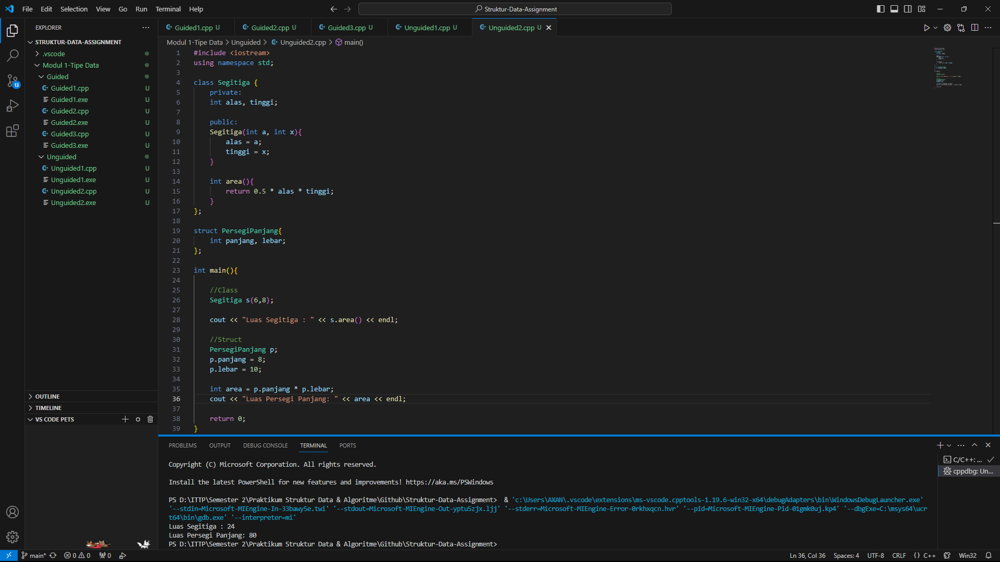

# <h1 align="center">Laporan Praktikum Modul Tipe Data</h1>
<p align="center">Axandio Biyanatul Lizan - 2311102179</p>

## Dasar Teori

Berikan penjelasan teori terkait materi modul ini dengan bahasa anda sendiri serta susunan yang terstruktur per topiknya.

## Guided 

### 1. [Tipe Data Primitif]

```C++
#include <iostream>
using namespace std;
//Tipe data primitif

int main(){
    char op;
    float num1, num2;
    
    cin >> op;
    cin >> num1 >> num2;

    switch (op)
    {
    case '+':
        cout << num1 + num2;
        break;

    case '-':
        cout << num1 - num2;
        break;
    
    case '*':
        cout << num1 * num2;
        break;

    case '/':
        cout << num1 / num2;
        break;
    
    default:
        cout << "Error! no operator";
        break;
    }

    return 0;
}
```
Kode di atas digunakan untuk mencetak hasil penjumlahan, pengurangan, perkalian, dan pembagian. Dengan memasukan operator dan number 1 & number 2. Kemudian program akan menggunakan percabangan switch case, dan percabangan tersebut ditentukan oleh operator yang dimasukan. jika kita memasuka + maka akan masuk ke case '+'

### 2. [Tipe Data Abstrak]
```C++
#include <iostream>
using namespace std;

//Tipe data abstrak

struct Mahasiswa
{
    const char *name;
    const char *address;
    int age;
};

int main (){
    struct Mahasiswa mhs1, mhs2;

    mhs1.name = "Dian";
    mhs1.address = "Mataram";
    mhs1.age = 22;
    mhs2.name = "Bambang";
    mhs2.address = "Surabaya";
    mhs2.age = 23;

    printf("## Mahasiswa 1 ##\n");
    printf("Nama : %s\n", mhs1.name);
    printf("Alamat : %s\n", mhs1.address);
    printf("Umur : %d\n", mhs1.age);
    printf("## Mahasiswa 2 ##\n");
    printf("Nama : %s\n", mhs2.name);
    printf("Alamat : %s\n", mhs2.address);
    printf("Age : %d\n", mhs2.age);

    return 0;
}
```
Kode diatas akan mencetak isi dari struct. pada kode diatas terdapat struct Mahasiswa, didalam struct tersebut terdapat 3 data variable yaitu nama, address, dan int age. kemudian pada int main mendeklarasikan struct mhs1 dan mhs2. Lalu dari mhs1 diisikan nilai dengan contoh mhs1.name diisi nilai Dian. Kemudian setelah mengisi nilai maka program akan mencetak dengan perintah printf

### 3. [Tipe Data Koleksi]
```C++
#include <iostream>
using namespace std;
int main(){
    int nilai[5];
    nilai[0] = 23;
    nilai[1] = 50;
    nilai[2] = 34;
    nilai[3] = 78;
    nilai[4] = 90;

    cout << "Isi array pertama : " << nilai[0] << endl;
    cout << "Isi array kedua : " << nilai[1] << endl;
    cout << "Isi array ketiga : " << nilai[2] << endl;
    cout << "Isi array keempat : " << nilai[3] << endl;
    cout << "Isi array kelima : " << nilai[4] << endl;

    return 0;
}
```
Kode diatas akan mencetak nilai array. Menginisialisasi variable nilai dengan ukuran 5, kemudian setiap array dari 0-4 diinisialisasi nilainya per array seperti array 0 memiliki nilai 23 dst. kemudian program mencetak array dengan menggunakan perintah cout dan memanggil variable nilai[nomor array].

## Unguided 

### 1. [Buatlah program menggunakan tipe data primitif minimal dua fungsi dan bebas. Menampilkan program, jelaskan program tersebut dan ambil kesimpulan dari materi tipe data primitif!]

```C++
#include <iostream>
using namespace std;

int HitungLuasLingkaran(int jari){
    return 3.14 * jari * jari;
}

int kelilingLingkaran(int jari){
    return 2 * 3.14 * jari;
}

int main(){
    int jari;
    cout << "\nKalkulator Lingkaran" << endl;
    cout << "Masukan Jari-Jari Lingkaran : ";
    cin >> jari;
    cout << endl;

    int luas = HitungLuasLingkaran(jari);
    int keliling = kelilingLingkaran(jari);

    cout << "Hasil Luas Lingkaran: " << luas << endl;
    cout << "Hasil Keliling Lingkaran: " << keliling << endl;

    return 0;
}
```
#### Output:


Kode di atas memunculkan sebuat output luas dan keliling lingkaran. terdapat 2 fungsi, yang pertama fungsi untuk menghitung luas lingkaran dengan menggunakan variabel jari (tipe data integer) kemudian mengembalikan nilai dengan rumus luas lingkaran, kemudian fungsi kedua untuk menghitung keliling lingkaran sistem kerjanya sama dengan fungsi pertama cuma berbeda dibagian pengembalian nilai (rumus).

Kesimpulan tipe data primitif
Tipe data primitif merupakan blok pembangun paling sederhana dari sebuah program, dalam bahasa C++ terdapat beberapa tipe data primitif seperti boolean, char, int, float, double, string dsb.

#### Full code Screenshot:


### 2. [Jelaskan fungsi dari class dan struct secara detail dan berikan contoh programnya]
```C++
#include <iostream>
using namespace std;

class Segitiga {
    private:
    int alas, tinggi;

    public:
    Segitiga(int a, int x){
        alas = a;
        tinggi = x;
    }

    int area(){
        return 0.5 * alas * tinggi;
    }
};

struct PersegiPanjang{
    int panjang, lebar;
};

int main(){

    //Class
    Segitiga s(6,8);

    cout << "Luas Segitiga : " << s.area() << endl;

    //Struct
    PersegiPanjang p;
    p.panjang = 8;
    p.lebar = 10;

    int area = p.panjang * p.lebar;
    cout << "Luas Persegi Panjang: " << area << endl;

    return 0;
}
```

#### Output


Kode di atas merupakan definisi perbedaan class dan struct. class digunakan untuk menghitung luas segitiga, dan struct digunakan untuk menghitung luas persegi panjang. Singkat nya : <br/>
- Class Segitiga : Menyimpan informasi (alas & tinggi) secara privat dan memiliki fungsi (area) untuk menghitung luas segitiga. <br/>
- Struct Persegi Panjang : Lebih simpel, seperti wadah, ia langsung menampung informasi (panjang & lebar) dan tidak memiliki fungsi bawaan. Luas persegi panjang dihitung manual di luar struct.<br/>

1. Fungsi Dari Struct <br/>
Struktur digunakan untuk mengelompokan sejumlah data yang mempunyaitipe data yang berbeda. Variabel-variabel yang membentuk sebuah struktur dinamakan elemen struktur.

2. Fungsi Dari Class <br/>
Class merupakan gambaran atau abstraksi karakter dan sifat dari suatu objek. Class juga dapat mendefinisikan ciri dan perilaku objek tersebut. <br/>
Item pada Class : <br/>
A. Public Class <br/>
Public (public) menyatakan bahwa deklarasi variabel atau item-item yang ada didalam kelas dapat diakses dari luar kelas.
B. Public Class <br/>
Private digunakan pada kelas untuk memproteksi anggota-anggota tertentunya agar tidak dapat diakses dari luar kelas secara langsung.<br/>


#### Full code Screenshot:


## Kesimpulan
Ringkasan dan interpretasi pandangan kalia dari hasil praktikum dan pembelajaran yang didapat[1].

## Referensi
[1] I. Holm, Narrator, and J. Fullerton-Smith, Producer, How to Build a Human [DVD]. London: BBC; 2002.