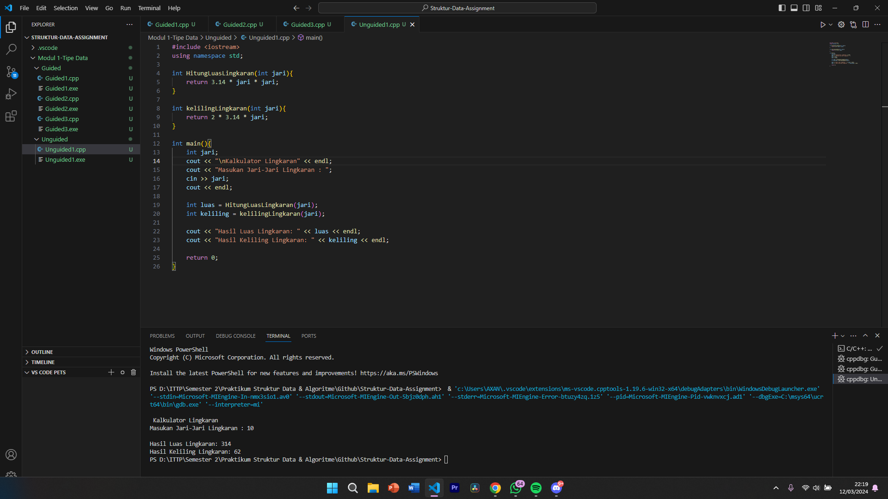

# <h1 align="center">Laporan Praktikum Modul Tipe Data</h1>
<p align="center">Axandio Biyanatul Lizan - 2311102179</p>

## Dasar Teori

Berikan penjelasan teori terkait materi modul ini dengan bahasa anda sendiri serta susunan yang terstruktur per topiknya.

## Guided 

### 1. [Tipe Data Primitif]

```C++
#include <iostream>
using namespace std;
//Tipe data primitif

int main(){
    char op;
    float num1, num2;
    
    cin >> op;
    cin >> num1 >> num2;

    switch (op)
    {
    case '+':
        cout << num1 + num2;
        break;

    case '-':
        cout << num1 - num2;
        break;
    
    case '*':
        cout << num1 * num2;
        break;

    case '/':
        cout << num1 / num2;
        break;
    
    default:
        cout << "Error! no operator";
        break;
    }

    return 0;
}
```
Kode di atas digunakan untuk mencetak hasil penjumlahan, pengurangan, perkalian, dan pembagian. Dengan memasukan operator dan number 1 & number 2. Kemudian program akan menggunakan percabangan switch case, dan percabangan tersebut ditentukan oleh operator yang dimasukan. jika kita memasuka + maka akan masuk ke case '+'

### 2. [Tipe Data Abstrak]
```C++
#include <iostream>
using namespace std;

//Tipe data abstrak

struct Mahasiswa
{
    const char *name;
    const char *address;
    int age;
};

int main (){
    struct Mahasiswa mhs1, mhs2;

    mhs1.name = "Dian";
    mhs1.address = "Mataram";
    mhs1.age = 22;
    mhs2.name = "Bambang";
    mhs2.address = "Surabaya";
    mhs2.age = 23;

    printf("## Mahasiswa 1 ##\n");
    printf("Nama : %s\n", mhs1.name);
    printf("Alamat : %s\n", mhs1.address);
    printf("Umur : %d\n", mhs1.age);
    printf("## Mahasiswa 2 ##\n");
    printf("Nama : %s\n", mhs2.name);
    printf("Alamat : %s\n", mhs2.address);
    printf("Age : %d\n", mhs2.age);

    return 0;
}
```
Kode diatas akan mencetak isi dari struct. pada kode diatas terdapat struct Mahasiswa, didalam struct tersebut terdapat 3 data variable yaitu nama, address, dan int age. kemudian pada int main mendeklarasikan struct mhs1 dan mhs2. Lalu dari mhs1 diisikan nilai dengan contoh mhs1.name diisi nilai Dian. Kemudian setelah mengisi nilai maka program akan mencetak dengan perintah printf

### 3. [Tipe Data Koleksi]
```C++
#include <iostream>
using namespace std;
int main(){
    int nilai[5];
    nilai[0] = 23;
    nilai[1] = 50;
    nilai[2] = 34;
    nilai[3] = 78;
    nilai[4] = 90;

    cout << "Isi array pertama : " << nilai[0] << endl;
    cout << "Isi array kedua : " << nilai[1] << endl;
    cout << "Isi array ketiga : " << nilai[2] << endl;
    cout << "Isi array keempat : " << nilai[3] << endl;
    cout << "Isi array kelima : " << nilai[4] << endl;

    return 0;
}
```
Kode diatas akan mencetak nilai array. Menginisialisasi variable nilai dengan ukuran 5, kemudian setiap array dari 0-4 diinisialisasi nilainya per array seperti array 0 memiliki nilai 23 dst. kemudian program mencetak array dengan menggunakan perintah cout dan memanggil variable nilai[nomor array].

## Unguided 

### 1. [Soal]

```C++
#include <iostream>
using namespace std;

int main() {
    cout << "ini adalah file code unguided praktikan" << endl;
    return 0;
}
```
#### Output:


Kode di atas digunakan untuk mencetak teks "ini adalah file code guided praktikan" ke layar menggunakan function cout untuk mengeksekusi nya.

#### Full code Screenshot:



## Kesimpulan
Ringkasan dan interpretasi pandangan kalia dari hasil praktikum dan pembelajaran yang didapat[1].

## Referensi
[1] I. Holm, Narrator, and J. Fullerton-Smith, Producer, How to Build a Human [DVD]. London: BBC; 2002.