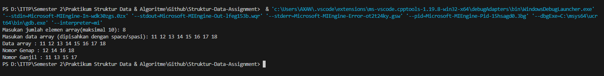

# <h1 align="center">Laporan Praktikum Modul Array</h1>
<p align="center">Axandio Biyanatul Lizan - 2311102179</p>

## Dasar Teori
Array adalah struktur data yang dapat menyimpan sejumlah nilai bertipe sama, sebagai contoh kita dapat menciptakan sebuah array yang dapat menampung 100 nilai bertipe int dan array kedua yang dapat menampung 25 nilai bertipe float. <br/>
1. Array 1 dimensi
Array Satu dimensi tidak lain adalah kumpulan elemen-elemen identik yang tersusun dalam satu baris. Elemen-elemen tersebut memiliki tipe data yang sama, tetapi isi dari elemen tersebut dapat berbeda. Petunjuk indeks hanya satu. <br/>
Bentuk Umum Array 1 Dimensi : <br/>
Tipe Data Nama_Variabel [Ukuran]<br/>
2. Array 2 dimensi : Matriks
Matriks adalah sekumpulan informasi yang setiap individu elemennya diacu dengan menggunakan dua buah indeks (yang biasanya dikonotasikan dengan baris dan kolom).<br/>
Bentuk Umum Array 2 dimensi : <br/>
Tipe Data Nama_Array[index-1] [index-2]
3. Array Multidimensi
Array multidimensi digunakan untuk mewakili array dengan dimensi lebih dari dua atau lebih, meskipun mereka memiliki kesamaan dengan array satu dimensi dan dua dimensi. Array yang memiliki lebih dari dua indeks; ini dapat berupa array tiga dimensi, empat dimensi, dll.

## Guided 

### 1. [Program Input Array Tiga Dimensi]

```C++
#include <iostream>
using namespace std;

//Array Input 3 Dimensi

int main (){
    int arr [2] [3] [3];
     for (int x = 0; x < 2; x++){
        for (int y = 0; y < 3 ; y++){
            for (int z = 0; z < 3; z++)
            {
                cout << "Input Array [" << x << "][" << y << "][" << z << "] = ";

                cin >> arr [x][y][z];
            }
            
        }
        cout << endl;
     }
     
     for (int x = 0; x < 2; x++){
        for (int y = 0; y < 3; y++){
            for (int z = 0; z < 3; z++){
                cout << "Data Array [" << x << "][" << y << "][" << z << "] = " << arr [x][y][z] << endl;
            }
        }
     }

     cout << endl;

     for (int x = 0; x < 2; x++){
        for (int y = 0; y < 3; y++){
            for (int z = 0; z < 3; z++){
                cout << arr[x][y][z] << ends;
            }
            cout << endl;
        }
        cout << endl;
     }

     return 0;
     
}
```
Kode C++ ini mendemonstrasikan cara kerja array tiga dimensi (3D) untuk menyimpan dan memproses data. Dimulai dengan deklarasi array arr yang bertipe integer dengan dimensi 2x3x3, yang berarti memiliki 2 "lapisan", 3 "baris" di setiap lapisan, dan 3 "kolom" di setiap baris. Ini menghasilkan total 18 elemen dalam array. Loop for berlapis lain digunakan untuk iterasi melalui array. Di dalam loop, informasi tentang elemen array (indeks dan nilai) dicetak dengan format yang rapi.

### 2. [Program Mencari Nilai Maksimal pada Array]
```C++
#include <iostream>
using namespace std;

int main(){
    int maks, a, i = 1, lokasi;
    cout << "Masukan Panjang Array: ";
    cin >> a;
    int array[a];
    cout << "Masukkan " << a << " angka\n";

    for (i = 0; i < a; i++){
        cout << "Array ke-" << (i) << ": ";
        cin >> array[i];
    }
    maks = array[0];

    for (i = 0; i < a; i++){
        if (array[i] > maks){
            maks = array[i];
            lokasi = i;
        }
    }

    cout << "Nilai maksimum adalah " << maks << " berada di array ke " << lokasi << endl;

    return 0;
}
```
Kode diatas mendeklarasikan 4 variable dengan tipe data integer, kemudian menggunakan loop for untuk menemukan nilai maksimum dalam array. Nilai maksimum dan lokasinya kemudian dicetak. jika nilai data array lebih besar dri maks, maka akan memperbarui nilai array dengan nilai maks.

## Unguided 

### 1. [Buatlah program untuk menampilkan Output seperti berikut dengan data yang diinputkan oleh user!]

```C++
#include <iostream>

using namespace std;

int main(){
    const int max_size = 10;
    int data [max_size];

    int jumlahElemen;
    cout << "Masukan jumlah elemen array(maksimal 10): ";
    cin >> jumlahElemen;

    if (jumlahElemen > max_size){
        cout << "Error: Jumlah elemen diluar kapasitas (maks 10)" << endl;
        return 1;
    }

    cout << "Masukan data array (dipisahkan dengan space/spasi): ";
    for (int i = 0; i < jumlahElemen; i++){
        cin >> data[i];
    }

    cout << "Data array : ";
    for (int i = 0; i < jumlahElemen; i++){
        cout << data[i] << " ";
    }
    cout << endl;

    cout << "Nomor Genap : ";
    for (int i = 0; i < jumlahElemen; i++){
        if (data[i]%2 == 0){
            cout << data[i] << " ";
        }
    }
    cout << endl;

    cout << "Nomor Ganjil : ";
    for (int i = 0; i < jumlahElemen; i++){
        if (data[i]%2 == 1){
            cout << data[i] << " ";
        }
    }
    cout << endl;

    return 0;
}
```
#### Output:


Kode diatas menggunakan maximal panjang array 10, jika lebih dari itu maka akan memuncul kan error yaitu "Error : jumlah elemen diluar kapasitas(maks 10)". Kemudian memasukan data array sesuai panjang array (bisa kurang dari panjang array). kemudian program akan mencetak data array menggunakan perulangan for, untuk mencari nilai genap program menggunakan permisalakn data pada i dibagi 2 nilainya 0 maka nilai tersebut adalah nomor genap, begitupun juga dengan ganjil data i dibagi dengan 2 menghasilkan sisa bagi 1 itu adalah nomor ganjil. Terakhir program maksimal panjang array, data array, nomor genap, dan nomor ganjil.


### 2. [Buatlah program Input array tiga dimensi (seperti pada guided) tetapi jumlah atau ukuran elemennya diinputkan oleh user!]
```C++
#include <iostream>
using namespace std;

int main (){
    int x,y,z;

    cout << "Masukan dimensi X (Array) : ";
    cin >> x;
    cout << "Masukan dimensi Y (Array) : ";
    cin >> y;
    cout << "Masukan dimensi Z (Array) : ";
    cin >> z;

    int array [x][y][z];

    for (int i = 0; i < x; i++){
        for (int j = 0; j < y; j++){
            for (int k = 0; k < z; k++){
                cout << "Masukan data Array [" << i << "][" << j << "][" << k << "]: ";
                cin >> array [i][j][k];
            }
        }
        cout << endl;
    }

    cout << "Data Array: " << endl;
    for (int i = 0; i < x; i++){
        for (int j = 0; j < y; j++){
            for (int k = 0; k < z; k++){
                cout << array [i][j][k] << " ";
            }
            cout << endl;
        }
        cout << endl;
    }

    return 0;
}
```

#### Output


Kode di atas merupakan modifikasi dari guided 1 dimana untuk dimensi x, y, z diinputkan secara manual oleh user. untuk menginputkan nilai dari masing masing variable array x, y, z menggunakan perulangan for sehingga data tersebut akan disimpan pada 'array [i][j][k]'. kemudian program akan mencetak dengan memanggil "array [i][j][k]"


### 3. [Buatlah program menu untuk mencari nilai Maksimum, Minimum dan Nilai rata – rata dari suatu array dengan input yang dimasukan oleh user!]

```C++
#include <iostream>

using namespace std;

int main (){
    int pilihan;
    int data[10];

    int jumlahElemen;
    cout << "Masukan jumlah elemen array (max 10): ";
    cin >> jumlahElemen;

    if (jumlahElemen > 10){
        cout << "Jumlah elemen diluar batas kemampuan" << endl;
        return 1;
    }

    cout << "Masukkan data array (pisahkan dengan space) : " ;
    for (int i = 0; i < jumlahElemen; i++){
        cin >> data[i];
    }

    do {
        cout << endl << "Axan Program Array : " << endl;
        cout << "1. Find Maximum Value of Array" << endl;
        cout << "2. Find Minimum Value of Array" << endl;
        cout << "3. Find Average Value of Array" << endl;
        cout << "4. Keluar" << endl;
        cout << "Pilih (1-4)! : ";
        cin >> pilihan;

        switch(pilihan) {
            case 1: {
                int max = data[0];
                for (int i = 1; i < jumlahElemen; i++){
                    if (data[i] > max){
                        max = data[i];
                    }
                }

                cout << "Nilai Maksimum : " << max << endl;
                break;
            }
            case 2 : {
                int min = data[0];
                for (int i = 1; i < jumlahElemen; i++){
                    if (data[i] < min){
                        min = data[i];
                    }
                }
                cout << "Nilai Minimum : " << min << endl;
                break;
            }

            case 3 : {
                int sum = 0;
                for (int i = 0; i < jumlahElemen; i++) {
                sum += data[i];
                }
                double average = (double)sum / jumlahElemen;
                cout << "Nilai Rata-rata: " << average << endl;
                break;
            }

            case 4 : {
                cout << "Terima kasih" << endl;
                break;
            }

            default : {
                cout << "Pilihan tidak valid!" << endl;
            }
            }
        } while (pilihan != 4);

        return 0;
    }

```
#### Output:


Kode di atas mendeklarasikan int data dengan panjang maksimal 10, alur kerja jumlah elemen seperti dengan unguided 1.  kemudian data array akan disimpan pada data[i].
1. Find Maximum Value of Array <br/>
Program mendeklarasikan data dengan indeks array ke 0 (awal), kemudian menggunakan perulangan for untuk mencari nilai maksimum, jika data[i] lebih besar dari nilai maksimum sebelumnya maka program akan memperbarui nilai dalam maks.
2. Find Minimum Value of Array <br/>
Program mendeklarasikan data dengan indeks array ke 0 (awal), kemudian menggunakan perulangan for untuk mencari nilai minimum, jika data[i] lebih kecil dari nilai minimum sebelumnya maka program akan memperbarui nilai dalam min. <br/>
3. Find Average Value of Array <br/>
Kode ini menggunakan loop for untuk menghitung total nilai elemen array dan kemudian membaginya dengan jumlah elemen untuk mendapatkan nilai rata-rata. Nilai rata-rata kemudian dicetak. <br/>


## Kesimpulan
Pada dasarnya, array adalah struktur data yang digunakan untuk menyimpan sejumlah data dalam satu tempat dan memiliki indeks untuk setiap data, sehingga mudah diproses. Selain itu, array membantu pengguna menyimpan dan mengorganisir data, dan memberikan akses mudah ke data melalui indeksnya. Array dibagi menjadi 3 jenis : <br/>
1. Array 1 dimensi, biasanya berbentuk []
2. Array 2 dimensi, memiliki 2 baris, biasanya berbentuk [][]
3. Array Multidimensi, memiliki lebih dari 2 dimensi, biasanya berbentuk [][][]

## Referensi
[1] Frieyadie, Sopian Dalis dan Pradita Cynthia Sari, Modul Praktikum Pemrograman C++ Menggunakan Borland C++. Jakarta:BSI,2014.<br/>
[2] Sindar, Anita, STRUKTUR DATA DAN ALGORITMA DENGAN C++. 1st Edisi. Serang:CV.AA.RIZKY,2018.<br/>
[3] Suprapto, Kadarisman Tejo Yuwono, Totok Sukardiyono, dan Adi Dewanto, BAHASA PEMROGRAMAN untuk Sekolah Menengah Kejuruan. Departemen Pendidikan Nasional, 2008.