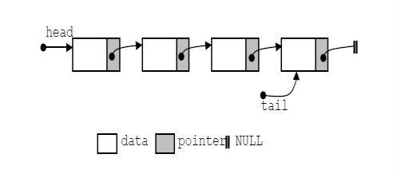
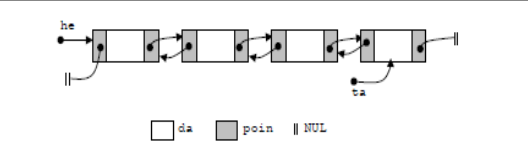
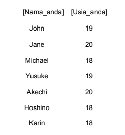
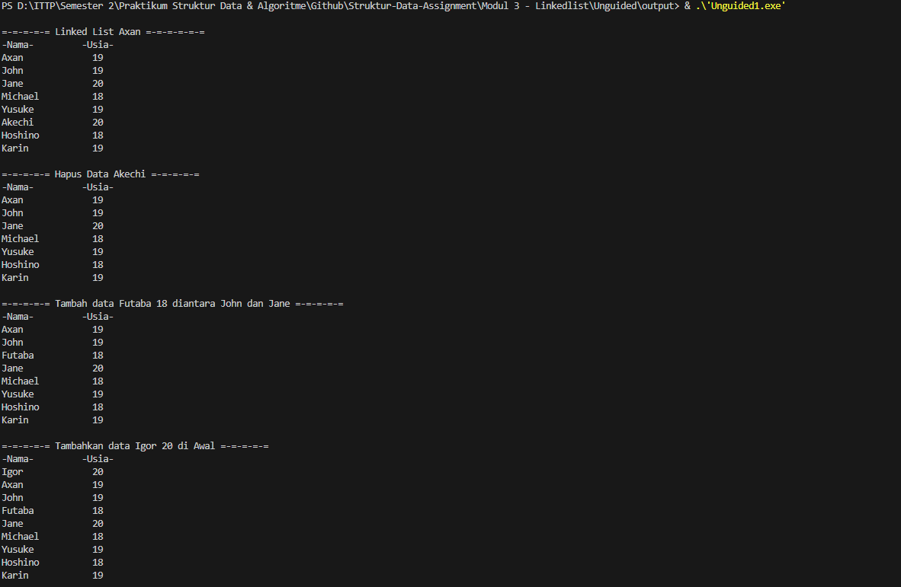
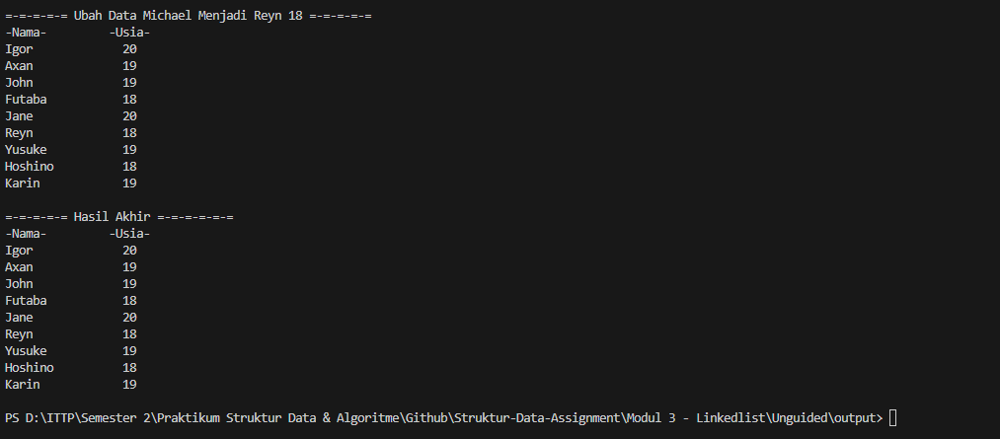
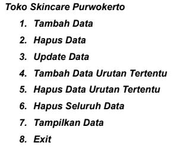
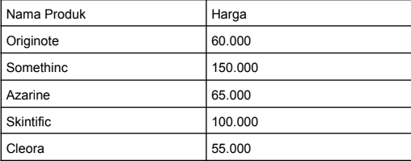

# <h1 align="center">Laporan Praktikum Modul Linked List</h1>
<p align="center">Axandio Biyanatul Lizan - 2311102179</p>

## Dasar Teori
Linked List adalah struktur data yang setiap itemnya dihubungkan satu sama lain dengan menggunakan pointer[2]. Struktur data ini mempunyai bentuk dasar dengan sifat data disisipkan ke dalam senarai melalui salah satu ujungnya[1].<br/>
1. Single Linked List <br/>
Single linked list atau biasa disebut linked list terdiri dari elemen-elemen individu, dimana masing masing dihubungkan dengan pointer tunggal. Masing-masing elemen terdiri dari dua bagian, yaitu sebuah data dan sebuah pointer yang disebut dengan pointer next. Elemen pada awal suatu list disebut head, dan elemen terakhir dari suatu list disebut tail[1]. 
 <br/>
2. Double Linked List <br/>
Elemen-elemen dihubungkan dengan dua pointer dalam satu elemen. Struktur ini menyebabkan list melintas baik ke depan maupun ke belakang. Masing-masing elemen pada double linked list terdiri dari tiga bagian, disamping data dan pointer next, masing-masing elemen dilengkapi dengan pointer prev yang menunjuk ke elemen sebelumnya. Double linked list dibentuk dengan menyusun sejumlah elemen sehingga pointer next menunjuk ke elemen yang mengikutinya dan pointer prev menunjuk ke elemen yang mendahuluinya[1]. <br/>

## Guided 

### 1. [Latihan Single Linked List]

```C++
#include <iostream>
using namespace std;

// Deklarasi Struct Node
struct Node {
    int data;
    Node *next;
};

Node *head;
Node *tail;

// Inisialisasi Node
void init() {
    head = NULL;
    tail = NULL;
}

// Pengecekan
bool isEmpty() {
    return head == NULL;
}

// Tambah Depan
void insertDepan(int nilai) {
    Node *baru = new Node;
    baru->data = nilai;
    baru->next = NULL;
    
    if (isEmpty()) {
        head = tail = baru;
    } else {
        baru->next = head;
        head = baru;
    }
}

// Tambah Belakang
void insertBelakang(int nilai) {
    Node *baru = new Node;
    baru->data = nilai;
    baru->next = NULL;
    
    if (isEmpty()) {
        head = tail = baru;
    } else {
        tail->next = baru;
        tail = baru;
    }
}

// Hitung Jumlah List
int hitungList() {
    Node *hitung = head;
    int jumlah = 0;
    
    while (hitung != NULL) {
        jumlah++;
        hitung = hitung->next;
    }
    
    return jumlah;
}

// Tambah Tengah
void insertTengah(int data, int posisi) {
    if (posisi < 1 || posisi > hitungList()) {
        cout << "Posisi diluar jangkauan" << endl;
        return;
    }

    if (posisi == 1) {
        cout << "Posisi bukan posisi tengah" << endl;
        return;
    }

    Node *baru = new Node();
    baru->data = data;
    
    Node *bantu = head;
    int nomor = 1;
    
    while (nomor < posisi - 1) {
        bantu = bantu->next;
        nomor++;
    }
    
    baru->next = bantu->next;
    bantu->next = baru;
}

// Hapus Depan
void hapusDepan() {
    if (isEmpty()) {
        cout << "List kosong!" << endl;
        return;
    }

    Node *hapus = head;
    
    if (head->next != NULL) {
        head = head->next;
    } else {
        head = tail = NULL;
    }
    
    delete hapus;
}

// Hapus Belakang
void hapusBelakang() {
    if (isEmpty()) {
        cout << "List kosong!" << endl;
        return;
    }

    Node *hapus = tail;
    Node *bantu = head;
    
    if (head != tail) {
        while (bantu->next != tail) {
            bantu = bantu->next;
        }
        tail = bantu;
        tail->next = NULL;
    } else {
        head = tail = NULL;
    }
    
    delete hapus;
}

// Hapus Tengah
void hapusTengah(int posisi) {
    if (posisi < 1 || posisi > hitungList()) {
        cout << "Posisi di luar jangkauan" << endl;
        return;
    }

    if (posisi == 1) {
        cout << "Posisi bukan posisi tengah" << endl;
        return;
    }

    Node *hapus, *bantu, *bantu2;
    int nomor = 1;
    
    bantu = head;
    
    while (nomor <= posisi) {
        if (nomor == posisi - 1) {
            bantu2 = bantu;
        }
        if (nomor == posisi) {
            hapus = bantu;
        }
        bantu = bantu->next;
        nomor++;
    }
    
    bantu2->next = bantu;
    delete hapus;
}

// Ubah Depan
void ubahDepan(int data) {
    if (isEmpty()) {
        cout << "List masih kosong!" << endl;
        return;
    }
    
    head->data = data;
}

// Ubah Tengah
void ubahTengah(int data, int posisi) {
    if (isEmpty()) {
        cout << "List masih kosong!" << endl;
        return;
    }

    if (posisi < 1 || posisi > hitungList()) {
        cout << "Posisi di luar jangkauan" << endl;
        return;
    }

    if (posisi == 1) {
        cout << "Posisi bukan posisi tengah" << endl;
        return;
    }

    Node *bantu = head;
    int nomor = 1;

    while (nomor < posisi) {
        bantu = bantu->next;
        nomor++;
    }
    
    bantu->data = data;
}

// Ubah Belakang
void ubahBelakang(int data) {
    if (isEmpty()) {
        cout << "List masih kosong!" << endl;
        return;
    }

    tail->data = data;
}

// Hapus List
void clearList() {
    Node *bantu, *hapus;
    bantu = head;
    
    while (bantu != NULL) {
        hapus = bantu;
        bantu = bantu->next;
        delete hapus;
    }
    
    head = tail = NULL;
    cout << "List berhasil terhapus!" << endl;
}

// Tampilkan List
void tampil() {
    Node *bantu = head;
    
    if (isEmpty()) {
        cout << "List masih kosong!" << endl;
        return;
    }

    while (bantu != NULL) {
        cout << bantu->data << " ";
        bantu = bantu->next;
    }
    
    cout << endl;
}

int main() {
    init();
    
    insertDepan(3); tampil();
    insertBelakang(5); tampil();
    insertDepan(2); tampil();
    insertDepan(1); tampil();
    hapusDepan(); tampil();
    hapusBelakang(); tampil();
    insertTengah(7, 2); tampil();
    hapusTengah(2); tampil();
    ubahDepan(1); tampil();
    ubahBelakang(8); tampil();
    ubahTengah(11, 2); tampil();

    return 0;
}
```
Kode C++ diatas merepresentasikan cara kerja dari single linked list. Terdapat beberapa prosedur yang menjelaskan mengenai Insert (menambahkan), Hapus, Ubah data pada linked list, tampil, init, function hitungList. Sebagai gambaran saya jelaskan cara kerja 2 prosedur dan 1 fungsi yaitu function hitung list, insert depan, dan juga hapus depan:  <br/>
a. Fungsi HitungList <br/>
Pertama, sebuah pointer hitung diinisialisasi dengan head, yang merupakan pointer ke node pertama dari linked list. Kemudian, variabel jumlah diinisialisasi dengan nilai 0 untuk menyimpan jumlah elemen. Kemudian program melakukan looping while dengan kondisi hitung != NULL dan pada jumlah akan bertambah 1 dan pointer hitung akan maju ke node berikutnya. Looping ini akan berhenti jika pointer hitung mencapai NULL. <br/>
b. Prosedur insertDepan <br/>
Pertama void insertDepan menggunakan paramater int data, kemudian membuat node baru dengan nilai 'data'. Program mengecek apakah linked list kosong menggunakan fungsi if isEmpty(). Jika kosong maka 'head' 'tail' diarahkan ke baru. jika isi maka 'baru' dihubungkan ke head, dan head diperbarui menjadi baru. <br/>
c. Prosedur hapusDepan <br/>
Fungsi pertama kali adalah mengecek apakah linked list kosong atau tidak, jika linked list kosong maka akan memunculkan pesan "List Kosong!" dan fungsi if berhenti. Jika tidak, pointer 'hapus' akan menginisialisasi head, kemudian head dipindahkan ke node berikutnya. Selanjutnya node yang telah dihapus 'hapus' dialokasikan dari memori 'delete'.<br/>


### 2. [Latihan Double Linked List]
```C++
#include <iostream>

using namespace std;

class Node {
public:
    int data;
    Node* prev;
    Node* next;

    Node(int data) {
        this->data = data;
        prev = nullptr;
        next = nullptr;
    }
};

class DoublyLinkedList {
public:
    Node* head;
    Node* tail;

    DoublyLinkedList() {
        head = nullptr;
        tail = nullptr;
    }

    void push(int data) {
        Node* newNode = new Node(data);
        if (head == nullptr) {
            head = tail = newNode;
        } else {
            newNode->next = head;
            head->prev = newNode;
            head = newNode;
        }
    }

    bool pop() {
        if (head == nullptr) {
            return false;
        }

        Node* temp = head;
        head = head->next;
        if (head != nullptr) {
            head->prev = nullptr;
        } else {
            tail = nullptr;
        }
        delete temp;
        return true;
    }

    bool update(int oldData, int newData) {
        Node* current = head;
        while (current != nullptr) {
            if (current->data == oldData) {
                current->data = newData;
                return true;
            }
            current = current->next;
        }
        return false;
    }

    void deleteAll() {
        Node* current = head;
        while (current != nullptr) {
            Node* temp = current;
            current = current->next;
            delete temp;
        }
        head = nullptr;
        tail = nullptr;
    }

    void display() {
        Node* current = head;
        while (current != nullptr) {
            cout << current->data << " ";
            current = current->next;
        }
        cout << endl;
    }
};

int main() {
    DoublyLinkedList list;

    while (true) {
        cout << "1. Add data" << endl;
        cout << "2. Delete data" << endl;
        cout << "3. Update data" << endl;
        cout << "4. Clear data" << endl;
        cout << "5. Display data" << endl;
        cout << "6. Exit" << endl;

        int choice;
        cout << "Enter your choice: ";
        cin >> choice;

        switch (choice) {
            case 1: {
                int data;
                cout << "Enter data to add: ";
                cin >> data;
                list.push(data);
                break;
            }
            case 2: {
                list.pop();
                break;
            }
            case 3: {
                int oldData, newData;
                cout << "Enter old data: ";
                cin >> oldData;
                cout << "Enter new data: ";
                cin >> newData;
                bool updated = list.update(oldData, newData);
                if (!updated) {
                    cout << "Data not found" << endl;
                }
                break;
            }
            case 4: {
                list.deleteAll();
                break;
            }
            case 5: {
                list.display();
                break;
            }
            case 6: {
                return 0;
            }
            default: {
                cout << "Invalid choice" << endl;
                break;
            }
        }
    }

    return 0;
}
```
Pertama terdapat class 'node' yang digunakan untuk merepresentasikan sebuah node DoublyLinkedList. data pada class node digunakan untuk menyimpan data dari node, prev bertipe pointer Node* digunakan untuk menunjukkan ke node sebelumnya pada linkedlist. sedangkan next bertipe pointer Node* digunakan untuk menunjukkan ke node selanjutnya pada linked List. <br/>

Class DoublyLinkedList() diinisialisasi dengan mengatur head dan tail ke nullptr, menandakan bahwa linked list awalnya kosong. Procedure push(int data) digunakan untuk menambahkan node baru di awal linked list. Jika linked list kosong, head dan tail diatur ke node baru tersebut. Jika tidak, node baru tersebut dihubungkan ke head dan head diperbarui. function bool pop() menghapus node dari awal linked list. Jika linked list kosong, metode ini mengembalikan false. Jika tidak, node pertama dihapus, head diperbarui, dan pointer prev dari node baru head diatur ke nullptr. Function bool updateupdate(int oldData, int newData) memperbarui nilai data dari node dengan nilai oldData menjadi newData. Jika node dengan nilai oldData ditemukan dan diperbarui, metode mengembalikan true. Jika tidak ditemukan, metode mengembalikan false. Procedure deleteAll() menghapus semua node dari linked list dan membebaskan memori yang dialokasikan untuk setiap node. Setelah itu, head dan tail diatur kembali ke nullptr. Procedure display() digunakan untuk menampilkan semua nilai data dalam linked list, mulai dari head sampai tail. <br/>

pada Int main terdapat switch case untuk menampilkan menu (add, delete, update, display, clear data) dan juga terdapat looping/perulangan while (true) sehingga program akan berjalan terus menerus kecuali user exit dari program. <br/>

## Unguided 

### 1. Buatlah program menu Single Linked List Non-Circular untuk menyimpan Nama dan usia mahasiswa, dengan menggunakan inputan dari user. Lakukan operasi berikut:<br/> a. Masukkan data sesuai urutan berikut. (Gunakan insert depan, belakang atau tengah). Data Pertama yang dimasukkan adalah nama dan usia anda. <br/> b. Hapus data Akechi <br/> c. Tambahkan data berikut diantara John dan Jane : Futaba 18 <br/> d. Tambahkan data berikut diawal : Igor 20 <br/> e. Ubah data Michael menjadi : Reyn 18 <br/> f. Tampilkan seluruh data <br/> Tampilan poin A : <br/> 

```C++
/*
By Axandio Biyanatul Lizan - 2311102179
*/

#include <iostream>
#include <string>
#include <iomanip>
using namespace std;

struct Node {
    string nama;
    int usia;
    Node* next;
};

class LinkedList {
public:
    Node* head;

    LinkedList() {
        head = nullptr;
    }

    void insertDepan(string nama, int usia) {
        Node* newNode = new Node;
        newNode->nama = nama;
        newNode->usia = usia;
        newNode->next = head;
        head = newNode;
    }

    void insertBelakang(string nama, int usia) {
        Node* newNode = new Node;
        newNode->nama = nama;
        newNode->usia = usia;
        newNode->next = nullptr;
        if (head == nullptr) {
            head = newNode;
            return;
        }
        Node* current = head;
        while (current->next != nullptr) {
            current = current->next;
        }
        current->next = newNode;
    }

    void insertTengah(string nama, int usia, string namaSebelum) {
        Node* newNode = new Node;
        newNode->nama = nama;
        newNode->usia = usia;
        Node* current = head;
        while (current != nullptr && current->nama != namaSebelum) {
            current = current->next;
        }
        if (current == nullptr) {
            cout << "Data " << namaSebelum << " tidak ditemukan." << endl;
            return;
        }
        newNode->next = current->next;
        current->next = newNode;
    }

    void hapus(string nama) {
        if (head == nullptr) {
            cout << "List kosong!" << endl;
            return;
        }
        if (head->nama == nama) {
            Node* temp = head;
            head = head->next;
            delete temp;
            return;
        }
        Node* current = head;
        while (current->next != nullptr && current->next->nama != nama) {
            current = current->next;
        }
        if (current->next == nullptr) {
            cout << "Data " << nama << " tidak ditemukan." << endl;
            return;
        }
        Node* temp = current->next;
        current->next = current->next->next;
        delete temp;
    }

    void update(string oldNama, string newNama) {
        Node* current = head;
        while (current != nullptr) {
            if (current->nama == oldNama) {
                current->nama = newNama;
                return;
            }
            current = current->next;
        }
        cout << "Data " << oldNama << " tidak ditemukan." << endl;
    }

    bool isEmpty() {
        return head == nullptr; // Check if head pointer is null (empty list)
    }

    void display() {
        Node* bantu = head;

        cout << left << setw(15) << "-Nama-" << right << setw(4) << "-Usia-" << endl; // Supaya rapi

        if (!isEmpty()) { // Use isEmpty function
            while (bantu != NULL) {
            cout << left << setw(15) << bantu->nama << right << setw(4) << bantu->usia << endl; // Supaya lurus di output
            bantu = bantu->next;
            }
            cout << endl;
        } else {
            cout << "ITS EMPTY!" << endl;
        }
    }

};

int main() {
    LinkedList list;

    // a. Insert data
    cout << "\n=-=-=-=-= Linked List Axan =-=-=-=-=-=" << endl;
    list.insertDepan("Karin", 19);
    list.insertDepan("Hoshino", 18);
    list.insertDepan("Akechi", 20);
    list.insertDepan("Yusuke", 19);
    list.insertDepan("Michael", 18);
    list.insertDepan("Jane", 20);
    list.insertDepan("John", 19);
    list.insertDepan("Axan", 19);
    list.display();

    // b. Hapus data Akechi
    cout << "=-=-=-=-= Hapus Data Akechi =-=-=-=-=" << endl;
    list.hapus("Akechi");
    list.display();

    // c. Tambahkan data Futaba 18 di antara John dan Jane
    cout << "=-=-=-=-= Tambah data Futaba 18 diantara John dan Jane =-=-=-=-=" << endl;
    list.insertTengah("Futaba", 18, "John");
    list.display();

    // d. Tambahkan data Igor 20 di awal
    cout << "=-=-=-=-= Tambahkan data Igor 20 di Awal =-=-=-=-=" << endl;
    list.insertDepan("Igor", 20);
    list.display();

    // e. Ubah data Michael menjadi Reyn 18
    cout << "=-=-=-=-= Ubah Data Michael Menjadi Reyn 18 =-=-=-=-=" << endl;
    list.update("Michael", "Reyn");
    list.display();

    // f. Tampilkan seluruh data (Hasil Akhir)
    cout << "=-=-=-=-= Hasil Akhir =-=-=-=-=-=" << endl;
    list.display();

    return 0;
}

```
#### Output:



Kode diatas mendeklarasikan struct node dengan 3 tipe data yaitu string nama, int usia, dan pointer Node 'next'. kemudian terdapat class bernama linkedlist  dengan atribut public 'head' dengan definisi sebagai berikut : <br/>
- LinkedList() digunakan untuk menginisialisasi 'head' dengan 'nullptr', menandakan bahwa linked list awalnya kosong. <br/>
- void insertDepan(string nama, int usia) digunakan untuk menyisipkan data baru di awal linked list. Metode ini membuat node baru, mengisi data nama dan usia ke dalam node tersebut, dan kemudian mengatur 'next' node baru ke 'head'. 'head' kemudian diperbarui dengan node baru tersebut. <br/>
- insertBelakang(string nama, int usia) digunakan untuk menyisipkan data baru di akhir linked list. Metode ini melakukan iterasi melalui linked list hingga menemukan node terakhir, lalu menyisipkan node baru setelah node terakhir tersebut. <br/>
- insertTengah(string nama, int usia, string namaSebelum) digunakan untuk menyisipkan data baru setelah node dengan nama tertentu. Metode ini mencari node dengan nama yang diberikan, jika ditemukan, node baru akan disisipkan setelah node tersebut. <br/>
- hapus(string nama) digunakan untuk menghapus node dengan nama tertentu dari linked list. Metode ini mencari node dengan nama yang diberikan dan menghapusnya dari linked list. <br/>
- update(string oldNama, string newNama) digunakan untuk mengubah nama dari node dengan nama tertentu. Metode ini mencari node dengan nama yang diberikan dan menggantinya dengan nama baru. <br/>
- isEmpty() merupakan fungsi bantu yang mengembalikan 'true' jika linked list kosong (yaitu 'head' adalah 'nullptr') dan 'false' jika sebaliknya. <br/>
- display() digunakan untuk menampilkan seluruh data dalam linked list. Metode ini mencetak nama dan usia setiap node dalam format yang rapi ke layar. Jika linked list kosong, akan dicetak pesan "IS EMPTY!". <br/> <br/>
Kemudian pada int main, diawali dengan inisialisasi linked list dengan 'LinkedList List;'. Pertama program memasukan data kemudian menampilkan seluruh data, Kedua program menghapus data Akechi menggunakan 'list.hapus("Akechi");', Ketiga Program menambahkan data baru yaitu futaba diantara john dan jane dengan cara 'list.insertTengah("Futaba", 18, "John");' yang dapat diartikan sebagai menambahkan elemen baru dengan nama Futaba berusia 18 tahun setelah John, Keempat program menambahkan data baru igor 20 dengan cara 'list.insertDepan("Igor", 20);', Kelima Mengubah data michael menjadi reyn 18 dengan cara hanya mengubah nama michael menjadi ryan 'list.update("Michael", "Reyn");', Keenam program menampilkan seluruh hasil akhir.

### 2. Modifikasi Guided Double Linked List dilakukan dengan penambahan operasi untuk menambah data, menghapus, dan update di tengah / di urutan tertentu yang diminta. Selain itu, buatlah agar tampilannya menampilkan Nama produk dan harga. <br/> Case : <br/> 1. Tambahkan produk Azarine dengan harga 65000 diantara Somethinc dan Skintific <br/> 2. Hapus produk Wardah <br/> 3. Update produk Hanasui menjadi Cleora dengan harga 55.000 <br> 4. Tampilkan menu seperti dibawah ini <br/>
 <br/>

```C++
#include <iostream>
using namespace std;

int main (){
    int x,y,z;

    cout << "Masukan dimensi X (Array) : ";
    cin >> x;
    cout << "Masukan dimensi Y (Array) : ";
    cin >> y;
    cout << "Masukan dimensi Z (Array) : ";
    cin >> z;

    int array [x][y][z];

    for (int i = 0; i < x; i++){
        for (int j = 0; j < y; j++){
            for (int k = 0; k < z; k++){
                cout << "Masukan data Array [" << i << "][" << j << "][" << k << "]: ";
                cin >> array [i][j][k];
            }
        }
        cout << endl;
    }

    cout << "Data Array: " << endl;
    for (int i = 0; i < x; i++){
        for (int j = 0; j < y; j++){
            for (int k = 0; k < z; k++){
                cout << array [i][j][k] << " ";
            }
            cout << endl;
        }
        cout << endl;
    }

    return 0;
}
```

#### Output


Kode di atas merupakan modifikasi dari guided 1 dimana untuk dimensi x, y, z diinputkan secara manual oleh user. untuk menginputkan nilai dari masing masing variable array x, y, z menggunakan perulangan for sehingga data tersebut akan disimpan pada 'array [i][j][k]'. kemudian program akan mencetak dengan memanggil "array [i][j][k]"

## Kesimpulan
Pada dasarnya, array adalah struktur data yang digunakan untuk menyimpan sejumlah data dalam satu tempat dan memiliki indeks untuk setiap data, sehingga mudah diproses. Selain itu, array membantu pengguna menyimpan dan mengorganisir data, dan memberikan akses mudah ke data melalui indeksnya. Array dibagi menjadi 3 jenis : <br/>
1. Array 1 dimensi, biasanya berbentuk []
2. Array 2 dimensi, memiliki 2 baris, biasanya berbentuk [][]
3. Array Multidimensi, memiliki lebih dari 2 dimensi, biasanya berbentuk [][][]

## Referensi
[1] Sindar, A, STRUKTUR DATA DAN ALGORITMA DENGAN C++. 1st Edisi. Serang:CV.AA.RIZKY,2018.<br/>
[2] Sanjaya, D, Asyiknya Belajar Struktur Data di Planet C++. 1st Edition. Jakarta:PT Gramedia, Jakarta,2005.