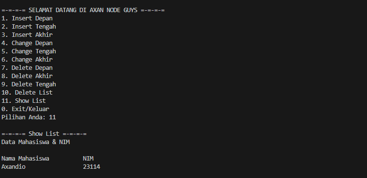

# <h1 align="center">Laporan Praktikum Modul Linked List Circular dan Non Circular</h1>
<p align="center">Axandio Biyanatul Lizan - 2311102179</p>

## Dasar Teori
Linked List adalah struktur data yang setiap itemnya dihubungkan satu sama lain dengan menggunakan pointer[2]. Struktur data ini mempunyai bentuk dasar dengan sifat data disisipkan ke dalam senarai melalui salah satu ujungnya[1].<br/>
1. Single Linked List <br/>
Single linked list atau biasa disebut linked list terdiri dari elemen-elemen individu, dimana masing masing dihubungkan dengan pointer tunggal. Masing-masing elemen terdiri dari dua bagian, yaitu sebuah data dan sebuah pointer yang disebut dengan pointer next. Elemen pada awal suatu list disebut head, dan elemen terakhir dari suatu list disebut tail[1]. 
 <br/>
2. Double Linked List <br/>
Elemen-elemen dihubungkan dengan dua pointer dalam satu elemen. Struktur ini menyebabkan list melintas baik ke depan maupun ke belakang. Masing-masing elemen pada double linked list terdiri dari tiga bagian, disamping data dan pointer next, masing-masing elemen dilengkapi dengan pointer prev yang menunjuk ke elemen sebelumnya. Double linked list dibentuk dengan menyusun sejumlah elemen sehingga pointer next menunjuk ke elemen yang mengikutinya dan pointer prev menunjuk ke elemen yang mendahuluinya[1]. <br/>
<br/>
3. Circular List <br/>
Circular list adalah bentuk lain dari linked list yang memberikan fleksibilitas dalam melewatkan elemen. Circular list bisa berupa single linked list atau double linked list, tetapi tidak mempunyai tail. Pada circular list, pointer next dari elemen terakhir menunjuk ke elemen pertama dan bukan menunjuk NULL[1].<br/>

4. Linked List Non Circular <br/>
Linked list non circular merupakan linked list dengan node pertama (head) dan node terakhir (tail) yang tidak saling terhubung. Pointer terakhir (tail) pada Linked List ini selalu bernilai ‘NULL’ sebagai pertanda data terakhir dalam list-nya. Linked list non circular dapat digambarkan sebagai berikut.<br/>
<br/>

## Guided 

### 1. [Linked List Non Circular]

```C++
/*
Axandio Biyanatul Lizan - 2311102179
*/
#include <iostream>
using namespace std;

// Deklarasi Struct Node
struct Node
{
    int data;
    Node *next;
};

Node *head; // Deklarasi head
Node *tail; // Deklarasi tail

// Inisialisasi Node
void init()
{
    head = NULL;
    tail = NULL;
}

// Pengecekan
bool isEmpty()
{
    return head == NULL;
}

// Tambah Depan
void insertDepan(int nilai)
{
    Node *baru = new Node;
    baru->data = nilai;
    baru->next = NULL;

    if (isEmpty())
    {
        head = tail = baru;
    }
    else
    {
        baru->next = head;
        head = baru;
    }
}

// Tambah Belakang
void insertBelakang(int nilai)
{
    Node *baru = new Node;
    baru->data = nilai;
    baru->next = NULL;

    if (isEmpty())
    {
        head = tail = baru;
    }
    else
    {
        tail->next = baru;
        tail = baru;
    }
}

// Hitung Jumlah List
int hitungList()
{
    Node *hitung = head;
    int jumlah = 0;
    while (hitung != NULL)
    {
        jumlah++;
        hitung = hitung->next;
    }
    return jumlah;
}

// Tambah Tengah
void insertTengah(int data, int posisi)
{
    if (posisi < 1 || posisi > hitungList())
    {
        cout << "Posisi diluar jangkauan" << endl;
    }
    else if (posisi == 1)
    {
        cout << "Posisi bukan posisi tengah" << endl;
    }
    else
    {
        Node *baru = new Node();
        baru->data = data;
        Node *bantu = head;
        int nomor = 1;
        while (nomor < posisi - 1)
        {
            bantu = bantu->next;
            nomor++;
        }
        baru->next = bantu->next;
        bantu->next = baru;
    }
}

// Hapus Depan
void hapusDepan()
{
    if (isEmpty())
    {
        cout << "List kosong!" << endl;
        return;
    }

    Node *hapus = head;
    if (head->next != NULL)
    {
        head = head->next;
    }
    else
    {
        head = tail = NULL;
    }
    delete hapus;
}

// Hapus Belakang
void hapusBelakang()
{
    if (isEmpty())
    {
        cout << "List kosong!" << endl;
        return;
    }

    Node *hapus = tail;
    if (head != tail)
    {
        Node *bantu = head;
        while (bantu->next != tail)
        {
            bantu = bantu->next;
        }
        tail = bantu;
        tail->next = NULL;
    }
    else
    {
        head = tail = NULL;
    }
    delete hapus;
}

// Hapus Tengah
void hapusTengah(int posisi)
{
    if (posisi < 1 || posisi > hitungList())
    {
        cout << "Posisi di luar jangkauan" << endl;
        return;
    }
    else if (posisi == 1)
    {
        cout << "Posisi bukan posisi tengah" << endl;
        return;
    }

    Node *bantu = head;
    Node *hapus = NULL;
    Node *sebelum = NULL;
    int nomor = 1;
    while (nomor <= posisi)
    {
        if (nomor == posisi - 1)
        {
            sebelum = bantu;
        }
        if (nomor == posisi)
        {
            hapus = bantu;
        }
        bantu = bantu->next;
        nomor++;
    }
    sebelum->next = bantu;
    delete hapus;
}

// Ubah Depan
void ubahDepan(int data)
{
    if (isEmpty())
    {
        cout << "List masih kosong!" << endl;
        return;
    }
    head->data = data;
}

// Ubah Tengah
void ubahTengah(int data, int posisi)
{
    if (isEmpty())
    {
        cout << "List masih kosong!" << endl;
        return;
    }
    if (posisi < 1 || posisi > hitungList())
    {
        cout << "Posisi di luar jangkauan" << endl;
        return;
    }
    else if (posisi == 1)
    {
        cout << "Posisi bukan posisi tengah" << endl;
        return;
    }

    Node *bantu = head;
    int nomor = 1;
    while (nomor < posisi)
    {
        bantu = bantu->next;
        nomor++;
    }
    bantu->data = data;
}

// Ubah Belakang
void ubahBelakang(int data)
{
    if (isEmpty())
    {
        cout << "List masih kosong!" << endl;
        return;
    }
    tail->data = data;
}

// Hapus List
void clearList()
{
    Node *bantu = head;
    while (bantu != NULL)
    {
        Node *hapus = bantu;
        bantu = bantu->next;
        delete hapus;
    }
    head = tail = NULL;
    cout << "List berhasil terhapus!" << endl;
}

// Tampilkan List
void tampil()
{
    Node *bantu = head;
    if (isEmpty())
    {
        cout << "List masih kosong!" << endl;
        return;
    }

    while (bantu != NULL)
    {
        cout << bantu->data << " ";
        bantu = bantu->next;
    }
    cout << endl;
}

int main()
{
    init();
    insertDepan(3);
    tampil();
    insertBelakang(5);
    tampil();
    insertDepan(2);
    tampil();
    insertDepan(1);
    tampil();
    hapusDepan();
    tampil();
    hapusBelakang();
    tampil();
    insertTengah(7, 2);
    tampil();
    hapusTengah(2);
    tampil();
    ubahDepan(1);
    tampil();
    ubahBelakang(8);
    tampil();
    ubahTengah(11, 2);
    tampil();

    return 0;
}
```
Kode C++ diatas merepresentasikan cara kerja dari Linked List non Circular. Pertama menggunakan Struct Node digunakan untuk merepresentasikan setiap elemen dalam linked list. Setiap node memiliki dua atribut: data untuk menyimpan nilai dan next untuk menunjukkan node selanjutnya dalam linked list. Kemudian ada inisialisasi variabel global Node head dan tail. kemudian ada prosedur init yang berisikan head dan tail (NULL) menandakan linked list kosong. Fungsi isEmpty() mengembalikan true jika linked list kosong dan false jika tidak. Kemudian ada beberapa prosedur untuk mengedit, menambah, dan menghapus node : <br/>
- Prosedur insertDepan() digunakan untuk menambahkan node baru di awal linked list.<br/>
- Prosedur insertBelakang() digunakan untuk menambahkan node baru di akhir linked list. <br/>
- Fungsi hitungList() digunakan untuk menghitung jumlah node dalam linked list. (fungsi ini jarang dipake) <br/>
- Prosedur insertTengah() digunakan untuk menambahkan node baru pada posisi tertentu dalam linked list. <br/>
- Prosedur hapusDepan() digunakan untuk menghapus node pertama dalam linked list.<br/>
- Prosedur hapusBelakang() digunakan untuk menghapus node terakhir dalam linked list. <br/>
- Prosedur hapusTengah() digunakan untuk menghapus node pada posisi tertentu dalam linked list. <br/>
- Beberapa Prosedur ubahDepan(), ubahTengah(), dan ubahBelakang() digunakan untuk mengubah nilai dari node pada posisi tertentu dalam linked list. <br/>
- Prosedur clearList() digunakan untuk menghapus seluruh node dalam linked list. <br/>
- Prosedur tampil() digunakan untuk menampilkan linked list. <br/> <br/>
Kemudian pada int main tinggal memanggil prosedur yang sudah dideklarasikan sebelumnya.<br/>

### 2. [Linked List Circular]
```C++
/*
Axandio Biyanatul Lizan - 2311102179
*/

#include <iostream>
using namespace std;

// Deklarasi Struct Node
struct Node
{
    string data;
    Node *next;
};

Node *head, *tail, *baru, *bantu, *hapus;

void init()
{
    head = NULL;
    tail = head;,,
}

// Pengecekan
int isEmpty()
{
    if (head == NULL)
        return 1; // true
    else
        return 0; // false
}

// Buat Node Baru
void buatNode(string data)
{
    baru = new Node;
    baru->data = data;
    baru->next = NULL;
}

// Hitung List
int hitungList()
{
    bantu = head;
    int jumlah = 0;
    while (bantu != NULL)
    {
        jumlah++;
        bantu = bantu->next;
    }
    return jumlah;
}

// Tambah Depan
void insertDepan(string data)
{
    // Buat Node baru
    buatNode(data);
    if (isEmpty() == 1)
    {
        head = baru;
        tail = head;
        baru->next = head;
    }
    else
    {
        while (tail->next != head)
        {
            tail = tail->next;
        }
        baru->next = head;
        head = baru;
        tail->next = head;
    }
}

// Tambah Belakang
void insertBelakang(string data)
{
    // Buat Node baru
    buatNode(data);
    if (isEmpty() == 1)
    {
        head = baru;
        tail = head;
        baru->next = head;
    }
    else
    {
        while (tail->next != head)
        {
            tail = tail->next;
        }
        tail->next = baru;
        baru->next = head;
    }
}

// Tambah Tengah
void insertTengah(string data, int posisi)
{
    if (isEmpty() == 1)
    {
        head = baru;
        tail = head;
        baru->next = head;
    }
    else
    {
        baru->data = data;
        // transversing
        int nomor = 1;
        bantu = head;
        while (nomor < posisi - 1)
        {
            bantu = bantu->next;
            nomor++;
        }
        baru->next = bantu->next;
        bantu->next = baru;
    }
}

// Hapus Depan
void hapusDepan()
{
    if (isEmpty() == 0)
    {
        hapus = head;
        tail = head;
        if (hapus->next == head)
        {
            head = NULL;
            tail = NULL;

            delete hapus;
        }
        else
        {
            while (tail->next != hapus)
            {
                tail = tail->next;
            }
            head = head->next;
            tail->next = head;
            hapus->next = NULL;
            delete hapus;
        }
    }
    else
    {
        cout << "List masih kosong!" << endl;
    }
}

// Hapus Belakang
void hapusBelakang()
{
    if (isEmpty() == 0)
    {
        hapus = head;
        tail = head;
        if (hapus->next == head)
        {
            head = NULL;
            tail = NULL;

            delete hapus;
        }
        else
        {
            while (hapus->next != head)
            {
                hapus = hapus->next;
            }
            while (tail->next != hapus)
            {
                tail = tail->next;
            }
            tail->next = head;
            hapus->next = NULL;
            delete hapus;
        }
    }
    else
    {
        cout << "List masih kosong!" << endl;
    }
}

// Hapus Tengah
void hapusTengah(int posisi)
{
    if (isEmpty() == 0)
    {
        // transversing
        int nomor = 1;
        bantu = head;
        while (nomor < posisi - 1)
        {
            bantu = bantu->next;
            nomor++;
        }
        hapus = bantu->next;
        bantu->next = hapus->next;
        delete hapus;
    }
    else
    {
        cout << "List masih kosong!" << endl;
    }
}

// Hapus List
void clearList()
{
    if (head != NULL)
    {
        hapus = head->next;
        while (hapus != head)
        {
            bantu = hapus->next;
            delete hapus;
            hapus = bantu;
        }
        delete head;
        head = NULL;
    }
    cout << "List berhasil terhapus!" << endl;
}

// Tampilkan List
void tampil()
{
    if (isEmpty() == 0)
    {
        tail = head;
        do
        {
            cout << tail->data << " ";
            tail = tail->next;
        } while (tail != head);
        cout << endl;
    }
    else
    {
        cout << "List masih kosong!" << endl;
    }
}

int main()
{
    init();
    insertDepan("Ayam");
    tampil();
    insertDepan("Bebek");
    tampil();
    insertBelakang("Cicak");
    tampil();
    insertBelakang("Domba");
    tampil();
    hapusBelakang();
    tampil();
    hapusDepan();
    tampil();
    insertTengah("Sapi", 2);
    tampil();
    hapusTengah(2);
    tampil();
    return 0;
}
```
Kode diatas merupakan representasi dari linked list circular. Pertama Struktur (Struct) Node digunakan untuk merepresentasikan setiap elemen dalam linked list sirkular. Setiap node memiliki dua atribut: data untuk menyimpan nilai berupa string dan next untuk menunjukkan node selanjutnya dalam linked list. Terdapat variabel variabel Node *head, *tail, *baru, *bantu, *hapus memiliki peranan masing masing, head tail dan baru (digunakan untuk node baru yang akan dibuat) , bantu (digunakan untuk transversing), hapus (digunakan untuk menghapus). Pada kode diatas terdapat beberapa prosedur dan fungsi untuk membuat, menghapus, dan mengubah node. Berikut penjelasannya : <br/>
- Prosedur init() digunakan untuk menginisialisasi head dan tail menjadi NULL, menandakan linked list masih kosong. <br/>
- Fungsi isEmpty() mengembalikan 1 jika linked list kosong dan 0 jika tidak. <br/>
- Prosedur buatNode() digunakan untuk membuat node baru dengan data yang diberikan. <br/>
- fungsi hitungList() digunakan untuk menghitung jumlah node dalam linked list. <br/>
- Prosedur insertDepan() digunakan untuk menambahkan node baru di awal linked list. <br/>
- Prosedur insertBelakang() digunakan untuk menambahkan node baru di akhir linked list. <br/>
- Prosedur insertTengah() digunakan untuk menambahkan node baru pada posisi tertentu dalam linked list. <br/>
- Prosedur hapusDepan() digunakan untuk menghapus node pertama dalam linked list. <br/>
- Prosedur hapusBelakang() digunakan untuk menghapus node terakhir dalam linked list. <br/>
- Prosedur hapusTengah() digunakan untuk menghapus node pada posisi tertentu dalam linked list. <br/>
- Prosedur clearList() digunakan untuk menghapus seluruh node dalam linked list. <br/>
- Prosedur tampil() digunakan untuk menampilkan semua nilai dalam linked list. <br/> <br/>
Kemudian pada int main tinggal memanggil prosedur yang sudah dideklarasikan sebelumnya.<br/>

## Unguided 

### Buatlah program menu Linked List Non Circular untuk menyimpan Nama dan NIM mahasiswa, dengan menggunakan input dari user. <br/>

```C++
/*
Axandio Biyanatul Lizan - 2311102179
*/

#include <iostream>
using namespace std;

struct Mahasiswa {
    string nama;
    string nim;
    Mahasiswa* next;
};

Mahasiswa* head = NULL;

void insertDepan(string nama, string nim) {
    Mahasiswa* newNode = new Mahasiswa();
    newNode->nama = nama;
    newNode->nim = nim;
    newNode->next = head;
    head = newNode;
    cout << "Yeyyy, Data " << nama << " dengan NIM " << nim << " berhasil ditambahkan!" << endl;
}

void insertTengah(string nama, string nim, int posisi) {
    Mahasiswa* newNode = new Mahasiswa();
    newNode->nama = nama;
    newNode->nim = nim;
    Mahasiswa* temp = head;
    for (int i = 1; i < posisi - 1; i++) {
        temp = temp->next;
    }
    newNode->next = temp->next;
    temp->next = newNode;
    cout << "Yeyyy, Data " << nama << " dengan NIM " << nim << " berhasil ditambahkan pada posisi " << posisi << "!" << endl;
}

void insertAkhir(string nama, string nim) {
    Mahasiswa* newNode = new Mahasiswa();
    newNode->nama = nama;
    newNode->nim = nim;
    newNode->next = NULL;
    if (head == NULL) {
        head = newNode;
        cout << "Yeayyy, Data " << nama << " dengan NIM " << nim << " berhasil ditambahkan!" << endl;
        return;
    }
    Mahasiswa* temp = head;
    while (temp->next != NULL) {
        temp = temp->next;
    }
    temp->next = newNode;
    cout << "Yeayyy, Data " << nama << " dengan NIM " << nim << " berhasil ditambahkan!" << endl;
}

void changeDepan(string nama, string nim) {
    if (head == NULL) {
        cout << "Linked List kosong!" << endl;
        return;
    }
    cout << "Data dengan nama " << head->nama << " nim " << head->nim << " berhasil diperbarui menjadi " << nama << " " << nim << ", Yeayyy!" << endl;
    head->nama = nama;
    head->nim = nim;
}

void changeTengah(string nama, string nim, int posisi) {
    if (head == NULL) {
        cout << "Linked List kosong!" << endl;
        return;
    }
    Mahasiswa* temp = head;
    for (int i = 1; i < posisi; i++) {
        temp = temp->next;
    }
    cout << "Data dengan nama " << temp->nama << " nim " << temp->nim << " pada posisi " << posisi << " berhasil diperbarui menjadi " << nama << " " << nim << ", Yeayyy!" << endl;
    temp->nama = nama;
    temp->nim = nim;
}

void changeAkhir(string nama, string nim) {
    if (head == NULL) {
        cout << "Linked List kosong!" << endl;
        return;
    }
    Mahasiswa* temp = head;
    while (temp->next != NULL) {
        temp = temp->next;
    }
    cout << "Data dengan nama " << temp->nama << " nim " << temp->nim << " berhasil diperbarui menjadi " << nama << " " << nim << ", Yeayyy!" << endl;
    temp->nama = nama;
    temp->nim = nim;
}

void deleteDepan() {
    if (head == NULL) {
        cout << "Linked List kosong!" << endl;
        return;
    }
    Mahasiswa* temp = head;
    head = head->next;
    delete temp;
    cout << "Yessss! Data " << temp->nama << " dengan NIM " << temp->nim << " berhasil dihapus!" << endl;
}

void deleteAkhir() {
    if (head == NULL) {
        cout << "Linked List kosong!" << endl;
        return;
    }
    Mahasiswa* temp = head;
    Mahasiswa* prev = NULL;
    while (temp->next != NULL) {
        prev = temp;
        temp = temp->next;
    }
    if (prev != NULL) {
        prev->next = NULL;
    } else {
        head = NULL;
    }
    cout << "Yessss! Data " << temp->nama << " dengan NIM " << temp->nim << " berhasil dihapus!" << endl;
    delete temp;
}

void deleteTengah(int posisi) {
    if (head == NULL) {
        cout << "Linked List kosong!" << endl;
        return;
    }
    Mahasiswa* temp = head;
    Mahasiswa* prev = NULL;
    
    if (posisi == 1) {
        head = head->next;
        cout << "Yes! Data " << temp->nama << " dengan NIM " << temp->nim << " pada posisi " << posisi << " berhasil dihapus!" << endl;
        delete temp;
        return;
    }

    for (int i = 1; i < posisi; i++) {
        prev = temp;
        temp = temp->next;
        if (temp == NULL) {
            cout << "Posisi " << posisi << " tidak valid!" << endl;
            return;
        }
    }
    
    prev->next = temp->next;
    cout << "Yes! Data " << temp->nama << " dengan NIM " << temp->nim << " pada posisi " << posisi << " berhasil dihapus!" << endl;
    delete temp;
}

void deleteList() {
    if (head == NULL) {
        cout << "Linked List kosong!" << endl;
        return;
    }
    while (head != NULL) {
        Mahasiswa* temp = head;
        head = head->next;
        delete temp;
    }
    cout << "Linked List berhasil dihapus!" << endl;
}

void showList() {
    if (head == NULL) {
        cout << "Linked List kosong!" << endl;
        return;
    }
    cout << "Data Mahasiswa & NIM" << endl;
    cout << "\nNama Mahasiswa\t\tNIM" << endl;
    Mahasiswa* temp = head;
    while (temp != NULL) {
        cout << temp->nama << "\t\t\t" << temp->nim << endl;
        temp = temp->next;
    }
}

int main() {
    int choice;
    string nama, nim;
    int posisi;
    do {
        cout << "\n=-=-=-= SELAMAT DATANG DI AXAN NODE GUYS =-=-=-=" << endl;
        cout << "1. Insert Depan" << endl;
        cout << "2. Insert Tengah" << endl;
        cout << "3. Insert Akhir" << endl;
        cout << "4. Change Depan" << endl;
        cout << "5. Change Tengah" << endl;
        cout << "6. Change Akhir" << endl;
        cout << "7. Delete Depan" << endl;
        cout << "8. Delete Akhir" << endl;
        cout << "9. Delete Tengah" << endl;
        cout << "10. Delete List" << endl;
        cout << "11. Show List" << endl;
        cout << "0. Exit/Keluar" << endl;
        cout << "Pilihan Anda: ";
        cin >> choice;
        cout << endl;

        switch (choice) {
            case 1:
                cout << "=-=-=-= Insert Depan =-=-=-=" << endl;
                cout << "Masukan Nama: ";
                cin >> nama;
                cout << "Masukan NIM: ";
                cin >> nim;
                insertDepan(nama, nim);
                break;
            case 2:
                cout << "=-=-=-= Insert Tengah =-=-=-=" << endl;
                cout << "Masukan Nama: ";
                cin >> nama;
                cout << "Masukan NIM: ";
                cin >> nim;
                cout << "Masukan Posisi: ";
                cin >> posisi;
                insertTengah(nama, nim, posisi);
                break;
            case 3:
                cout << "=-=-=-= Insert Akhir =-=-=-=" << endl;
                cout << "Masukan Nama: ";
                cin >> nama;
                cout << "Masukan NIM: ";
                cin >> nim;
                insertAkhir(nama, nim);
                break;
            case 4:
                cout << "=-=-=-= Change Depan =-=-=-=" << endl;
                cout << "Masukan New Nama: ";
                cin >> nama;
                cout << "Masukan New NIM: ";
                cin >> nim;
                changeDepan(nama, nim);
                break;
            case 5:
                cout << "=-=-=-= Change Tengah =-=-=-=" << endl;
                cout << "Masukan New Nama: ";
                cin >> nama;
                cout << "Masukan New NIM: ";
                cin >> nim;
                cout << "Masukan Posisi: ";
                cin >> posisi;
                changeTengah(nama, nim, posisi);
                break;
            case 6:
                cout << "=-=-=-= Change Akhir =-=-=-=" << endl;
                cout << "Masukan New Nama: ";
                cin >> nama;
                cout << "Masukan New NIM: ";
                cin >> nim;
                changeAkhir(nama, nim);
                break;
            case 7:
                cout << "=-=-=-= Delete Depan =-=-=-=" << endl;
                deleteDepan();
                break;
            case 8:
                cout << "=-=-=-= Delete Akhir =-=-=-=" << endl;
                deleteAkhir();
                break;
            case 9:
                cout << "=-=-=-= Delete Tengah =-=-=-=" << endl;
                cout << "Masukan Posisi: ";
                cin >> posisi;
                deleteTengah(posisi);
                break;
            case 10:
                cout << "=-=-=-= Delete List =-=-=-=" << endl;
                deleteList();
                break;
            case 11:
                cout << "=-=-=-= Show List =-=-=-=" << endl;
                showList();
                break;
            case 0:
                cout << "Yeyyyyy kamu berhasil! Jika puas dengan program ini jangan lupa mampir lagi yak!" << endl;
                break;
            default:
                cout << "Input Error/Invalid!" << endl;
                break;
        }
    } while (choice != 0);

    return 0;
}

```
## 1. Buatlah menu untuk menambahkan, mengubah, menghapus, dan melihat Nama dan NIM mahasiswa.
#### Output Unguided 1:




## 2. Setelah membuat menu tersebut, masukkan data sesuai urutan berikut, lalu tampilkan data yang telah dimasukkan. (Gunakan insert depan, belakang atau tengah)

#### Output Unguided 2:


Kode diatas mendeklarasikan struct node dengan 3 tipe data yaitu string nama, int usia, dan pointer Node 'next'. kemudian terdapat class bernama linkedlist  dengan atribut public 'head' dengan definisi sebagai berikut : <br/>
- LinkedList() digunakan untuk menginisialisasi 'head' dengan 'nullptr', menandakan bahwa linked list awalnya kosong. <br/>
- void insertDepan(string nama, int usia) digunakan untuk menyisipkan data baru di awal linked list. Metode ini membuat node baru, mengisi data nama dan usia ke dalam node tersebut, dan kemudian mengatur 'next' node baru ke 'head'. 'head' kemudian diperbarui dengan node baru tersebut. <br/>
- insertBelakang(string nama, int usia) digunakan untuk menyisipkan data baru di akhir linked list. Metode ini melakukan iterasi melalui linked list hingga menemukan node terakhir, lalu menyisipkan node baru setelah node terakhir tersebut. <br/>
- insertTengah(string nama, int usia, string namaSebelum) digunakan untuk menyisipkan data baru setelah node dengan nama tertentu. Metode ini mencari node dengan nama yang diberikan, jika ditemukan, node baru akan disisipkan setelah node tersebut. <br/>
- hapus(string nama) digunakan untuk menghapus node dengan nama tertentu dari linked list. Metode ini mencari node dengan nama yang diberikan dan menghapusnya dari linked list. <br/>
- update(string oldNama, string newNama) digunakan untuk mengubah nama dari node dengan nama tertentu. Metode ini mencari node dengan nama yang diberikan dan menggantinya dengan nama baru. <br/>
- isEmpty() merupakan fungsi bantu yang mengembalikan 'true' jika linked list kosong (yaitu 'head' adalah 'nullptr') dan 'false' jika sebaliknya. <br/>
- display() digunakan untuk menampilkan seluruh data dalam linked list. Metode ini mencetak nama dan usia setiap node dalam format yang rapi ke layar. Jika linked list kosong, akan dicetak pesan "IS EMPTY!". <br/> <br/>
Kemudian pada int main, diawali dengan inisialisasi linked list dengan 'LinkedList List;'. Pertama program memasukan data kemudian menampilkan seluruh data, Kedua program menghapus data Akechi menggunakan 'list.hapus("Akechi");', Ketiga Program menambahkan data baru yaitu futaba diantara john dan jane dengan cara 'list.insertTengah("Futaba", 18, "John");' yang dapat diartikan sebagai menambahkan elemen baru dengan nama Futaba berusia 18 tahun setelah John, Keempat program menambahkan data baru igor 20 dengan cara 'list.insertDepan("Igor", 20);', Kelima Mengubah data michael menjadi reyn 18 dengan cara hanya mengubah nama michael menjadi ryan 'list.update("Michael", "Reyn");', Keenam program menampilkan seluruh hasil akhir.


## Kesimpulan
Linked list, baik single linked list maupun double linked list, adalah struktur data yang penting dan sering digunakan dalam pemrograman. Keduanya memiliki kelebihan dan kekurangan masing-masing, dan pilihan antara keduanya tergantung pada kebutuhan dan kegunaan spesifik dari aplikasi yang sedang dikembangkan. <br/>
- Single Linked List <br/>
Cocok untuk situasi di mana akses cepat ke elemen terakhir jarang diperlukan dan kebutuhan memori adalah prioritas.<br/>
- Double Linked List <br/>
Lebih sesuai untuk aplikasi di mana akses cepat ke elemen terakhir dan kebutuhan untuk mengunjungi elemen sebelumnya adalah penting, meskipun dengan biaya memori yang lebih tinggi dan kompleksitas implementasi yang lebih rumit.<br/>

## Referensi
[1] Sindar, A, STRUKTUR DATA DAN ALGORITMA DENGAN C++. 1st Edisi. Serang:CV.AA.RIZKY,2018.<br/>
[2] Sanjaya, D, Asyiknya Belajar Struktur Data di Planet C++. 1st Edition. Jakarta:PT Gramedia, Jakarta,2005.