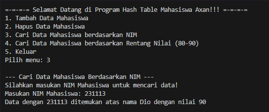
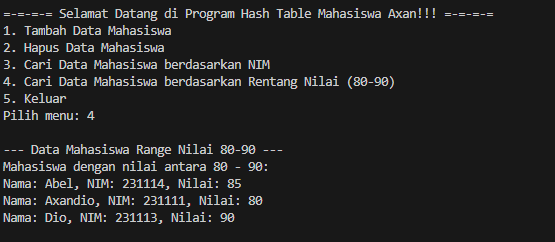

# <h1 align="center">Laporan Praktikum Modul Hash Table</h1>
<p align="center">Axandio Biyanatul Lizan - 2311102179</p>

## Dasar Teori
Hash table atau tabel hash digunakan untuk mengindeks sekumpulan array untuk memudahkan proses pencarian. Hash function adalah fungsi yang digunakan untuk mengubah nilai kunci menjadi nilai yang disebut alamat hash. Alamat hash ini mewakili indeks posisi dalam array[1]. Hash merupakan modul (function) dalam algoritma. Teknik yang memungkinkan lokasi suatu record dapat diperoleh dengan mudah dan cepat dikenal dengan fungsi hashing. Untuk menyimpan data dalam hashing diantaranya menggunakan array yang dikenal dengan istilah tabel hashing. [2] <br/>

Operasi Hash Table / Tabel Hash : <br/>
1. Insertion <br/>
Menambahkan data baru ke dalam hash table dengan memanfaatkan fungsi hash untuk menemukan bucket yang sesuai, lalu menyimpan data ke dalam bucket tersebut. <br/>
2. Deletion <br/>
Menghapus data dari hash table dengan mencari data menggunakan fungsi hash, dan kemudian menghapusnya dari bucket yang sesuai. <br/>
3. Searching <br/>
Mencari data dalam hash table dengan memasukkan input kunci ke fungsi hash untuk menentukan posisi bucket, dan kemudian mencari data di dalam bucket yang sesuai. <br/>
4. Update <br/>
Memperbarui data dalam hash table dengan mencari data menggunakan fungsi hash, dan kemudian memperbarui data yang ditemukan.<br/>
5. Transversal / Transverse <br/>
Melalui seluruh hash table untuk memproses semua data yang ada dalam tabel. <br/>

## Guided 

### 1. [Guided 1]

```C++
/*
Axandio Biyanatul Lizan - 2311102179
*/

#include <iostream>
using namespace std;

const int MAX_SIZE = 10;

// Fungsi hash sederhana
int hash_func(int key) {
    return key % MAX_SIZE;
}

// Struktur data untuk setiap node
struct Node {
    int key;
    int value;
    Node* next;

    Node(int key, int value) : key(key), value(value), next(nullptr) {}
};

// Class hash table
class HashTable {
private:
    Node** table;

public:
    // Konstruktor
    HashTable() {
        table = new Node*[MAX_SIZE]();
    }

    // Destruktor
    ~HashTable() {
        for (int i = 0; i < MAX_SIZE; i++) {
            Node* current = table[i];
            while (current != nullptr) {
                Node* temp = current;
                current = current->next;
                delete temp;
            }
        }
        delete[] table;
    }

    // Penyisipan data
    void insert(int key, int value) {
        int index = hash_func(key);
        Node* current = table[index];
        while (current != nullptr) {
            if (current->key == key) {
                current->value = value;
                return;
            }
            current = current->next;
        }

        Node* node = new Node(key, value);
        node->next = table[index];
        table[index] = node;
    }

    // Pencarian data
    int get(int key) {
        int index = hash_func(key);
        Node* current = table[index];
        while (current != nullptr) {
            if (current->key == key) {
                return current->value;
            }
            current = current->next;
        }
        return -1;
    }

    // Penghapusan data
    void remove(int key) {
        int index = hash_func(key);
        Node* current = table[index];
        Node* prev = nullptr;
        while (current != nullptr) {
            if (current->key == key) {
                if (prev == nullptr) {
                    table[index] = current->next;
                } else {
                    prev->next = current->next;
                }
                delete current;
                return;
            }
            prev = current;
            current = current->next;
        }
    }

    // Traverse atau traversal
    void traverse() {
        for (int i = 0; i < MAX_SIZE; i++) {
            Node* current = table[i];
            while (current != nullptr) {
                cout << current->key << ": " << current->value << endl;
                current = current->next;
            }
        }
    }
};

int main() {
    HashTable ht;

    // Penyisipan data
    ht.insert(1, 10);
    ht.insert(2, 20);
    ht.insert(3, 30);

    // Pencarian data
    cout << "Get key 1: " << ht.get(1) << endl;
    cout << "Get key 4: " << ht.get(4) << endl;

    // Penghapusan data
    ht.remove(4);

    // Traversal
    ht.traverse();

    return 0;
}

```
Kode di atas adalah implementasi dari sebuah tabel hash dalam bahasa pemrograman C++. Tabel hash digunakan untuk menyimpan pasangan kunci-nilai (key-value) dengan metode penyimpanan dan pencarian yang cepat. ada beberapa fungsi kode diatas yang dapat dijelaskan sebagai berikut : <br/>
- MAX_SIZE adalah ukuran maksimum dari tabel hash. Fungsi hash_func adalah fungsi hash sederhana yang mengembalikan indeks dalam tabel hash berdasarkan modulus dari key dengan MAX_SIZE. <br/>
- Struktur Node digunakan untuk menyimpan data dengan tiga atribut: key, value, dan next. Atribut next digunakan untuk menunjukkan node berikutnya dalam kasus tabrakan hash. <br/>
- Kelas HashTable memiliki atribut table yang merupakan array dari pointer ke Node. <br/>
- Konstruktor HashTable menginisialisasi table sebagai array kosong dengan ukuran MAX_SIZE. Destruktor akan membersihkan memori dengan menghapus setiap node dalam tabel. <br/>
- Metode prosedur insert digunakan untuk menyisipkan data ke dalam tabel hash. Jika key sudah ada dalam tabel, value yang sesuai akan diperbarui. <br/>
- Metode get digunakan untuk mencari value berdasarkan key dalam tabel hash. <br/>
- Prosedur remove digunakan untuk menghapus data dari tabel hash berdasarkan key. <br/>
- Prosedur traverse digunakan untuk menampilkan seluruh pasangan kunci-nilai yang ada dalam tabel hash. <br/> <br/>
Lalu pada bagian int main, kelas HashTable diuji dengan menyisipkan beberapa data, melakukan pencarian, penghapusan, dan traversal.<br/>

### 2. [Guided 2]
```C++
/*
Axandio Biyanatul Lizan - 2311102179
*/

#include <iostream>
#include <string>
#include <vector>
using namespace std;

const int TABLE_SIZE = 11;

class HashNode {
public:
    string name;
    string phone_number;

    HashNode(string name, string phone_number) {
        this->name = name;
        this->phone_number = phone_number;
    }
};

class HashMap {
private:
    vector<HashNode*> table[TABLE_SIZE];

public:
    // Fungsi hash untuk menghitung indeks dalam tabel
    int hashFunc(string key) {
        int hash_val = 0;
        for (char c : key) {
            hash_val += c;
        }
        return hash_val % TABLE_SIZE;
    }

    // Menyisipkan data ke dalam tabel hash
    void insert(string name, string phone_number) {
        int hash_val = hashFunc(name);
        for (auto node : table[hash_val]) {
            if (node->name == name) {
                node->phone_number = phone_number;
                return;
            }
        }
        table[hash_val].push_back(new HashNode(name, phone_number));
    }

    // Menghapus data dari tabel hash berdasarkan nama
    void remove(string name) {
        int hash_val = hashFunc(name);
        for (auto it = table[hash_val].begin(); it != table[hash_val].end(); it++) {
            if ((*it)->name == name) {
                table[hash_val].erase(it);
                return;
            }
        }
    }

    // Mencari nomor telepon berdasarkan nama
    string searchByName(string name) {
        int hash_val = hashFunc(name);
        for (auto node : table[hash_val]) {
            if (node->name == name) {
                return node->phone_number;
            }
        }
        return "";
    }

    // Menampilkan isi dari tabel hash
    void print() {
        for (int i = 0; i < TABLE_SIZE; i++) {
            cout << i << ": ";
            for (auto pair : table[i]) {
                if (pair != nullptr) {
                    cout << "[" << pair->name << ", " << pair->phone_number << "] ";
                }
            }
            cout << endl;
        }
    }
};

int main() {
    HashMap employee_map;
    
    // Menambahkan data ke dalam tabel hash
    employee_map.insert("Mistah", "1234");
    employee_map.insert("Pastah", "5678");
    employee_map.insert("Ghana", "91011");

    // Mencari nomor telepon berdasarkan nama
    cout << "Nomer Hp Mistah : " << employee_map.searchByName("Mistah") << endl;
    cout << "Nomer Hp Pastah : " << employee_map.searchByName("Pastah") << endl;

    // Menghapus data dari tabel hash
    employee_map.remove("Mistah");
    cout << "Nomer Hp Mistah setelah dihapus : " << employee_map.searchByName("Mistah") << endl << endl;

    // Menampilkan isi dari tabel hash
    cout << "Hash Table : " << endl;
    employee_map.print();

    return 0;
}

```
Kode di atas adalah implementasi dari struktur data tabel hash dalam bahasa pemrograman C++. Struktur data tabel hash digunakan untuk menyimpan dan mengakses data dengan kunci tertentu dalam waktu yang konstan, yaitu O(1). Implementasi ini menggunakan metode chaining untuk menangani tabrakan hash, di mana setiap indeks dalam tabel hash menunjuk ke sebuah linked list atau dalam kasus ini, sebuah vector. <br/>
- Pertama kita mendefinisikan konstanta TABLE_SIZE yang menentukan ukuran maksimum dari tabel hash. Struktur HashNode didefinisikan untuk menyimpan pasangan kunci-nilai. Setiap HashNode memiliki dua atribut: name untuk menyimpan nama dan phone_number untuk menyimpan nomor telepon. <br/>
- Class HashMap memiliki sebuah atribut table, yang merupakan array dari vector yang berisi pointer ke HashNode. <br/>
- Fungsi hashFunc adalah fungsi hash sederhana yang menghitung nilai hash dari key dengan menjumlahkan nilai ASCII dari setiap karakter dalam key dan mengembalikan hasil modulus dengan TABLE_SIZE untuk mendapatkan indeks dalam tabel hash. <br/>
- Prosedur insert digunakan untuk menyisipkan data ke dalam tabel hash. Pertama, kita menghitung indeks hash dari name dengan menggunakan hashFunc. Kemudian, kita melakukan iterasi melalui vector di indeks tersebut untuk memeriksa apakah name sudah ada dalam tabel. Jika sudah, phone_number yang sesuai akan diperbarui. Jika tidak, HashNode baru akan ditambahkan ke vector di indeks yang sesuai dalam table. <br/>
- Prosedur remove digunakan untuk menghapus data dari tabel hash berdasarkan name. Kita menghitung indeks hash dari name dengan hashFunc dan kemudian melakukan iterasi melalui vector di indeks tersebut untuk mencari name. Jika ditemukan, HashNode yang bersesuaian akan dihapus dari vector.
- Fungsi searchByName digunakan untuk mencari phone_number berdasarkan name dalam tabel hash. Kita menghitung indeks hash dari name dan kemudian melakukan iterasi melalui vector di indeks tersebut untuk mencari name. Jika ditemukan, phone_number yang bersesuaian akan dikembalikan. Jika tidak ditemukan, metode ini akan mengembalikan string kosong. <br/>
- Prosedur print digunakan untuk menampilkan seluruh isi tabel hash. Metode ini melakukan iterasi melalui setiap indeks dalam table dan menampilkan pasangan name dan phone_number yang ada dalam vector di setiap indeks. <br/><br/>
Pada int main/fungsi utama diuji lah kelas hashMap dengan menyisipkan beberapa data, melakukan pencarian, penghapusan, dan menampilkan isi hash tabel.<br/>

## Unguided 

### Implementasikan hash table untuk menyimpan data mahasiswa. Setiap mahasiswa memiliki NIM dan nilai. Implementasikan fungsi untuk menambahkan data baru, menghapus data, mencari data berdasarkan NIM, dan mencari data berdasarkan nilai. Dengan ketentuan : <br/> a. Setiap mahasiswa memiliki NIM dan nilai. <br/> b. Program memiliki tampilan pilihan menu berisi poin C. <br/> c. Implementasikan fungsi untuk menambahkan data baru, menghapus data, mencari data berdasarkan NIM, dan mencari data berdasarkan rentang nilai (80 – 90). <br/>

```C++
#include <iostream>
#include <list>
#include <vector>

using namespace std;

// Struktur data untuk mahasiswa
struct Mahasiswa {
    string nim;
    int nilai;
    string nama;
};

// Hash table
class HashTable {
private:
    static const int tableSize = 10;
    list<Mahasiswa> table[tableSize];

    // Fungsi hash
    int hashFunction(string nim) {
        int sum = 0;
        for (char ch : nim) {
            sum += ch;
        }
        return sum % tableSize;
    }

public:
    // Menambah data mahasiswa
    void tambahData(string nim, int nilai, string nama) {
        int index = hashFunction(nim);
        Mahasiswa mahasiswa = {nim, nilai, nama};
        table[index].push_back(mahasiswa);
    }

    // Menghapus data mahasiswa berdasarkan NIM
    void hapusData(string nim) {
        int index = hashFunction(nim);
        for (auto it = table[index].begin(); it != table[index].end(); ++it) {
            if (it->nim == nim) {
                table[index].erase(it);
                break;
            }
        }
    }

    // Mencari data mahasiswa berdasarkan NIM
    Mahasiswa* cariByNIM(string nim) {
        int index = hashFunction(nim);
        for (auto& mahasiswa : table[index]) {
            if (mahasiswa.nim == nim) {
                return &mahasiswa;
            }
        }
        return nullptr;
    }

    // Mencari data mahasiswa berdasarkan rentang nilai (80 - 90)
    vector<Mahasiswa> cariByRentangNilai(int min, int max) {
        vector<Mahasiswa> hasil;
        for (int i = 0; i < tableSize; ++i) {
            for (auto& mahasiswa : table[i]) {
                if (mahasiswa.nilai >= min && mahasiswa.nilai <= max) {
                    hasil.push_back(mahasiswa);
                }
            }
        }
        return hasil;
    }
};

int main() {
    HashTable hashTable;
    int pilihan;
    string nim;
    int nilai;
    string nama;

    do {
        cout << "\n=-=-=-= Selamat Datang di Program Hash Table Mahasiswa Axan!!! =-=-=-=\n";
        cout << "1. Tambah Data Mahasiswa\n";
        cout << "2. Hapus Data Mahasiswa\n";
        cout << "3. Cari Data Mahasiswa berdasarkan NIM\n";
        cout << "4. Cari Data Mahasiswa berdasarkan Rentang Nilai (80-90)\n";
        cout << "5. Keluar\n";
        cout << "Pilih menu: ";
        cin >> pilihan;

        switch (pilihan) {
            case 1:
                cout << "\n--- Tambah Data Mahasiswa ---" << endl;
                cout << "Silahkan tambah data mahasiswa dengan mengisi format dibawah!\n";
                cout << "Masukan Nama Mahasiswa: ";
                cin.ignore();
                getline(cin, nama);
                cout << "Masukan NIM Mahasiswa: ";
                cin >> nim;
                cout << "Masukan Nilai Mahasiswa: ";
                cin >> nilai;
                hashTable.tambahData(nim, nilai, nama);
                cout << "Data baru telah ditambahkan dengan Nama " << nama << " [" << nim << "] dengan perolehan Nilai " << nilai << "!\n";
                break;
            case 2:
                cout << "\n--- Hapus Data Mahasiswa ---" << endl;
                cout << "Silahkan masukan NIM Mahasiswa yang akan dihapus datanya dibawah ini!\n";
                cout << "Masukan NIM Mahasiswa: ";
                cin >> nim;
                if (Mahasiswa* mahasiswa = hashTable.cariByNIM(nim)) {
                    cout << "Data dengan nama " << mahasiswa->nama << " [" << mahasiswa->nim << "] dengan perolehan Nilai " << mahasiswa->nilai << " telah dihapus!\n";
                    hashTable.hapusData(nim);
                } else {
                    cout << "Data tidak ditemukan.\n";
                }
                break;
            case 3:
                cout << "\n--- Cari Data Mahasiswa Berdasarkan NIM ---" << endl;
                cout << "Silahkan masukan NIM Mahasiswa untuk mencari data!\n";
                cout << "Masukan NIM Mahasiswa: ";
                cin >> nim;
                if (Mahasiswa* mahasiswa = hashTable.cariByNIM(nim)) {
                    cout << "Data dengan " << nim << " ditemukan atas nama " << mahasiswa->nama << " dengan nilai " << mahasiswa->nilai << endl;
                } else {
                    cout << "Data tidak ditemukan.\n";
                }
                break;
            case 4:
                cout << "\n--- Data Mahasiswa Range Nilai 80-90 ---" << endl;
                cout << "Mahasiswa dengan nilai antara 80 - 90:\n";
                {
                    vector<Mahasiswa> mahasiswas = hashTable.cariByRentangNilai(80, 90);
                    for (const auto& mahasiswa : mahasiswas) {
                        cout << "Nama: " << mahasiswa.nama << ", NIM: " << mahasiswa.nim << ", Nilai: " << mahasiswa.nilai << endl;
                    }
                }
                break;
            case 5:
                cout << "Terima kasih!\n";
                break;
            default:
                cout << "Pilihan tidak valid. Silakan coba lagi.\n";
                break;
        }
    } while (pilihan != 5);

    return 0;
}

```
#### Output Unguided 1 (Tambah Data):


#### Output Unguided 1 (Hapus Data):


#### Output Unguided 1 (Cari Data):


#### Output Unguided 1 (Cari Data Rentang Nilai):


Program diatas merupakan kode bahasa c++ yang menjelaskan mengenai Penambahan data, hapus data, pencarian data menggunakan hash table. Pada awal program, didefinisikan sebuah struktur data Mahasiswa yang memiliki tiga atribut: nim untuk menyimpan NIM mahasiswa dalam bentuk string, nilai untuk menyimpan nilai mahasiswa dalam bentuk integer, dan nama untuk menyimpan nama mahasiswa dalam bentuk string. Selanjutnya, didefinisikan kelas HashTable yang memiliki tiga atribut: tableSize yang menentukan ukuran hash table, dan table yang merupakan array dari linked list (list<Mahasiswa>) untuk menyimpan data mahasiswa. Di dalam kelas HashTable, terdapat beberapa metode: <br/>
- hashFunction(string nim): Metode ini merupakan fungsi hash sederhana yang mengembalikan nilai hasil modulus dari penjumlahan ASCII setiap karakter dalam nim terhadap tableSize. <br/>
- tambahData(string nim, int nilai, string nama): Metode ini digunakan untuk menambahkan data mahasiswa ke dalam hash table. Data mahasiswa yang baru ditambahkan akan disimpan pada indeks yang dihasilkan oleh fungsi hash. <br/>
- hapusData(string nim): Metode ini digunakan untuk menghapus data mahasiswa dari hash table berdasarkan nim. <br/>
- cariByNIM(string nim): Metode ini digunakan untuk mencari data mahasiswa berdasarkan nim. Jika data ditemukan, metode ini akan mengembalikan pointer ke data mahasiswa tersebut; jika tidak, akan mengembalikan nullptr. <br/>
- cariByRentangNilai(int min, int max): Metode ini digunakan untuk mencari data mahasiswa yang memiliki nilai di antara min dan max. Metode ini mengembalikan sebuah vector yang berisi data mahasiswa yang memenuhi kriteria tersebut. <br/><br/>

Di dalam fungsi main(), program utama dimulai dengan menampilkan menu pilihan kepada user dengan menggunakan do-while loop. Berikut adalah pilihan menu yang tersedia:<br/>
1. Tambah Data Mahasiswa: <br/>
Pengguna diminta untuk memasukkan nama, nim, dan nilai mahasiswa. Setelah data dimasukkan, data tersebut ditambahkan ke dalam hash table dengan memanggil prosedur tambahData(). <br/>
2. Hapus Data Mahasiswa: <br/>
Pengguna diminta untuk memasukkan nim mahasiswa yang ingin dihapus. Jika data ditemukan dalam hash table, data tersebut akan dihapus dengan memanggil prosedur hapusData(). <br/>
3. Cari Data Mahasiswa berdasarkan NIM: <br/>
Pengguna diminta untuk memasukkan nim mahasiswa yang ingin dicari. Jika data ditemukan dalam hash table, informasi mengenai mahasiswa tersebut akan ditampilkan. <br/>
4. Cari Data Mahasiswa berdasarkan Rentang Nilai (80-90): <br/>
Program akan mencari dan menampilkan semua mahasiswa yang memiliki nilai di antara 80 dan 90 dengan memanggil function cariByRentangNilai(). <br/>
5. Keluar/Exit : Program akan berhenti dan menampilkan pesan "Terima kasih!". <br/><br/>
Kode di atas dijalankan dengan memanggil metode-metode yang telah didefinisikan dalam kelas HashTable. Program ini akan terus berjalan dan menampilkan menu pilihan kepada pengguna sampai pengguna memilih untuk keluar (pilihan 5).

## Kesimpulan
Hash table adalah struktur data yang memungkinkan penyimpanan dan pencarian data berdasarkan kunci unik dengan kompleksitas waktu rata-rata konstan (O(1)). Dalam bahasa C++, hash table dapat diimplementasikan menggunakan array dari list (atau vector) yang disebut bucket. Setiap elemen dalam list atau vector ini berisi kumpulan pasangan kunci-nilai. <br/>

Fungsi hash merupakan komponen kritis dalam hash table. Fungsi ini mengonversi kunci yang unik menjadi indeks dalam array (bucket) di mana data akan disimpan. Fungsi hash yang baik harus mendistribusikan kunci dengan baik di seluruh rentang indeks untuk mengurangi kemungkinan tabrakan hash (collision). <br/>

Operasi yang umumnya tersedia dalam hash table meliputi: <br/>
- Tambah (Insert): Menambahkan pasangan kunci-nilai baru ke dalam hash table dengan memanfaatkan fungsi hash untuk menentukan bucket yang tepat. <br/>
- Hapus (Delete): Menghapus pasangan kunci-nilai berdasarkan kunci yang diberikan dari hash table. <br/>
- Cari (Search): Mencari dan mengembalikan nilai berdasarkan kunci yang diberikan dari hash table. <br/>
- Update: Mengganti nilai dari pasangan kunci-nilai yang ada dalam hash table berdasarkan kunci yang diberikan. <br/>

Hash table menawarkan keuntungan dalam efisiensi waktu untuk operasi-operasi dasar ini, namun pengelolaan tabrakan hash dan pemilihan fungsi hash yang tepat adalah kunci untuk memastikan performa dan efisiensi yang optimal.<br/>

## Referensi
[1] Bahit, M, ALGORITMA PEMROGRAMAN TERSTRUKTUR . Cetakan Pertama. Banjarmasin:Poliban Press,2024.<br/>
[2] Supriatna, A, "PENERAPAN ALGORITMA HASH PADA APLIKASI PERPUSTAKAAN KAMPUS UNTUK PENATAAN BUKU-BUKU DALAM RAK", J. Teknologi Informasi dan Komunikasi. 2, Okt. 2016. <br/>