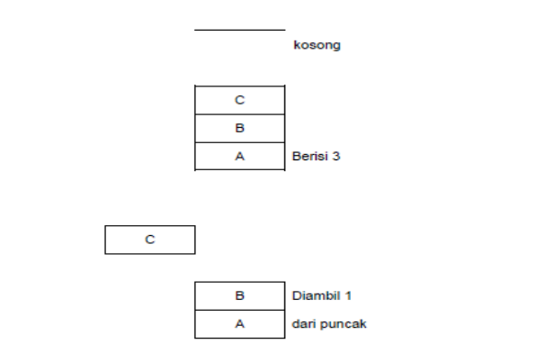
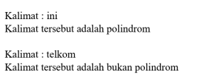
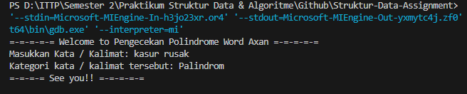
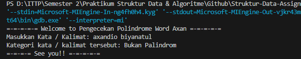
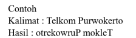
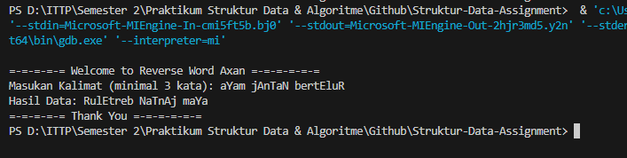

# <h1 align="center">Laporan Praktikum Modul Stack</h1>
<p align="center">Axandio Biyanatul Lizan - 2311102179</p>

## Dasar Teori
Stack (tumpukan) dapat diartikan sebagai kumpulan data, seolah-olah satu data ditempatkan di atas yang lain. Menambah dan menghapus data hanya dapat dilakukan dari ujung yang sama, yang disebut bagian atas tumpukan (top of stack). Pada kondisi tersebut, prinsip yang digunakan pada stack (tumpukan) adalah LIFO (last in first out). Stack adalah tipe data abstrak dengan kapasitas terbatas (sudah ditentukan sebelumnya). Ini adalah struktur data sederhana yang memungkinkan penambahan dan penghapusan elemen dalam urutan tertentu. Setiap kali sebuah elemen ditambahkan, ia berada di atas tumpukan dan satu-satunya elemen yang dapat dihapus adalah elemen yang berada di atas tumpukan, seperti tumpukan objek. [1] <br/>

Penyimpanan data/item dimana data/item yang diakses adalah paling akhir yang disebut top of stack. Item ditempatkan membentuk tumpukan. [2] <br/>
<br/>
Tumpukan memiliki sifat Last In First Out (LIFO). Artinya, data yang terakhir kali dimasukkan/disisipkan akan menjadi data yang pertama kali keluar. Pada contoh di atas, yang berisi tumpukan A, B, dan C jelas terlihat bahwa C adalah data yang terakhir kali ditumpukkan. Jika terjadi operasi pengambilan data maka C adalah data yang akan keluar terlebih dulu.[2] <br/>

Operasi - Operasi Stack : <br/>
1. Push <br/>
Digunakan untuk menambah item pada stack pada tumpukan paling atas. [2] <br/>
2. Pop <br/>
Digunakan untuk mengambil item pada stack pada tumpukan paling atas. [2] <br/>
3. Clear/Destroy <br/>
Menghapus semua data tumpukan. [2] <br/>
4. IsEmpty <br/>
Fungsi yang digunakan untuk mengecek apakah stack kosong atau ngga. [2]<br/>
5. IsFull <br/>
Fungsi yang digunakan untuk mengecek apakah stack penuh atau ngga. [2] <br/>

## Guided 

### 1. [Guided 1]

```C++
/*
Axandio Biyanatul Lizan - 2311102179
*/

#include <iostream>
using namespace std;

string arrayBuku[5];
int maksimal = 5, top = 0;

bool isFull(){
    return (top == maksimal);
}

bool isEmpty(){
    return (top == 0);
}

void pushArrayBuku (string data){
    if (isFull()){
        cout << "Data telah penuh" << endl;
    } else {
        arrayBuku[top] = data;
        top++;
    }
}

void popArrayBuku(){
    if (isEmpty()){
        cout << "Tidak ada data yang dihapus" << endl;
    } else {
        arrayBuku[top-1] = " ";
        top --;
    }
}

void peekArrayBuku(int posisi) {
    if (isEmpty()) {
        cout << "Tidak ada data yang bisa dilihat" << endl;
    } else {
        int index = top; 
        for (int i = 1; i <= posisi; i++) {
        index--;
        }
        cout << "Posisi ke " << posisi << " adalah " << arrayBuku[index] << endl;
    }
}

int countStack(){
    return top;
}

void changeArrayBuku(int posisi, string data){
    if (posisi > top){
        cout << "Posisi melebihi data yang ada" << endl;
    } else {
        int index = top;
        for (int i = 1; i <= posisi; i++){
            index --;
        }
        arrayBuku[index] = data;
    }
}

void destroyBuku (){
    for (int i = top; i >= 0; i--){
        arrayBuku[i] = " ";
    }
    top = 0;
}

void cetakArrayBuku(){
    if (isEmpty()){
        cout << "Tidak ada buku yang dicetak" << endl;
    } else {
        for (int i = top -1; i >= 0; i--){
            cout << arrayBuku[i] << endl;
        }
    }
}

int main(){
    pushArrayBuku("Kalkulus");
    pushArrayBuku("Struktur Data");
    pushArrayBuku("Matematika Diskrit");
    pushArrayBuku("Dasar Multimedia");
    pushArrayBuku("Inggris");

    cetakArrayBuku();
    cout << "\n";

    cout << "Apakah data stack penuh? " << isFull() << endl;
    cout << "Apakah data stack kosong? " << isEmpty() << endl;

    cout << "\n";

    peekArrayBuku(2);
    popArrayBuku();

    cout << "Banyaknya data = " << countStack() << endl;

    changeArrayBuku(2, "Bahasa Jerman");
    cetakArrayBuku();

    cout << "\n";

    destroyBuku();

    cout << "Jumlah data setelah dihapus : " << top << endl;

    cetakArrayBuku();
    return 0;
}
```
Kode diatas adalah bentuk implementasi dari Stack atau yang biasa dikenal tumpukan, kode diatas juga memiliki beberapa deklarasi prosedur & function. Hal pertama kode diatas menggunakan array yang bertipe string dengan nama variabel arrayBuku yang memiliki panjang array 5. Lalu terdapat 2 variabel bertipe data int, maksimal (berfungsi sebagai wadah/tempat/media) yang memiliki kapasitas 6 (0-5), kemudian ada inisiasi variabel top yang dimulai dari 0. Kemudian juga ada pengencekan apakah data stack udh penuh / kosong. Berikut adalah rincian penjelasan kode diatas : <br/>
- Bool IsEmpty <br/>
Function tersebut digunakan untuk mengecek apakah data stack kosong dengan cara mencocokan apakah nilai top sama dengan 0. <br/>
- Bool IsFull <br/>
Function tersebut digunakan untuk mengecek apakah data stack penuh dengan cara mencocokan apakah nilai top sama dengan maksimal.<br/>
- void pushArrayBuku <br/>
Deklarasi tersebut menjelaskan cara menambahkan data buku baru. Hal pertama adalah pengecekan menggunakan IsFull, jika bernilai true berarti data stack penuh. jika bernilai false maka top akan di increment/tambah 1 dengan menambahkan data. <br/>
- void popArrayBuku() <br/>
Deklarasi tersebut menjelaskan cara menghapus buku. Hal pertama adalah pengecekan menggunakan IsEmpty, jika bernilai true maka data stack kosong dan tidak dapat menghapus. Jika bernilai false maka tumpukan (top) akan di kurang 1, kemudian data yang paling atas akan dihapus.<br/>
- void peekArrayBuku(int posisi) <br/>
Deklarasi tersebut adalah melihat elemen stack pada posisi tertentu. Hal pertama adalah pengecekan IsEmpty, jika bernilai true maka tidak ada data yang bisa dilihat. Jika bernilai false maka mencetak posisi dan elemen array pada posisi yang dimaksud. parameter posisi adalah indeks yang ingin diakses, arrayBuku[index]  <br/>
- int countStack() <br/>
Function tersebut digunakan untuk menghitung jumlah stack, dengan cara mengembalikan nilai top.<br/>
- void changeArrayBuku(int posisi, string data) <br/>
Deklarasi tersebut digunakan untuk mengganti data pada posisi tertentu. Pertama adalah pengecekan apakah posisi yang dimasukan melebihi top, jika iya maka akan mencetak posisi melebihi data yang ada, jika tidak maka terjadi iterasi untuk mencari posisi yang diinginkan, kemudian memperbarui arrayBuku dengan data yang baru. <br/>
- void destroyBuku () <br/>
Deklarasi tersebut digunakan untuk menghapus semua data buku dengan menggunakan iterasi perulangan for.<br/>
- void cetakArrayBuku() <br/>
Deklarasi tersebut digunakan untuk mencetak data buku. Pertama kode menggunakan perkondisian pengecekan jika IsEmpty bernilai true maka tidak ada data yang dicetak, jika bernilai false maka akan mencetak arrayBuku[i] sesuai iterasi perulangan.<br/>
<br/>
Pada int main() ada pendeklarasian data seperti menambahkan kalkulus, struktur data, matematika diskrit, dasar multimedia, dan Inggris. Karena stack bersifat Last In First Out maka data kalkulus berada diurutan paling bawah dan data inggris berada diurutan paling atas. selain menambahkan data, ada juga pengecekan data, penghapusan data paling atas, pengecekan data stack penuh atau kosong, pengecekan banyak data menggunakan countStack, mengubah data pada posisi ke 2, kemudian menghapus seluruh data, dan mencetak hasil akhir data. <br/>

## Unguided 

### 1. Buatlah program untuk menentukan apakah kalimat tersebut yang diinputkan dalam program stack adalah palindrom/tidak. Palindrom kalimat yang dibaca daridepan dan belakang sama. Jelaskan bagaimana cara kerja programnya. <br/>


```C++
/*
Axandio Biyanatul Lizan - 2311102179
*/
#include <iostream>
#include <stack>
#include <string>
#include <cctype>

using namespace std;

string hapusNonAlpha(string str) {
    string result;
    for (char a : str) {
        if (isalpha(a)) {
            result += tolower(a); // konversi ke huruf kecil
        }
    }
    return result;
}

// pengecekan polindrome atau bukan polindrome
bool isPalindrome(string str) {
    stack<char> charStack;
    int length = str.length();

    for (int a = 0; a < length / 2; a++) {
        charStack.push(str[a]);
    }

    // pengecekan jika string ganjil, maka skip kata ditengah
    if (length % 2 != 0) {
        length++;
    }

    for (int a = length / 2; a < length; a++) {
        if (charStack.empty() || str[a] != charStack.top()) {
            return false;
        }
        charStack.pop();
    }

    return true;
}

int main() {
    string masukan;

    cout << "=-=-=-=-= Welcome to Pengecekan Polindrome Word Axan =-=-=-=-=" << endl;
    cout << "Masukkan Kata / Kalimat: ";
    getline(cin, masukan);

    // Menghapus karakter non-alfabet dan menkonversi huruf menjadi huruf kecil
    string cleanMasukan = hapusNonAlpha(masukan);

    // pengecekan apakah kata yang sudah di clean polindrome atau bukan polindrome
    if (isPalindrome(cleanMasukan)) {
        cout << "Kategori kata / kalimat tersebut: Palindrom" << endl;
    } else {
        cout << "Kategori kata / kalimat tersebut: Bukan Palindrom" << endl;
    }
    cout << "=-=-=-= See you!! =-=-=-=-=" << endl;
    cout << "\n";
    return 0;
}
```
#### Output Unguided 1 (Kata Palindrom):

#### Output Unguided 1 (Kata Bukan Palindrome):


Program diatas merupakan kode bahasa c++ yang menjelaskan mengenai pengecekan apakah kata/kalimat yang dimasukan merupakan tipe polindrome atau tidak polindrome yang menggunakan fungsi Stack sebagai operasinya. Pada kode diatas, terdapat 1 Deklarasi function dan 1 Pengecekan. : <br/>
- string hapusNonAlpha(string str) <br/>
Fungsi diatas digunakan untuk menghapus karakter non-alfabet dari string. Fungsi ini menerima satu parameter berupa string str. Kemudian, dilakukan iterasi melalui setiap karakter dalam string tersebut menggunakan loop for (char a : str).Pada setiap iterasi, dilakukan pengecekan apakah karakter tersebut merupakan karakter alfabet atau bukan dengan menggunakan fungsi isalpha(a). Jika karakter tersebut adalah alfabet, maka karakter tersebut ditambahkan ke dalam string result. Selain itu juga ada fungsi tolower(a) yang digunakan untuk mengkonversi atau merubah menjadi huruf kecil.<br/>
- bool isPalindrome(string str) <br/>
Fungsi ini merupakan fungsi pengecekan apakah string merupakan sebuah polindrome atau tidak. stack<char> charStack;: Baris ini mendeklarasikan sebuah objek dari kelas stack dengan tipe data elemen char, yang dinamakan charStack. int length = str.length();: Baris ini menghitung panjang dari string str dengan menggunakan fungsi length(). Terdapat 2 fungsi iterasi perulangan for pada fungsi pengecekan ini. Iterasi pertama adalah memasukkan setengah pertama dari string ke dalam stack, dan Iterasi kedua adalah membandingkan setengah kedua dari string dengan karakter yang ada di stack. Ada 1 Perkondisian if yang berfungsi untuk jika panjang string ganjil, maka skip karakter di tengah. <br/>
<br/>
Pada int main() terdapat tipe data string dengan variabel 'masukan'. kemudian terdapat fungsi getline yang berguna untuk mengabaikan spasi dan dapat mengecek lebih dari 1 kata. Kemudian ada string cleanMasukan yang berfungsi untuk menghapus karakter non-alfabet dan mengubah huruf menjadi lowercase. Ada perkondisian IF-ELSE yang berguna untuk pengecekan apakah kata/kalimat yang diinputkan oleh user polindrome atau bukan polindrome. <br/>

### 2. Buatlah program untuk melakukan pembalikan terhadap kalimat menggunakan stack dengan minimal 3 kata. Jelaskan output program dan source codenya beserta operasi/fungsi yang dibuat? <br/>

```C++
/*
Axandio Biyanatul Lizan - 2311102179
*/
#include <iostream>
#include <stack>
#include <string>
#include <cctype>

using namespace std;

// Pembalikan karakter dalam kata
string reverseKata(string kata) {
    string reversedKata = "";
    for (int a = kata.length() - 1; a >= 0; a--) {
        reversedKata += kata[a];
    }
    return reversedKata;
}

// Pembalikan kalimat menggunakan stack
string pembalikanKalimat(string kalimat) {
    stack<string> kataStack;
    string kata = "";
    string pembalikanKalimat = "";

    // Memisahkan kata-kata dari kalimat dan memasukkan ke dalam stack
    for (char x : kalimat) {
        if (x == ' ') {
            kataStack.push(reverseKata(kata));
            kata = "";
        } else {
            kata += x;
        }
    }

    // Menambahkan kata terakhir kedalam stack
    kataStack.push(reverseKata(kata));

    // Membentuk kalimat terbalik
    while (!kataStack.empty()) {
        pembalikanKalimat += kataStack.top() + " ";
        kataStack.pop();
    }

    return pembalikanKalimat;
}

int main() {
    string kalimat;
    cout << "\n=-=-=-=-= Welcome to Reverse Word Axan =-=-=-=-=-=" << endl;
    cout << "Masukan Kalimat (minimal 3 kata): ";
    getline(cin, kalimat);

    // Memeriksa apakah kalimat memiliki minimal 3 kata
    int kataCount = 0;
    for (char a : kalimat) {
        if (a == ' ') {
            kataCount++;
        }
    }
    if (kataCount < 2) {
        cout << "Kalimat harus memiliki minimal 3 kata!" << endl;
        return 1;
    }

    // Memanggil fungsi pembalikan kalimat
    string hasil = pembalikanKalimat(kalimat);

    // Mencetak Hasil
    cout << "Hasil Data: " << hasil << endl;
    cout << "=-=-=-=-= Thank You =-=-=-=-=-=" << endl;
    return 0;
}
```
#### Output Unguided 2 (Reverse Kata):


Program diatas merupakan kode bahasa c++ yang menjelaskan mengenai reverse word atau pembalikan kata menggunakan fungsi operasi Stack. Pada kode diatas, terdapat 2 Deklarasi function. : <br/>
- string reverseKata(string kata) <br/>
Fungsi ini menerima satu parameter berupa string kata. Selanjutnya, dilakukan iterasi mundur melalui setiap karakter dalam string kata menggunakan loop 'for' dengan inisialisasi 'int a = kata.length() - 1', yang berarti dimulai dari indeks karakter terakhir hingga indeks '0'. Pada setiap iterasi, karakter pada indeks ke-a dari string kata ditambahkan ke dalam string 'reversedKata'. Dengan cara ini, karakter-karakter dalam kata tersebut dipindahkan ke string baru dalam urutan terbalik. String 'reversedKata' yang berisi karakter-karakter dalam kata yang sudah terbalik urutannya, akan dikembalikan sebagai output dari fungsi 'reverseKata'<br/>
- string pembalikanKalimat(string kalimat) <br/>
Pada awalnya, dideklarasikan sebuah stack bernama kataStack yang bertipe stack<string> untuk menyimpan kata-kata dalam urutan terbalik. Selain itu, dideklarasikan juga dua string, yaitu kata untuk menyimpan kata sementara dan pembalikanKalimat untuk menyimpan kalimat terbalik. Kemudian dilakukan sebuah iterasi melalui setiap karakter dalam string kalimat menggunakan loop 'for' dengan deklarasi 'char x : kalimat'. Pada setiap iterasi, dilakukan pengecekan apakah karakter saat itu adalah spasi. Jika iya, maka kata sementara yang telah terbentuk ('kata') akan dimasukkan ke dalam stack kataStack setelah diubah urutan karakternya menggunakan fungsi reverseKata. Kemudian, variabel kata direset kembali menjadi string kosong untuk menampung kata berikutnya. Jika karakter saat itu bukan spasi, maka karakter tersebut ditambahkan ke dalam kata sementara. Kemudian setelah iterasi selesai, kata sementara terakhir (kata yang tidak diakhiri oleh spasi) juga dimasukkan ke dalam stack 'kataStack' setelah diubah urutan karakternya menggunakan fungsi 'reverseKata'. Proses pengambilan kata-kata dari stack 'kataStack' dan dimasukkan ke dalam string 'pembalikanKalimat' satu per satu dengan menambahkan spasi di antara setiap kata. Hal ini dilakukan sampai stack kataStack kosong. Kemudian, string 'pembalikanKalimat' yang berisi kalimat dengan urutan kata terbalik akan dikembalikan sebagai output dari fungsi 'pembalikanKalimat'.  <br/>
<br/>
Pada int main() terdapat tipe data string dengan variabel 'kalimat'. kemudian terdapat fungsi getline yang berguna untuk mengabaikan spasi dan dapat mengecek lebih dari 1 kata. Kemudian ada 'int kataCount = 0' yang menandakan bahwa belum ada kata sama sekali, Kemudian, dilakukan iterasi melalui setiap karakter dalam string kalimat menggunakan loop 'for' dengan deklarasi 'char a : kalimat'. Setiap kali karakter yang ditemui adalah spasi, nilai kataCount akan ditambah satu. Proses ini bertujuan untuk menghitung jumlah kata dalam kalimat. Kemudian ada pengecekan If apakah nilai 'kataCount' kurang dari 2. Jika iya, artinya kalimat yang dimasukkan tidak memiliki minimal tiga kata. Maka, program akan menampilkan pesan kesalahan "Kalimat harus memiliki minimal 3 kata!" dan menghentikan program dengan mengembalikan nilai 1 sebagai tanda kesalahan. Jika kalimat memiliki minimal tiga kata, maka fungsi 'pembalikanKalimat' dipanggil untuk melakukan pembalikan urutan kata, dan hasilnya disimpan dalam variabel 'hasil', kemudian program menampilkan sebuah informasi string "Hasil Data: " diikuti dengan nilai variabel 'hasil'.<br/>

## Kesimpulan
Stack (tumpukan) dapat diartikan sebagai kumpulan data, seolah-olah satu data ditempatkan di atas yang lain. Menambah dan menghapus data hanya dapat dilakukan dari ujung yang sama, yang disebut bagian atas tumpukan (top of stack). Pada kondisi tersebut, prinsip yang digunakan pada stack (tumpukan) adalah LIFO (last in first out). Stack adalah tipe data abstrak dengan kapasitas terbatas (sudah ditentukan sebelumnya). Ini adalah struktur data sederhana yang memungkinkan penambahan dan penghapusan elemen dalam urutan tertentu. Setiap kali sebuah elemen ditambahkan, ia berada di atas tumpukan dan satu-satunya elemen yang dapat dihapus adalah elemen yang berada di atas tumpukan, seperti tumpukan objek. [1]<br/>

Operasi - Operasi Stack : <br/>
1. Push <br/>
Digunakan untuk menambah item pada stack pada tumpukan paling atas. [2] <br/>
2. Pop <br/>
Digunakan untuk mengambil item pada stack pada tumpukan paling atas. [2] <br/>
3. Clear/Destroy <br/>
Menghapus semua data tumpukan. [2] <br/>
4. IsEmpty <br/>
Fungsi yang digunakan untuk mengecek apakah stack kosong atau ngga. [2]<br/>
5. IsFull <br/>
Fungsi yang digunakan untuk mengecek apakah stack penuh atau ngga. [2] <br/>
<br/>

Kelebihan Stack : <br/>
1. Sederhana : Pendekatan LIFO (Last In First Out) <br/>
2. Efisien : Memiliki kompleksitas waktu O(1), artinya operasi-operasi tersebut dapat dilakukan dengan cepat bahkan untuk stack yang besar. <br/>
3. Fleksibel : Stack dapat diimplementasikan dengan mudah menggunakan berbagai struktur data dasar seperti array atau linked list. <br/>
4. Rekursi: Stack sangat berguna dalam implementasi rekursi dalam pemrograman. <br/>
<br/>

Kelemahan Stack : <br/>
1. Keterbatasan Kapasitas: Stack memiliki keterbatasan kapasitas tergantung pada ukuran memori yang dialokasikan untuknya saat pembuatan. <br/>
2. Akses Terbatas: Karena sifatnya yang LIFO, stack hanya memungkinkan akses terhadap elemen paling atas (top) saja. <br/>
3. Tidak Cocok untuk Semua Kasus: Meskipun stack berguna dalam banyak konteks, ada situasi di mana struktur data lain lebih sesuai. <br/>
4. Membutuhkan Memori Tambahan: Penggunaan stack membutuhkan alokasi memori tambahan untuk menyimpan informasi konteks panggilan fungsi atau data lainnya. <br/>
<br/>

## Referensi
[1] Bahit, M, ALGORITMA PEMROGRAMAN TERSTRUKTUR . Cetakan Pertama. Banjarmasin:Poliban Press,2024.<br/>
[2] Sindar, A, STRUKTUR DATA DAN ALGORITMADENGAN C++. Cetakan Pertama. Serang:CV.AA.RIZKY, 2018 <br/>