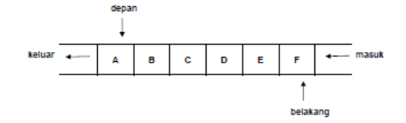

# <h1 align="center">Laporan Praktikum Modul Queue</h1>
<p align="center">Axandio Biyanatul Lizan - 2311102179</p>

## Dasar Teori
Queue (antrian) adalah sekumpulan data,penambahan elemen hanya dapat dilakukan pada salah satu ujung (disebut belakang atau rear) ENQUEUE, dan penghapusan atau pengambilan elemen dilakukan melalui ujung yang lain (disebut sisi depan atau front) DEQUEUE.[1] Queue disebut juga antrian dimana data masuk di satu sisi dan keluar di sisi yang lain. Karena itu, queue bersifat FIFO (First In First Out). Jadi, dalam antrian menggunakan prinsip “masuk pertama keluar pertama” atau disebut juga dengan prinsip FIFO (first in first out). [2] <br/>

Berikut ini operasi - operasi standar pada queue : [2]<br/>
1. <b>Inisialisasi<b>, merupakan prosedur untuk membuat queue pada kondisi awal, yaitu queue yang masih kosong (belum mempunyai elemen). <br/>
2. <b>InQueue<b>, Insert Queue merupakan prosedur untuk memasukkan sebuah elemen baru pada queue. Jumlah elemen Queue akan bertambah satu dan elemen tersebut merupakan elemen belakang. <br/>
3. <b>DeQueue<b>, Delete Queue merupakan prosedur untuk menghapus/mengambil sebuah elemen dari queue. Elemen yang diambil adalah elemen depan dan jumlah elemen queue akan berkurang satu. <br/> <br/>

Operasi-operasi yang berhubungan dengan jumlah elemen suatu queue adalah : <br/>
1. <b>Size<b>, yaitu operasi untuk mendapatkan banyaknya elemen queue. <br/>
2. <b>Empty<b>, yaitu prosedur untuk mengetahui apakah queue dalam keadaan kosong atau tidak. Dengan status ini maka dapat dicegah dilakukannya operasi Dequeue dari suatu queue yang kosong. <br/>
3. <b>Full<b>, merupakan prosedur untuk mengetahui apakah Queue penuh atau tidak. Prosedur ini hanya berlaku untuk queue yang jumlahnya terbatas. <br/><br/>

Antrian merupakan suatu kumpulan data, maka tipe data yang sesuai untuk menyajikan antrian adalah menggunakan array atau list (senarai berantai). <br/>
 <br/>
Gambar di atas menunjukkan contoh penyajian antrian menggunakan array. Antrian di atas berisi 6 elemen yaitu A, B, C, D, E dan F. Elemen A terletak di bagian depan antrian dan elemen F terletak di bagian belakang antrian. Jika ada elemen baru yang akan masuk, maka elemen tersebut akan diletakkan di sebelah kanan F. Dan jika ada elemen yang akan dihapus, maka A akan dihapus terlebih dahulu. [2] <br/>

## Guided 

### 1. [Guided 1]

```C++
/*
Axandio Biyanatul Lizan - 2311102179
*/

#include <iostream>
using namespace std;

const int MAX_QUEUE = 5; // Kapasitas maksimal antrian
int front = 0; // Indeks elemen terdepan dalam antrian
int back = 0; // Indeks elemen berikutnya yang tersedia dalam antrian
string queueTeller[MAX_QUEUE]; // Array untuk menyimpan nama pelanggan

// Fungsi untuk memeriksa apakah antrian penuh
bool isFull() {
    return back == MAX_QUEUE;
}

// Fungsi untuk memeriksa apakah antrian kosong
bool isEmpty() {
    return back == 0;
}

// Fungsi untuk menambahkan pelanggan ke antrian
void enqueueAntrian(string data) {
    if (isFull()) {
        cout << "Antrian penuh!" << endl;
        return; // Keluar dari fungsi jika antrian penuh
    }

    if (isEmpty()) { // Kondisi awal saat antrian kosong
        queueTeller[0] = data; // Tambahkan data ke elemen pertama
        front++;
        back++;
        return;
    }

    // Kondisi antrian tidak kosong
    queueTeller[back] = data; // Tambahkan data ke elemen berikutnya yang tersedia
    back++;
}

// Fungsi untuk mengeluarkan pelanggan dari antrian
void dequeueAntrian() {
    if (isEmpty()) {
        cout << "Antrian kosong!" << endl;
        return; // Keluar dari fungsi jika antrian kosong
    }

    // Geser semua elemen ke depan satu posisi
    for (int i = 0; i < back - 1; i++) {
        queueTeller[i] = queueTeller[i + 1];
    }

    back--; // Perbarui indeks elemen berikutnya yang tersedia
}

// Fungsi untuk menghitung jumlah pelanggan dalam antrian
int countQueue() {
    return back;
}

// Fungsi untuk menghapus semua pelanggan dari antrian
void clearQueue() {
    if (isEmpty()) {
        cout << "Antrian kosong!" << endl;
        return; // Keluar dari fungsi jika antrian kosong
    }

    // Set semua elemen ke string kosong
    for (int i = 0; i < back; i++) {
        queueTeller[i] = "";
    }

    back = 0; // Reset indeks elemen berikutnya yang tersedia
    front = 0; // Reset indeks elemen terdepan
}

// Fungsi untuk menampilkan isi antrian
void viewQueue() {
    cout << "Data Antrian Teller:" << endl;

    for (int i = 0; i < MAX_QUEUE; i++) {
        if (queueTeller[i] != "") {
            cout << i + 1 << ". " << queueTeller[i] << endl;
        } else {
            cout << i + 1 << ". (Kosong)" << endl;
        }
    }
}

int main() {
    enqueueAntrian("Andi");
    enqueueAntrian("Maya");
    viewQueue();
    cout << "Jumlah antrian: " << countQueue() << endl;
    dequeueAntrian();
    viewQueue();
    cout << "Jumlah antrian: " << countQueue() << endl;
    clearQueue();
    viewQueue();
    cout << "Jumlah antrian: " << countQueue() << endl;

    return 0;
}
```
Kode diatas adalah bentuk implementasi dari program queue yang mengutamakan fungsi FIFO (First In First Out), terdapat deklarasi variabel MAX_QUEUE yang berguna untuk menyimpan batas maksimal antrian (5), kemudian ada variabel front dan back yang berfungsi untuk mendeklarasi variabel elemen terdepan dan berikutnya. Pada variabel front dan back terdapat inisialisasi nilai awal yaitu 0, kemudian ada queueTeller yang digunakan untuk menyimpan data pelanggan sesuai dengan maksimal antrian (MAX_QUEUE). Untuk data lebih lanjut berikut adalah rincian penjelasan kode diatas : <br/>
- Bool IsFull <br/>
Function tersebut digunakan untuk mengecek apakah data stack kosong dengan cara mencocokan apakah nilai back(elemen berikutnya) sama dengan MAX_QUEUE(maksimal penyimpanana Antrian.). <br/>
- Bool IsEmpty <br/>
Function tersebut digunakan untuk mengecek apakah data stack penuh dengan cara mengecek nilai dari variabel back dan mengembalikan nilai back jika sama dengan 0<br/>
- void enqueueAntrian(string data) <br/>
Deklarasi tersebut menjelaskan cara menambahkan antrian pelanggan. Terdapat 2 percabangan if, if yang pertama digunakan untuk melakukan pengecekan apakah antrian penuh atau tidak, kemudian if yang kedua digunakan untuk menambahkan data dengan memperbarui nilai dari queueTeller, dan meng increase nilai dari variabel front & back. Lalu kode dibawahnya menjelaskan bahwa jika antrian tidak kosong (sudah ada isinya namun tidak full/penuh) maka data akan diarahkan ke elemen berikutnya. Pada deklarasi ini menggunakan parameter string data untuk menambahkan data.  <br/>
- void dequeueAntrian() <br/>
Deklarasi tersebut menjelaskan cara menghapus antrian pelanggan. Terdapat 1 perkondisian if yang digunakan untuk pengecekan apakah antrian kosong atau tidak. Kemudian terdapat perulangan for yang digunakan untuk menggeser elemen ke depan satu posisi, kemudian menggunakan back-- untuk menghapus dan memperbarui indeks elemen berikutnya.<br/>
- void clearQueue() <br/>
Deklarasi tersebut digunakan untuk menghapus seluruh antrian dalam cakupan array, terdapat if perkondisian yang berguna untuk mengecek apakah antrian kosong atau tidak, kemudian perulangan digunakan untuk menyeting semua elemen ke string kosong, terakhir mengembalikan nilai front dan back menjadi 0.  <br/>
- int countQueue() <br/>
Function tersebut digunakan untuk menghitung jumlah queue, dengan cara mengembalikan nilai back.<br/>
- void viewQueue() <br/>
Deklarasi tersebut digunakan untuk menampilkan antrian yang menggunakan perulangan for dengan deklarasi nilai i=0, kemudian terdapat percabangan if didalam perulangan. Jika kondisi queueTeller tidak bernilai "" (kosong), maka akan menampilkan data baru dengan menampilkan data pada queueTeller antrian ke i. Jika kondisi queueTeller[i] = "" (kosong), maka akan menampilkan output "(kosong)". <br/>
<br/>
Pada int main() menambahkan data Andi dan Maya, kemudian menampilkan antrian. kemudian ada fungsi untuk menampilkan jumlah queue, dan ada pengurangan antrian. Antrian yang dihapus adalah yang pertama kali masuk yaitu 'Andi', setelah menghapus antrian maka akan menampilkan antrian kembali dengan data yang telah diperbarui.   <br/>

## Unguided 

### 1. Ubahlah penerapan konsep queue pada bagian guided dari array menjadi linked list <br/>
```C++
/*
Axandio Biyanatul Lizan - 2311102179
*/

#include <iostream>
using namespace std;

// Node untuk menyimpan data & pointer ke Node berikutnya
struct Node {
    string data;
    Node* next;
};

class Queue {
private:
    Node* front; // Pointer elemen terdepan dalam antrian
    Node* back;  // Pointer elemen terbelakang dalam antrian
public:
    Queue() {
        front = nullptr;
        back = nullptr;
    }

    // Fungsi untuk memeriksa apakah antrian kosong atau tidak
    bool isEmpty() {
        return front == nullptr;
    }

    // Fungsi untuk menambahkan pelanggan ke antrian
    void enqueueAntrian(string data) {
        Node* newNode = new Node; // Membuat node baru
        newNode->data = data; // Mengisi node baru dengan data yang diberikan
        newNode->next = nullptr; // Menetapkan pointer next dari node baru ke nullptr, karena node ini menjadi node terakhir dalam antrian.
        if (isEmpty()) {
            front = newNode;
            back = newNode;
        } else {
            back->next = newNode;
            back = newNode;
        }
    }

    // Fungsi untuk mengeluarkan pelanggan dari antrian
    void dequeueAntrian() {
        if (isEmpty()) { // Mengecek apakah antrian kosong atau tidak
            cout << "Antrian kosong!" << endl;
            return;
        }
        Node* temp = front; // Menyimpan pointer dari node paling depan ke 'temp'
        front = front->next; // Menunjuk node berikutnya untuk menjadi front
        delete temp;
    }

    // Fungsi untuk menghitung jumlah pelanggan dalam antrian
    int countQueue() {
        int count = 0; // Inisialisasi nilai awal 0
        Node* current = front; // Menginisialisasi pointer current dengan front (elemen/node pertama).
        while (current != nullptr) { 
            count++;
            current = current->next;
        }
        return count;
    }

    // Fungsi untuk menghapus semua pelanggan dari antrian
    void clearQueue() {
        while (!isEmpty()) {
            dequeueAntrian();
        }
    }

    // Fungsi untuk menampilkan isi antrian
    void viewQueue() {
        cout << "Data Antrian Teller:" << endl;
        Node* current = front;
        int index = 1;
        while (current != nullptr) {
            cout << index << ". " << current->data << endl;
            current = current->next;
            index++;
        }
    }
};

int main() {
    Queue queue;
    cout << "=-=-=-=-= Antrian Teller Axan =-=-=-=-=\n" << endl;
    cout << "--- Add Queue Teller ---" << endl;
    queue.enqueueAntrian("Andi");
    queue.enqueueAntrian("Maya");
    queue.viewQueue();
    cout << "Jumlah antrian: " << queue.countQueue() << endl;
    cout << "\n--- Removal Queue Teller ---\n";
    queue.dequeueAntrian();
    queue.viewQueue();
    cout << "Jumlah antrian: " << queue.countQueue() << endl;
    cout << "\n--- Remove All Queue --- \n";
    queue.clearQueue();
    queue.viewQueue();
    cout << "Jumlah antrian: " << queue.countQueue() << endl;
    cout << "\n";

    return 0;
}
```
#### Output Unguided 1:


Program diatas merupakan kode bahasa c++ yang menjelaskan mengenai Antrian Teller menggunakan konsep queue linked list. Pertama ada deklarasi struct Node yang berfungsi untuk menyimpan data dari string data, kemudian mengarahkan pointer ke node berikutnya. Kemudian ada deklarasi dari Class yang dimana pada class private digunakan untuk deklarasi pointer node untuk front dan back, Class public digunakan untuk mendeklarasikan beberapa fungsi dan void. Berikut adalah rincian fungsi dan deklarasi void : <br/>
- bool isEmpty() <br/>
Fungsi diatas digunakan untuk mengecek apakah antrian kosong atau tidak dengan cara mencocokan nilai elemen terdepan (front) sama dengan 0/nullptr.<br/>
-  void enqueueAntrian(string data) <br/>
Deklarasi diatas digunakan untuk menambahkan sebuah antrian baru. Dengan menggunakan linkedlist, pertama mendeklarasi node baru kemudian mengisi data node yang disimpan dalam anggota data node baru, lalu next digunakan untuk memberikan arahan ke nullptr menunjuk bahwa node ini adalah node terakhir dalam antrian (sebelumnya). Terdapat perkondisian if-else, if digunakan untuk mengecek apakah antrian kosong atau tidak, jika kosong maka front dan back akan diarahkan ke node baru, Jika tidak kosong maka back akan diarahkan ke node terakhir dan mengisi back dengan newNode yang berisikan data. <br/>
-  void dequeueAntrian() <br/>
Deklarasi diatas digunakan untuk menghapus antrian teller yang menggunakan linkedlist. Terdapat perkondisian if yang digunakan untuk pengecekan apakah antrian kosong atau tidak, jika kosong akan menampilkan output antrian kosong!, jika tidak kosong maka akan diarahkan ke else  yang berisi <br/>
- int countQueue() <br/>
Fungsi diatas digunakan untuk menghitung jumlah antrian. Dengan cara pertama menginisialisasi nilai count = 0, kemudian meletakan pointer current ke front. Lalu ada perulangan yang memiliki kondisi / syarat current != nullptr (tidak boleh 0), lalu count akan bertamabah (increase) dan current diarahkan ke node berikutnya. Lalu setelah proses selesai, maka akan mengembalikan nilai count yang akan bertambah sesuai dengan jumlah total node.<br/>
- void clearQueue() <br/>
Deklarasi diatas digunakan untuk menghapus keseluruhan antrian node. Perulangan while digunakan untuk menghapus dengan syarat/kondisi antrian tidak boleh kosong lalu menghapus menggunakan deklarasi dequeueAntrian(). <br/>
- void viewQueue() <br/>
Deklarasi diatas digunakan untuk melihat antrian. Pointer current diarahkan ke front (node pertama), kemudian menginisialisasi index dengan nilai awal 1. Lalu ada perulangan while dengan syarat current tidak boleh 0 (!= nullptr). Lalu memanggil nilai index lalu current mengarah ke data, setelah itu diarahkan ke node berikutnya dan index akan terus bertambah sesuai total data yang dimasukan.<br/>
<br/>
Pada int main() Pertama deklarasi objek queue dari kelas Queue, kemudian ada pemanggilan beberapa fungsi dan void seperti enqueueAntrian, viewQueue, dll. Dalam pemanggilan fungsi dan void wajib menggunakan queue didepan variabel deklarasi. Kemudian program mengembalikan nilai 0 untuk menghentikan program,  <br/>

### 2. Dari nomor 1 buatlah konsep antri dengan atribut Nama mahasiswa dan NIM Mahasiswa <br/>
```C++
/*
Axandio Biyanatul Lizan - 2311102179
*/

#include <iostream>
using namespace std;

// Struktur Mahasiswa yang digunakan untuk menyimpan Nama dan NIM
struct Mahasiswa {
    string nama;
    long long int nim;
};

// Node untuk menyimpan data Mahasiswa dan pointer ke Node berikutnya
struct Node {
    Mahasiswa data;
    Node* next;
};

class Queue {
private:
    Node* front; // Pointer elemen terdepan dalam antrian
    Node* back;  // Pointer elemen terbelakang dalam antrian
public:
    Queue() {
        front = nullptr;
        back = nullptr;
    }

    // Fungsi untuk memeriksa apakah antrian kosong atau tidak
    bool isEmpty() {
        return front == nullptr;
    }

    // Fungsi untuk menambahkan Mahasiswa ke antrian
    void enqueueAntrian(string nama, long long int nim) {
        Node* newNode = new Node;
        newNode->data.nama = nama;
        newNode->data.nim = nim;
        newNode->next = nullptr;
        if (isEmpty()) {
            front = newNode;
            back = newNode;
        } else {
            back->next = newNode;
            back = newNode;
        }
    }

    // Fungsi untuk mengeluarkan Mahasiswa dari antrian
    void dequeueAntrian() {
        if (isEmpty()) {
            cout << "Antrian kosong!" << endl;
            return;
        }
        Node* temp = front;
        front = front->next;
        delete temp;
    }

    // Fungsi untuk menghitung jumlah Mahasiswa dalam antrian
    int countQueue() {
        int count = 0;
        Node* current = front;
        while (current != nullptr) {
            count++;
            current = current->next;
        }
        return count;
    }

    // Fungsi untuk menghapus semua Mahasiswa dari antrian
    void clearQueue() {
        while (!isEmpty()) {
            dequeueAntrian();
        }
    }

    // Fungsi untuk menampilkan isi antrian
    void viewQueue() {
        cout << "Data Antrian Mahasiswa:" << endl;
        Node* current = front;
        int index = 1;
        while (current != nullptr) {
            cout << index << ". Nama: " << current->data.nama << ", NIM: " << current->data.nim << endl;
            current = current->next;
            index++;
        }
    }
};

int main() {
    Queue queue;
    cout << "\n=-=-=-=-= Antrian Mahasiswa Axan =-=-=-=-=\n" << endl;
    cout << "--- Tambah Antrian Mahasiswa ---" << endl;
    queue.enqueueAntrian("Axandio", 2311102179);
    queue.enqueueAntrian("Biyanatul", 3111021792);
    queue.enqueueAntrian("Lizan", 1110217923);
    queue.enqueueAntrian("Abel", 1102179231);
    queue.viewQueue();
    cout << "Jumlah antrian: " << queue.countQueue() << endl;
    cout << "\n--- Hapus Antrian Mahasiswa ---\n";
    queue.dequeueAntrian();
    queue.viewQueue();
    cout << "Jumlah antrian: " << queue.countQueue() << endl;
    cout << "\n--- Hapus Semua Antrian --- \n";
    queue.clearQueue();
    queue.viewQueue();
    cout << "Jumlah antrian: " << queue.countQueue() << endl;
    cout << "\n";

    return 0;
}
```
#### Output Unguided 2:


Program diatas merupakan kode yang kurang lebih konsepnya sama seperti no 1 unguided, hanya memiliki beberapa perbedaan dalam hal berikut : <br/>
- Struct Mahasiswa dan Struct Node<br/>
Struct Mahasiswa digunakan untuk menyimpan beberapa data seperti nama dan nim, sedangkan Struct Node digunakan untuk menyimpan data, dan pointer node untuk diarahkan ke node berikutnya.
- void enqueueAntrian(string nama, long long int nim) <br/>
Pada deklarasi ini terdapat perbedaan dengan no 1 unguided yaitu pada pemanggilan/deklarasi data untuk nama dan nim. newNode->data.nama = nama (mengisi anggota nama (struct Mahasiswa) dari data(struct Node) pada node baru yang diberikan argumen 'nama'). untuk newNode->data.nim = nim (mengisi anggota nim dari data pada node baru yang diberikan sebagai argumen nim.)  <br/>
- void viewQueue() <br/>
Perbedaan deklarasi unguided 2 dan unguided 1 adalah pada line pemanggilan/line cetak. Unguided 1 hanya current->data, sedangkan Unguided 2 current->data.nama dikarenakan memanggil nama dari data. <br/>
<br/>
Pada Kode Unguided 2 juga menggunakan tipe data long long int yang berarti digunakan untuk menyimpan bilangan bulat (integer) yang lebih besar daripada yang bisa ditampung oleh tipe int biasa. Tipe data ini sangat berguna ketika Anda memerlukan rentang nilai yang sangat besar. Jika tidak menggunakan long long int maka NIM yang saya masukan 2311102179 dapat berubah nilainya menjadi mines(-)<br/>

## Kesimpulan
QUEUE merupakan struktur data dinamis, ketika program dijalankan, jumlah elemennya dapat berubah. Tumpukan dikenal dengan menggunakan prinsip LIFO (Last In First Out), maka pada antrian prinsip yang digunakan adalah FIFO (First In First Out). Queue menggunakan prinsip FIFO (First In First Out). Dari unguided dan guided bahwa queue juga dapat dipasangkan dengan array dan juga linkedlist. <br/>

Berikut ini operasi - operasi standar pada queue : <br/>
1. <b>Inisialisasi<b>, merupakan prosedur untuk membuat queue pada kondisi awal, yaitu queue yang masih kosong (belum mempunyai elemen). <br/>
2. <b>InQueue<b>, Insert Queue merupakan prosedur untuk memasukkan sebuah elemen baru pada queue. Jumlah elemen Queue akan bertambah satu dan elemen tersebut merupakan elemen belakang. <br/>
3. <b>DeQueue<b>, Delete Queue merupakan prosedur untuk menghapus/mengambil sebuah elemen dari queue. Elemen yang diambil adalah elemen depan dan jumlah elemen queue akan berkurang satu. <br/> <br/>

Operasi-operasi yang berhubungan dengan jumlah elemen suatu queue adalah : <br/>
1. <b>Size<b>, yaitu operasi untuk mendapatkan banyaknya elemen queue. <br/>
2. <b>Empty<b>, yaitu prosedur untuk mengetahui apakah queue dalam keadaan kosong atau tidak. Dengan status ini maka dapat dicegah dilakukannya operasi Dequeue dari suatu queue yang kosong. <br/>
3. <b>Full<b>, merupakan prosedur untuk mengetahui apakah Queue penuh atau tidak. Prosedur ini hanya berlaku untuk queue yang jumlahnya terbatas. <br/><br/>

## Referensi
[1] Bahit, M, ALGORITMA PEMROGRAMAN TERSTRUKTUR . Cetakan Pertama. Banjarmasin:Poliban Press,2024.<br/>
[2] Sindar, A, STRUKTUR DATA DAN ALGORITMADENGAN C++. Cetakan Pertama. Serang:CV.AA.RIZKY, 2018 <br/>