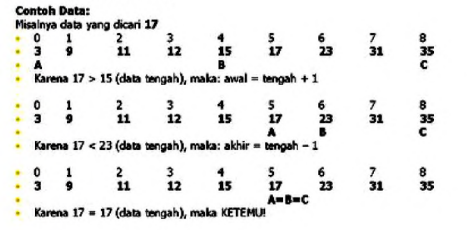
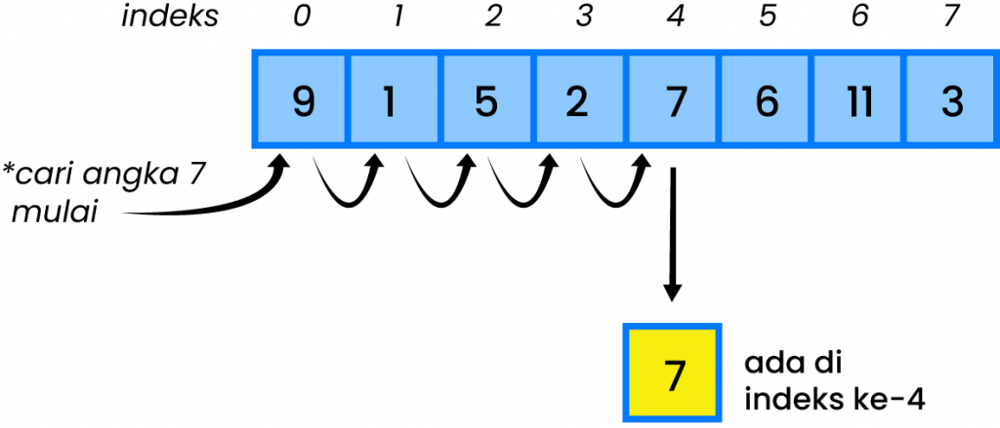
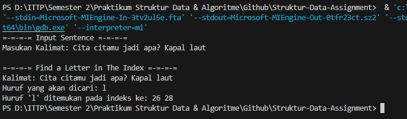
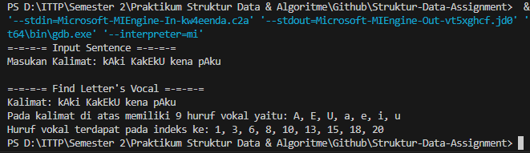
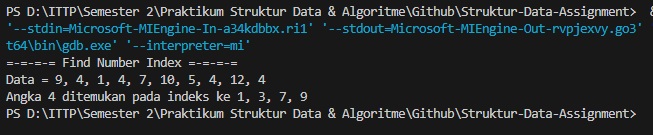

# <h1 align="center">Laporan Praktikum Modul Searching</h1>
<p align="center">Axandio Biyanatul Lizan - 2311102179</p>

## Dasar Teori
Searching adalah metode untuk menemukan informasi dalam aplikasi menggunakan kunci. Ketika lokasi yang tepat dari informasi spesifik sebelumnya tidak diketahui, pencarian diperlukan untuk menemukan informasi spesifik dalam tabel. Berdasarkan jenis operasi pencarian, algoritma ini umumnya diklasifikasikan menjadi dua kategori. Adapun ketegori yang digunakan dalam metode pencarian, yaitu: sekuensial (sequential search) dan Pencarian biner (binary search).  [1] <br/>
1) Binary Search <br/>
Dalam binary search, data yang ada harus diurutkan terlebih dahulu berdasarkan suatu urutan tertentu yang dijadikan kunci pencarian. Sebagai contoh data diambil dari posisi 1 hingga posisi akhir N, kemudian cari posisi data tengah dengan rumus (posisi awal + posisi akhir) / 2. Kekmudian data yang dicari dibandingkan dengan data yang di tengah, apakah sama atau lebih kecil, atau lebih besar? Jika lebih besar, maka proses pencarian dicari dengan posisi awal adalah posisi tengah + 1. Jika lebih kecil, maka proses pencarian dicari dengan posisi akhir adalah posisi tengah -1. Jika data sama berarti data ketemu. [2] <br/>
<br/>
2) Sequential Search <br/>
Pencarian sekuensial (sequential search), atau biasa disebut pencarian linier, menggunakan prinsip sebagai berikut: membandingkan data yang ada dengan konten yang dicari satu per satu secara berurutan. Pada dasarnya pencarian ini hanya mengulang dari 1 sampai jumlah data. Dalam setiap iterasi, data kei dibandingkan dengan 32 konten yang dicari. Jika sama, data telah ditemukan. Sebaliknya, jika tidak ada yang sama sampai akhir pengulangan, berarti data tersebut tidak ada. [1] <br/>
 <br/>

## Guided 

### 1. [Buatlah sebuah project dengan menggunakan sequential search sederhana untuk melakukan pencarian data.]

```C++
/*
Axandio Biyanatul Lizan - 2311102179
*/

#include <iostream>

using namespace std;

int main() {
  // Jumlah data
  int n = 10;

  // Data yang akan dicari
  int data[n] = {9, 4, 1, 7, 5, 12, 4, 13, 4, 10};
  int cari = 10;
  int i;
  // Variabel untuk menandakan apakah data ditemukan
  bool ditemukan = false;

  // Algoritma Sequential Search
  for (i = 0; i < n; i++) {
    if (data[i] == cari) {
      ditemukan = true;
      break;
    }
  }

  // Menampilkan hasil pencarian
  cout << "\t Program Sequential Search Sederhana\n" << endl;
  cout << "Data: {9, 4, 1, 7, 5, 12, 4, 13, 4, 10}" << endl;

  if (ditemukan) {
    cout << "\nAngka " << cari << " ditemukan pada indeks ke-" << i << endl;
  } else {
    cout << cari << " tidak dapat ditemukan pada data." << endl;
  }

  return 0;
}
```
Kode diatas adalah bentuk implementasi dari program searching menggunakan sequential search. Pertama program mendeklarasikan beberapa variabel n dengan nilai 10, kemudian data[n] dengan beberapa data angka, kemudian variabel cari dengan nilai 10, kemudian ada fungsi pengecekan bool ketemu dengan nilai awal false, dan int i untuk perulangan. <br/>
- Setelah Mendeklarasikan beberapa variable terdapat perulangan for untuk sequential search dengan syarat kondisi i dengan nilai awal 0, dan i kurang dari n (10), i akan bertambah 1. Jika data pada array i sama dengan variable cari maka fungsi pengecekan ketemu akan berubah menjadi true, dan looping/perulangan akan berhenti. <br/>
- Kemudian terdapat perkondisian if-else yang kedua, Jika kondisi pertama terpenuhi maka program akan mencetak angka yang dicari dan ditemukan pada indeks tertentu. Jika kondisi ketemu tidak terpenuhi maka program akan memunculkan pesan "Tidak dapat ditemukan pada data.". <br/> <br/>

### 2. [Buatlah sebuah project untuk melakukan pencarian data dengan menggunakan Binary Search.]

```C++
/*
Axandio Biyanatul Lizan - 2311102179
*/

#include <iostream>
#include <iomanip>

using namespace std;

// Deklarasi array dan variabel untuk pencarian
int arrayData[7] = {1, 8, 2, 5, 4, 9, 7};
int cari;

// Fungsi selection sort untuk mengurutkan array
void selectionSort(int arr[], int n) {
    int temp, minIndex;

    for (int i = 0; i < n - 1; i++) {
        minIndex = i;

        for (int j = i + 1; j < n; j++) {
            if (arr[j] < arr[minIndex]) {
                minIndex = j;
            }
        }

        // Tukar elemen
        temp = arr[i];
        arr[i] = arr[minIndex];
        arr[minIndex] = temp;
    }
}

// Fungsi binary search untuk mencari data dalam array yang telah diurutkan
void binarySearch(int arr[], int n, int target) {
    int start = 0, end = n - 1, middle, found = 0;

    while (start <= end && found == 0) {
        middle = (start + end) / 2;

        if (arr[middle] == target) {
            found = 1;
        } else if (arr[middle] < target) {
            start = middle + 1;
        } else {
            end = middle - 1;
        }
    }

    if (found == 1) {
        cout << "\nData ditemukan pada indeks ke-" << middle << endl;
    } else {
        cout << "\nData tidak ditemukan\n";
    }
}

int main() {
    cout << "\tBINARY SEARCH" << endl;

    cout << "\nData awal: ";
    // Menampilkan data awal
    for (int i = 0; i < 7; i++) {
        cout << setw(3) << arrayData[i];
    }
    cout << endl;

    cout << "\nMasukkan data yang ingin Anda cari: ";
    cin >> cari;

    // Mengurutkan data dengan selection sort
    selectionSort(arrayData, 7);

    cout << "\nData diurutkan: ";
    // Menampilkan data setelah diurutkan
    for (int i = 0; i < 7; i++) {
        cout << setw(3) << arrayData[i];
    }
    cout << endl;

    // Melakukan binary search
    binarySearch(arrayData, 7, cari);

    return 0;
}
```
Kode diatas adalah bentuk implementasi dari program Searching yang menggunakan Binary Search untuk mencari suatu data, selain itu kode diatas juga dibantu oleh selection sort untuk mengurutkan data yang ada pada array. <br/>
Pertama program mendeklarasikan sebuah variable global yaitu arrayData yang memiliki panjang array 7 dan ada data didalamnya (1,8,2,5,4,9,7). Selain arrayData, kode juga ada deklarasi untuk variable cari. Berikut penjelasan deklarasi lebih lanjut : <br/>
- void selection_sort(int arr[], int n) <br/>
Deklarasi selection sort digunakan untuk mengurutkan sebuah data pada array dari elemen terkecil hingga elemen terbesar. Dimulai dengan menemukan elemen terkecil dalam array dan menukarnya dengan elemen pertama. Kemudian, elemen terkecil yang telah dipindahkan ini tidak akan lagi dipertimbangkan dalam langkah-langkah selanjutnya. Setelah elemen terkecil dipindahkan ke posisi pertama, langkah tersebut diulang untuk bagian sisa dari array, yaitu dari elemen kedua hingga elemen terakhir. Proses ini dilakukan dengan cara mencari elemen terkecil dalam bagian sisa array yang belum diurutkan, lalu menukarnya dengan elemen pada posisi kedua, dan seterusnya hingga seluruh array terurut. Terdapat dua buah loop for. Loop pertama digunakan untuk menentukan batas iterasi, dimulai dari indeks pertama hingga indeks kedua dari ujung array. Loop kedua digunakan untuk mencari elemen terkecil dalam bagian array yang belum diurutkan, dimulai dari indeks yang sedang diproses oleh loop pertama hingga ujung array. <br/>
- void binary_search(int arr[], int n, int target) <br/>
Deklarasi binary_search digunakan untuk mencari sebuah data. Terdapat deklarasi variable awal dengan nilai awal 0, akhir dengan nilai n - 1, tengah, dan b_flag dengan nilai awal 0. Kemudian terdapat perulangan dengan kondisi jika b_flag == 0 (atau target belum ditemukan) dan awal masih kurang dari atau sama dengan akhir maka loop akan berjalan terus menerus. Kemudian terdapat rumus untuk mencari nilai tengah. setelah itu ada perkondisian if pertama : <br/>
1) Jika nilai array tengah sama dengan target maka b_flag = 1 yang berarti data ditemukan dan looping/perulangan akan berhenti. <br/> 
2) Jika nilai array tengah kurang dari target maka nilai akan ditambah 1 hingga data ditemukan. <br/> 
Disini data yang akan dicari 7, nah nilai tengah array 5, maka jika dimasukan ke kondisi else-if nanti 5 + 1 = 6 (karena nilai 6 masih kurang dari target maka akan looping sekali lagi sehingga menjadi 6 + 1 = 7 (nilai target)).
3) Jika nilai array tengah lebih besar dari target maka nilai akhir dikurangi 1. <br/>
Semisal nilai array tengah ternyata adalah angka 8, maka untuk mencari target adalah dengan cara mengurangi angka 8 dengan 1. <br/> <br/>
Selanjutnya terdapat perkondisian yang kedua yaitu if dan else, jika kondisi if memenuhi (b_flag == 1 (data target ditemukan)) makan program akan mencetak output "Data ditemukan pada index ke - << tengah << endl;. Jika kondisi awal tidak terpenuhi maka akan lanjut ke kondisi terakhir yaitu else, dengan menampilkan output <<"\n Data tidak ditemukan" << endl;. <br/>

Pada int main, terdapat looping/perulangan for untuk menampikan data awal, kemudian program meminta user untuk memasukan data yang akan dicari. Setelah itu program akan mengurutkan data pada arrayData menggunakan selection sort dan untuk menampilkan data yang telah diurutkan menggunakan perulangan for. Kemudian program akan mencetak pencarian data angka 7 pada arrayData yang diambil dari target melalui inputan cari. <br/>

## Unguided 

### 1. Buatlah sebuah program untuk mencari sebuah huruf pada sebuah kalimat yang sudah di input dengan menggunakan Binary Search! <br/>
```C++
/*
Axandio Biyanatul Lizan - 2311102179
*/

#include <iostream>
#include <algorithm>

using namespace std;

// Struktur untuk menyimpan karakter dan indeksnya
struct CharIndex {
    char karakter;
    int indeks;
};

// Fungsi untuk melakukan binary search
int binarySearch(CharIndex arr[], int size, char x) {
    int kiri = 0, kanan = size - 1;
    while (kiri <= kanan) {
        int tengah = kiri + (kanan - kiri) / 2;
        if (arr[tengah].karakter == x)
            return tengah;
        if (arr[tengah].karakter < x)
            kiri = tengah + 1;
        else
            kanan = tengah - 1;
    }
    return -1;
}

int main() {
    string kalimat, hurufDicari;

    cout << "=-=-=-= Input Sentence =-=-=-=" << endl;
    cout << "Masukan Kalimat: ";
    getline(cin, kalimat);

    cout << "\n=-=-=-= Find a Letter in The Index =-=-=-=" << endl;
    cout << "Kalimat: " << kalimat << endl;

    cout << "Huruf yang akan dicari: ";
    cin >> hurufDicari;

    char huruf = hurufDicari[0];
    int length = kalimat.length();

    // Membuat array untuk menyimpan karakter dan indeksnya
    CharIndex* charIndexArray = new CharIndex[length];
    for (int i = 0; i < length; i++) {
        charIndexArray[i].karakter = kalimat[i];
        charIndexArray[i].indeks = i;
    }

    // Mengurutkan array berdasarkan karakter
    sort(charIndexArray, charIndexArray + length, [](CharIndex a, CharIndex b) {
        return a.karakter < b.karakter;
    });

    // Mencari huruf yang dicari
    int index = binarySearch(charIndexArray, length, huruf);
    int* resultIndices = new int[length];
    int resultCount = 0;

    // Jika huruf ditemukan, kita cari semua indeks kemunculannya
    if (index != -1) {
        int tempIndex = index;
        // Cari ke kiri
        while (tempIndex >= 0 && charIndexArray[tempIndex].karakter == huruf) {
            resultIndices[resultCount++] = charIndexArray[tempIndex].indeks;
            tempIndex--;
        }
        // Cari ke kanan
        tempIndex = index + 1;
        while (tempIndex < length && charIndexArray[tempIndex].karakter == huruf) {
            resultIndices[resultCount++] = charIndexArray[tempIndex].indeks;
            tempIndex++;
        }
    }

    // Mengurutkan indeks yang ditemukan
    sort(resultIndices, resultIndices + resultCount);

    // Menampilkan hasil
    if (resultCount > 0) {
        cout << "Huruf '" << huruf << "' ditemukan pada indeks ke: ";
        for (int i = 0; i < resultCount; i++) {
            cout << resultIndices[i] << " ";
        }
        cout << endl;
    } else {
        cout << "Huruf '" << huruf << "' tidak ditemukan dalam kalimat." << endl;
    }

    // Membersihkan memori
    delete[] charIndexArray;
    delete[] resultIndices;

    return 0;
}
```
#### Output Unguided 1:


#### Penjelasan Program Unguided 1:
Kode program c++ diatas adalah implementasi dari Searching yang menggunakan binary search. Pertama ada deklarasi struct dengan nama CharIndex yang menampung variabel karakter dan indeks. Penjelasan lebih rinci mengenai fungsi binarySearch dan fungsi main : <br/>
1) int binarySearch(CharIndex arr[], int size, char x) <br/>
Fungsi diatas digunakan untuk membantu mencari huruf pada suatu kalimat menggunakan binary search. Pertama terdapat deklarasi variabel kiri dengan nilai awal 0, dan kanan size - 1. Terdapat perulangan dengan kondisi kiri kurang dari sama dengan kanan. Terdapat rumus perhitungan untuk mencari nilai tengah array. Kemudian terdapat 2 perkondisian if : <br/>
- Perkondisian IF pertama <br/>
Apabila nilai array tengah karakter sesuai dengan nilai x, maka data ditemukan dengan mengembalikan nilai tengah dan perulangan akan berhenti <br/>
- Perkondisian IF kedua <br/>
Jika perkondisian if pertama tidak terpenuhi maka akan melalui perkondisian IF yang kedua yaitu kondisi awal nilai array tengah data karakter kurang dari x maka nilai kiri = tengah + 1. Jika kondisi awal tidak terpenuhi maka nilai kanan = tengah -1 untuk mencari data yang ingin dicari. <br/> <br/>
Setelah itu jika data belum ditemukan maka program akan terus berulang jika data yang ingin dicari belum ditemukan. <br/>
2) int main() <br/>
Pada fungsi main terdapat deklarasi variabel kalimat dan hurufDicari. kemudian program meminta user untuk memasukan kalimat dan huruf yang akan dicari. Kemudian terdapat deklarasi variabel huruf dengan nilai dari hurufDicari, dan length untuk variabel kalimat. Setelah itu program membuat array untuk menyimpan karakter dan indeks dari karakter (charIndexArray[]). Setelah itu array diurutkan menggunakan sorting dengan mengembalikan nilai karakter a lebih kecil dari karakter b. Setelah array diurutkan, program akan mencari huruf yang dicari dengan inisialisasi index dengan fungsi binarySearch, lalu memanggil pointer untuk menyimpan indeks huruf yang ditemukan pada memori yang dialokasikan sepanjang 'length', lalu menyimpan indeks/elemen array yang ditemukan pada resultIndices. Kemudian jika huruf telah ditemukan, maka program akan mencari semua indeks dari kemunculan huruf tersebut. Setelah itu akan mengurutkan indeks kembali yang telah ditemukan, lalu program akan mencetak/menampilkan hasil. Setelah menampilkan hasil program akan langsung membersihkan memori dari charIndexArray dan resultIndices. <br/> <br/>

### 2. Buatlah sebuah program yang dapat menghitung banyaknya huruf vocal dalam sebuah kalimat! <br/>
```C++
/*
Axandio Biyanatul Lizan - 2311102179
*/

#include <iostream>
#include <set>
#include <cctype>

using namespace std;

struct VocalData {
    int* indices; // Array dinamis untuk menyimpan indeks huruf vokal
    int count;    // Jumlah huruf vokal yang ditemukan
};

// Fungsi untuk memeriksa apakah sebuah karakter adalah huruf vokal
bool isVocal(char ch) {
    ch = tolower(ch); // Mengubah huruf menjadi huruf kecil untuk mempermudah pengecekan
    return ch == 'a' || ch == 'e' || ch == 'i' || ch == 'o' || ch == 'u';
}

// Fungsi sequential search untuk menemukan huruf vokal dan mengisi data dalam VowelData
void sequentialSearchVocals(const string& kalimat, set<char>& vocalsFound, VocalData& vocalData) {
    int length = kalimat.length();
    vocalData.indices = new int[length]; // Alokasikan memori untuk array dinamis
    vocalData.count = 0; // Inisialisasi jumlah huruf vokal

    for (int i = 0; i < length; i++) {
        if (isVocal(kalimat[i])) {
            vocalsFound.insert(kalimat[i]);
            vocalData.indices[vocalData.count++] = i; // Simpan indeks dan tingkatkan jumlah
        }
    }
}

int main() {
    string kalimat;
    cout << "=-=-=-= Input Sentence =-=-=-=" << endl;
    cout << "Masukan Kalimat: ";
    getline(cin, kalimat);

    cout << "\n=-=-=-= Find Letter's Vocal =-=-=-=" << endl;
    cout << "Kalimat: " << kalimat << endl;

    set<char> vocalsFound; // Set untuk menyimpan huruf vokal unik yang ditemukan
    VocalData vocalData;   // Struct untuk menyimpan data huruf vokal

    // Panggil fungsi sequentialSearchVowels untuk menemukan huruf vokal
    sequentialSearchVocals(kalimat, vocalsFound, vocalData);

    cout << "Pada kalimat di atas memiliki " << vocalData.count << " huruf vokal yaitu: ";
    for (auto it = vocalsFound.begin(); it != vocalsFound.end(); ++it) {
        if (it != vocalsFound.begin()) {
            cout << ", ";
        }
        cout << *it;
    }
    cout << endl;

    cout << "Huruf vokal terdapat pada indeks ke: ";
    for (int i = 0; i < vocalData.count; i++) {
        cout << vocalData.indices[i];
        if (i != vocalData.count - 1) {
            cout << ", ";
        }
    }
    cout << endl;

    // Membersihkan memori yang dialokasikan
    delete[] vocalData.indices;

    return 0;
}
```
#### Output Unguided 2:


#### Penjelasan Program Unguided 2:
Kode program diatas merupakan implementasi searching menggunakan sequential search. Pertama adalah deklarasi dari struct VocalData untuk menyimpan pointer indices dan count. Lalu terdapat 2 buah fungsi dan prosedur untuk program dengan rincian penjelasan sebagai berikut : <br/>
1) bool isVocal(char ch) <br/>
Fungsi diatas digunakan untuk pengecekan sebuah karakter apakah huruf vokal atau tidak. Kemudian dalam fungsi tersebut terdapat function tolower untuk merubah huruf besar menjadi huruf kecil. dan mengembalikan nilai ch dengan rincian a,e,i,o, dan u. <br/>
2) void sequentialSearchVocals(const string& kalimat, set<char>& vocalsFound, VocalData& vocalData) <br/>
Deklarasi diatas digunakan untuk mencari huruf vokal menggunakan sequential search dengan ketentuan parameter kalimat, vocalsFound, dan vocalData. Kemudian ada inisialisasi dari length yang berarti menghitung panjang  jumlah karakter dari string yang disimpan dalam variabel kalimat, kemudian ada inisialisasi jumlah huruf vokal dan mengalokasikan memori untuk array dinamis. Lalu ada perulangan for yang digunakan untuk mengecek satu per satu karakter dalam string kalimat. <br/> <br/>
Pada fungsi main terdapat inisialisasi variabel kalimat, dan program meminta user untuk menginputkan kalimat lebih dari 1 kata. Setelah itu program akan menampilkan ulang kalimat yang dimasukan oleh user kemudian menyimpan huruf vokal unik pada set<char> vocalsFound dan menyimpan data dari huruf vokal pada VocalData vocalData. Setelah menyimpan huruf vokal, program akan mencari huruf vokal menggunakan fungsi sequentialSearchVocals. Kemudian program akan mencetak jumlah huruf vokal yang ditemukan dan huruf vokal apa aja yang ditemukan menggunakan perulangan for, lalu program akan mencetak indeks dari huruf vokal. Terakhir program membersihkan array dinamis untuk menyimpan huruf vokal. <br/>

### 3. Diketahui data = 9, 4, 1, 4, 7, 10, 5, 4, 12, 4. Hitunglah berapa banyak angka 4 dengan menggunakan algoritma Sequential Search! <br/>
```C++
/*
Axandio Biyanatul Lizan - 2311102179
*/

#include <iostream>

using namespace std;

struct SearchResult {
    int* indices; // Array dinamis untuk menyimpan indeks
    int count;    // Jumlah elemen yang ditemukan
};

// Fungsi sequential search untuk mencari angka 4 dan mengembalikan indeksnya
void sequentialSearch(const int data[], int size, int target, SearchResult& result) {
    result.indices = new int[size]; // Alokasikan memori untuk array dinamis
    result.count = 0; // Inisialisasi jumlah elemen yang ditemukan

    for (int i = 0; i < size; i++) {
        if (data[i] == target) {
            result.indices[result.count++] = i; // Simpan indeks dan tingkatkan jumlah
        }
    }
}

int main() {
    int data[] = {9, 4, 1, 4, 7, 10, 5, 4, 12, 4};
    int size = sizeof(data) / sizeof(data[0]);
    int target = 4;
    SearchResult result;

    // Panggil fungsi sequentialSearch untuk menemukan angka 4
    sequentialSearch(data, size, target, result);

    cout << "=-=-=-= Find Number Index =-=-=-=" << endl;
    cout << "Data = ";
    for (int i = 0; i < size; i++) {
        cout << data[i];
        if (i != size - 1) {
            cout << ", ";
        }
    }
    cout << endl;

    cout << "Angka " << target << " ditemukan pada indeks ke ";
    for (int i = 0; i < result.count; i++) {
        cout << result.indices[i];
        if (i != result.count - 1) {
            cout << ", ";
        }
    }
    cout << endl;

    // Membersihkan memori yang dialokasikan
    delete[] result.indices;

    return 0;
}
```
#### Output Unguided 3:


#### Penjelasan Program Unguided 3:
Kode program c++ diatas merupakan sebuah implementasi untuk menemukan data menggunakan sequential search. Pertama terdapat deklarasi struct dengan nama SearchResult yang digunakan untuk menyimpan pointer indices dan count. Lalu terdapat deklarasi dan fungsi, penjelasan detail sebagai berikut : <br/>
1) void sequentialSearch(const int data[], int size, int target, SearchResult& result) <br/>
Deklarasi diatas digunakan untuk menemukan sebuah data menggunakan algoritma sequential search. Terdapat inisialisasi untuk jumlah elemen yang ditemukan dengan nilai awal 0, kemudian terdapat alokasi memori untuk array dinamis. Setelah itu ada perulangan for dengan int i awal 0, dan i kurang dari size, i bertambah 1. Kemudian terdapat perkondisian if didalam perulangan for dengan kondisi jika data pada array i == target maka akan menyimpan sebuah indeks dari elemen tersebut dan meningkatkan jumlah. <br/> <br/>
Pada fungsi main terdapat deklarasi data, panjang array, dan target dengan nilai 4, serta pemanggil Struct SearchResult dengan variabel result. Kemudian program melakukan pemanggilan terhadap fungsi sequentialSearch dengan parameter data, size, target, dan result. Kemudian program mencetak nilai pada data menggunakan perulangan for. Setelah itu program kan mencetak angka 4 dan indeks yang ditemukan untuk angka 4 menggunakan perulangan for dengan kondisi nilai i awal = 0, lalu i kurang dari jumlah elemen yang ditemukan dan i bertambah 1, kemudian akan mencetak indeks dimana elemen yang dicari ditemukan dalam array aslinya. Jika i bukan indeks terakhir maka akan ditambahkan tanda koma ',' setelah mencetak indeks. Dan yang terakhir adalah menghapus memori yang dialokasikan secara dinnamis untuk array result.indices dan mencegah terjadinya kebocoran memori setelah digunakan. <br/> 

## Kesimpulan
Dalam pemrograman, pencarian (searching) adalah proses mencari nilai tertentu di dalam kumpulan data (biasanya dalam bentuk array atau daftar). Ada dua jenis utama pencarian yang umum digunakan: binary search (pencarian biner) dan sequential search (pencarian berurutan). <br/>

1. Sequential Search (Pencarian Berurutan): <br/>
- Sequential search adalah metode pencarian yang sederhana dan langsung. <br/>
- Proses pencarian dimulai dari awal hingga akhir kumpulan data. <br/>
- Setiap elemen dalam kumpulan data diperiksa satu per satu hingga nilai yang dicari ditemukan atau sampai akhir kumpulan data. <br/>
- Cocok digunakan untuk kumpulan data yang tidak terurut atau ukuran kumpulan data yang kecil. <br/>
- Kekurangannya adalah kecepatan pencarian kurang efisien untuk kumpulan data yang besar karena memerlukan waktu linier (O(n)) untuk menyelesaikan pencarian. <br/> <br/>

2. Binary Search (Pencarian Biner): <br/>
- Binary search adalah metode pencarian yang lebih efisien yang hanya dapat diterapkan pada kumpulan data yang telah diurutkan. <br/>
- Proses pencarian membagi kumpulan data menjadi dua bagian dan hanya memeriksa bagian mana yang mungkin berisi nilai yang dicari berdasarkan urutan data. <br/>
- Setiap iterasi mengurangi jumlah data yang harus diperiksa menjadi setengah dari iterasi sebelumnya. <br/>
- Cocok digunakan untuk kumpulan data yang besar dan terurut. <br/>
- Keunggulannya adalah memiliki kompleksitas waktu logaritmik (O(log n)), sehingga lebih cepat dibandingkan dengan pencarian berurutan untuk kumpulan data yang besar. <br/><br/>
Kesimpulannya, pemilihan antara sequential search dan binary search tergantung pada sifat kumpulan data yang akan dicari dan urutan data tersebut. Jika kumpulan data tidak terurut atau berukuran kecil, sequential search dapat digunakan. Namun, jika kumpulan data telah diurutkan dan berukuran besar, binary search akan lebih efisien. <br/>
## Referensi
[1] Bahit, M, ALGORITMA PEMROGRAMAN TERSTRUKTUR . Cetakan Pertama. Banjarmasin:Poliban Press,2024.<br/>
[2] Firliana, R, Algoritma & Pemrograman C++. Cetakan Pertama. Prambon Nganjuk:CV.Adjie Media Nusantara, 2018 <br/>