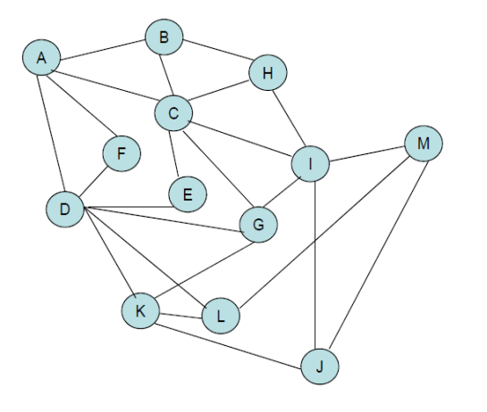

# <h1 align="center">Laporan Praktikum Modul Graph and Tree</h1>
<p align="center">Axandio Biyanatul Lizan - 2311102179</p>

## Dasar Teori
Graph merupakan struktur data yang berbentuk network/jaringan, hubungan antar elemen adalah many-to-many. Graph terdiri dari himpunan verteks (node) dan himpunan sisi (edge, arc). Verteks menyatakan entitasentitas data dan sisi menyatakan keterhubungan antara verteks [2] <br/> <br/>
Notasi matematis graph G : <br/>
G = (V,E) <br/>
V = Verteks, E = Edge <br/>
Subgraph : graph yang merupakan suatu subset (bagian) graph yang connected. [2]<br/>
- Jenis Graph [2] <br/>
1) Directed Graph/digraph (Graf Berarah) : Jika sisi-sisi graph hanya berlaku satu arah. Misalnya : {x,y} yaitu arah x ke y, bukan dari y ke x; x disebut origin dan y disebut terminus. Secara notasi sisi digraph ditulis sebagai vektor (x, y). <br/>
Contoh Digraph G = {V,E}<br/>
V = {A, B, C, D, E, F, G, H, I,J, K, L, M} <br/>
E = {(A,B),(A,C), (A,D), (A,F), (B,C), (B,H), (C,E), (C,G), (C,H), (C,I), (D,E), (D,F), (D,G), (D,K), (D,L), (E,F), (G,I), (G K), (H,I), (I,J), (I,M), (J,K), (J,M), (L,K), (L,M)}.[2] <br/>
<br/> <br/>
2) Undirected Graph/UndiGraph (Graph Tak Berarah) : setiap sisi {x, y} berlaku pada kedua arah: baik x ke y maupun y ke x Secara grafis sisi pada undigraph tidak memiliki mata panah dan secara notasional menggunakan kurung kurawal. <br/>
Contoh Undigraph G = {V, E} <br/>
V = {A, B, C, D, E, F, G, H, I,J, K, L, M} <br/>
E = { {A,B},{A,C}, {A,D}, {A,F}, {B,C}, {B,H}, {C,E}, {C,G}, {C,H}, {C,I}, {D,E}, {D,F}, {D,G}, {D,K}, {D,L}, {E,F}, {G,I}, {G,K}, {H,I}, {I,J}, {I,M}, {J,K}, {J,M}, {L,K}, {L,M}}. <br/>
Khusus graph, undigraph bisa sebagai digraph (panah di kedua ujung edge berlawanan). Struktur data linear maupun hirarkis adalah juga graph. Node-node pada struktur linear ataupun hirarkis adalah verteks-verteks dalam pengertian graph dengan sisi-sisinya menyusun node-node tersebut secara linear atau hirarkis. Struktur data linear adalah juga tree dengan pencabangan pada setiap node hanya satu atau tidak ada. Linear 1-way linked list (digraph), linear 2-way linked lis (undigraph). <br/>
<br/>
Linear 1-way Digraph<br/>
<br/>
Linear 2-way Undigraph <br/> <br/>
Konektivitas pada Undigraph <br/>
- Adjacency: Dua verteks x dan y yang berlainan disebut terhubung langsung (adjacent) jika ada sisi {x, y} dalam E. <br/>
- Path : Urutan dari kumpulan node-node, dimana tiap node dengan node berikutnya dihubungkan dengan Edge <br/>
- Simple Path : Jika node dalam path tsb hanya muncul 1 kali <br/>
- Panjang dari path: jumlah sisi yang dilalui path. <br/>
- Siklus (cycle) : suatu path dengan panjang lebih dari satu, dimana vertex awal dan akhir sama. <br/>
- Siklus sederhana: dalam undigraph, siklus yang terbentuk dari tiga atau lebih verteks yang berlainan, dimana tidak ada vertex muncul lebih satu kali kecuali verteks awal/akhir. <br/>
- Dua verteks x dan y yang berbeda dalam suatu undigraph disebut berkoneksi (connected) apabila ada path penghubung. <br/>
- Suatu komponen terkoneksi (connected components) adalah subgraph (bagian dari graph) yang berisikan satu himpunan bagian verteks yang berkoneksi. [2]<br/> <br/>
3) Weighted Graph (Graf Berarah) : Graph dengan sisi mempunyai Bobot/ Biaya. “Biaya" ini bisa mewakili banyak aspek: biaya ekonomi suatu aktifitas, jarak geografis/tempuh, waktu tempuh, tingkat kesulitan, dan lain sebagainya. Contoh : Graph ini merupakan Undirected Weighted Graph. Order dari verteks A = 4, verteks B = 3, dst. Adjacentcy list dari D adalah = {A, E, F, G, K, L}. [2]<br/>
4) Represenasi Graph <br/>
Representasi Matriks Keterhubungan Langsungv(Adjacency Matrix) Matriks digunakan untuk himpunan adjacency setiap verteks. Baris berisi vertex asal adjacency, sedangkan kolom berisi vertex tujuan adjacency. Bila sisi graph tidak mempunyai bobot, maka [x, y] adjacency disimbolkan dengan 1 dan 0 bila tidak adjacency. Bila sisi graph mempunyai bobot, maka [x, y] adjacency disimbolkan dengan bobot sisi tersebut.[2]<br/><br/>


Tree merupakan salah satu struktur data yang paling penting, karena banyak aplikasi menggunakan informasi dan data yang secara alami memiliki struktur hirarkis berguna dalam membantu memecahkan banyak masalah algoritmis. Tree (atau pohon) sejumlah node yang berhubungan secara hirarkis dimana suatu node pada suatu hirarki merupakan cabang dari node dengan hirarki yang lebih tinggi dan juga memiliki cabang ke beberapa node lainnya dengan hirarki yang lebih rendah.[2] <br/>
Istilah dalam struktur data tree dapat dirangkum sebagai berikut : [2] <br/>
- Root (atau akar) Node dengan hirarki tertinggi dinamakan root. <br/>
- Leaf (atau daun) Node yang tidak memiliki cabang.
- Internal node (atau node dalam) Node yang bukan merupakan leaf. <br/>
- Edge (atau sisi atau cabang) Menyatakan hubungan hirarkis antara kedua node yang terhubungkan, biasanya digambarkan berarah (berupa panah) untuk menunjukkan node asal edge lebih tinggi dari node tujuan dari edge. <br/>
- Level (atau tingkat) suatu node (Kadang dimulai level 0 atau 1) <br/>
- Bilangan yang menunjukan hirarki dari suatu node, root memiliki level 1, node cabang dari root memiliki level 2, node cabang berikutnya dari node adalah level 3, dan seterusnya. <br/>
- Height (atau tinggi) suatu tree, sama dengan level dengan angka terbesar (hirarki terendah) suatu node yang ada dalam tree atau bisa juga didefinisikan sebagai jumlah sisi terbanyak dari root hingga suatu leaf yang ada di tree. <br/>
- Depth (atau kedalaman) suatu node : jumlah sisi dari root hingga node ybs.<br/>
- Subtree (atau subpohon), sebagian dari tree mulai dari suatu node N melingkupi node-node yang berada dibawah hirarkinya sehingga dapat dipandang sebagai suatu tree juga yang mana N sebagai root dari tree ini.<br/>
- Tree kosong : suatu tree yang tidak memiliki satu node pun <br/>
- Predesesor merupakan node yang berada di atas node tertentu. [1] <br/>
- Successor merupakan node yang berada dibawah node tertentu. [1] <br/>
- Ancestor merupakan seluruh node yang terletak sebelum node tertentu dan terletak pada jalur yang sama. [1] <br/>
- Descendant merupakan seluruh node yang terletak sesudah node tertentu dan terletak pada jalur yang sama. [1] <br/>
- Parent merupakan predesesor satu level di atas satu node.[1] <br/>
- Child merupakan successor satu level di bawah suatu node. [1] <br/>
- Sibling merupakan node-node yang memiliki parent yang sama dengan suatu node. [1] <br/>
<br/>

Binary tree adalah tree syaratnya setiap node hanya boleh memiliki paling banyak dua subtree, dan kedua subtree tersebut harus dipisahkan. Dengan definisi ini, setiap node di binary tree hanya dapat memiliki paling banyak dua child.[1] <br/>
<br/>
Transversal Binary Tree : [1]<br/>
- Preorder adalah urutan kunjungan dari node mengunjungi
node utama, kemudian mengunjungi node di sebelah kiri, dan terakhir mengunjungi node di sebelah kanan. <br/>
- Inorder adalah kunjungan dimana node yang dikunjungi mempunyai urutan dikunjungi node di sebelah kiri, kemudian mengunjungi node asli dan terakhir kunjungi node di sebelah kanan. <br/>
- Postorder adalah kunjungan dimana node yang berkunjung diperintahkan untuk mengunjungi node (L) di subtree kiri, kemudian mengunjungi node di sebelah kanan (R), dan terakhir mengunjungi node itu sendiri (V).<br/><br/>
Jenis operasi pada tree : <br/>
1) Create: digunakan untuk membentuk binary tree baru yang masih kosong. <br/>
2) Clear: digunakan untuk mengosongkan binary tree yang sudah ada atau menghapus semua node pada binary tree.<br/>
3) isEmpty: digunakan untuk memeriksa apakah binary tree masih kosong atau tidak.<br/>
4) Insert: digunakan untuk memasukkan sebuah node kedalam tree. <br/>
5)  Find: digunakan untuk mencari root, parent, left child, atau right child dari suatu node dengan syarat tree tidak boleh kosong.<br/>
6) Update: digunakan untuk mengubah isi dari node yang ditunjuk oleh pointer current dengan syarat tree tidak boleh kosong.<br/>
7) Retrive: digunakan untuk mengetahui isi dari node yang ditunjuk pointer current dengan syarat tree tidak boleh kosong.<br/>
8) Delete Sub: digunakan untuk menghapus sebuah subtree (node beserta seluruh descendant-nya) yang ditunjuk pointer current dengan syarat tree tidak boleh kosong.<br/>
9) Characteristic: digunakan untuk mengetahui karakteristik dari suatu tree. Yakni size, height, serta average lenght-nya.<br/>
10) Traverse: digunakan untuk mengunjungi seluruh node-node pada tree dengan cara traversal. Terdapat 3 metode traversal yang dibahas dalam modul ini yakni Pre-Order, In-Order, dan Post-Order.<br/><br/>

## Guided 

### 1. [Program Graph]

```C++
// Graph Code
/*
Axandio Biyanatul Lizan - 2311102179
*/

#include <iostream>
#include <iomanip>

using namespace std;

const string simpul[7] = {
    "Ciamis",
    "Bandung",
    "Bekasi",
    "Tasikmalaya",
    "Cianjur",
    "Purwokerto",
    "Yogyakarta"
};

const int busur[7][7] = {
    {0, 7, 8, 0, 0, 0, 0},
    {0, 0, 5, 0, 0, 15, 0},
    {0, 6, 0, 0, 5, 0, 0},
    {0, 5, 0, 0, 2, 4, 0},
    {23, 0, 0, 10, 0, 0, 8},
    {0, 0, 0, 0, 7, 0, 3},
    {0, 0, 0, 0, 9, 4, 0}
};

void tampilGraph() {
    for (int baris = 0; baris < 7; baris++) {
        cout << " " << setw(15) << left << simpul[baris] << " : ";
        for (int kolom = 0; kolom < 7; kolom++) {
            if (busur[baris][kolom] != 0) {
                cout << " " << setw(15) << left << simpul[kolom] << "(" << busur[baris][kolom] << ")";
            }
        }
        cout << endl;
    }
}

int main() {
    tampilGraph();
    return 0;
}
```
Kode diatas adalah bentuk implementasi dari program graph sederhana dengan 2 variabel array yang bersifat public. Array pertama mendeklarasikan data string dengan maksimal penyimpanan array yaitu 7 (indeks 0-6), Array kedua menggunakan 2 dimensi/matriks yang berguna untuk menyimpan data busur dengan tipe data int. Lalu ada deklarasi tampilGraph yang berguna untuk menampilkan nama graph dan bobot/jarak busur antar kota. Pada int main hanya memanggil deklarasi tampilGraph dan program tidak ada perulangan. <br/>
Deklarasi tampilGraph : <br/>
- Perulangan 'for' yang pertama berfungsi untuk Menampilkan nama simpul (node) pada indeks baris dari array simpul. set (15) digunakan untuk mengatur lebar keluaran menjadi 15 karakter, left digunakan untuk meratakan teks ke kiri. Karakter : digunakan untuk menunjukkan koneksi simpul dengan simpul lainnya. <br/>
- Perulangan 'for' yang kedua memiliki kondisi if yang berfungsi Memeriksa apakah ada busur (edge) yang menghubungkan simpul pada indeks baris dengan simpul pada indeks kolom. Jika nilai busur[baris][kolom] tidak sama dengan 0, berarti ada koneksi antar simpul. Jika kondisi pada if terpenuhi, maka program akan menampilkan nama simpul pada indeks kolom dari array simpul, diikuti dengan bobot busur yang menghubungkan simpul baris dan kolom. setw(15) dan left digunakan untuk mengatur tampilan keluaran, memastikan setiap simpul dan bobotnya ditampilkan dalam kolom yang rata ke kiri dengan lebar 15 karakter. <br/> <br/>

### 2. [Program Tree]

```C++
// Tree Code
/*
Axandio Biyanatul Lizan - 2311102179
*/

#include <iostream>
using namespace std;

// PROGRAM BINARY TREE
// Deklarasi Pohon
struct Pohon {
    char data;
    Pohon *left, *right, *parent; // pointer
};

// pointer global
Pohon *root;

// Inisialisasi
void init() {
    root = NULL;
}

bool isEmpty() {
    return root == NULL;
}

Pohon *newPohon(char data) {
    Pohon *node = new Pohon();
    node->data = data;
    node->left = NULL;
    node->right = NULL;
    node->parent = NULL;
    return node;
}

void buatNode(char data) {
    if (isEmpty()) {
        root = newPohon(data);
        cout << "\nNode " << data << " berhasil dibuat menjadi root." << endl;
    } else {
        cout << "\nPohon sudah dibuat" << endl;
    }
}

Pohon *insertLeft(char data, Pohon *node) {
    if (isEmpty()) {
        cout << "\nBuat tree terlebih dahulu!" << endl;
        return NULL;
    } else {
        if (node->left != NULL) {
            cout << "\nNode " << node->data << " sudah ada child kiri!" << endl;
            return NULL;
        } else {
            Pohon *baru = newPohon(data);
            baru->parent = node;
            node->left = baru;
            cout << "\nNode " << data << " berhasil ditambahkan ke child kiri " << node->data << endl;
            return baru;
        }
    }
}

Pohon *insertRight(char data, Pohon *node) {
    if (isEmpty()) {
        cout << "\nBuat tree terlebih dahulu!" << endl;
        return NULL;
    } else {
        if (node->right != NULL) {
            cout << "\nNode " << node->data << " sudah ada child kanan!" << endl;
            return NULL;
        } else {
            Pohon *baru = newPohon(data);
            baru->parent = node;
            node->right = baru;
            cout << "\nNode " << data << " berhasil ditambahkan ke child kanan " << node->data << endl;
            return baru;
        }
    }
}

void update(char data, Pohon *node) {
    if (isEmpty()) {
        cout << "\nBuat tree terlebih dahulu!" << endl;
    } else {
        if (!node)
            cout << "\nNode yang ingin diganti tidak ada!!" << endl;
        else {
            char temp = node->data;
            node->data = data;
            cout << "\nNode " << temp << " berhasil diubah menjadi " << data << endl;
        }
    }
}

void retrieve(Pohon *node) {
    if (isEmpty()) {
        cout << "\nBuat tree terlebih dahulu!" << endl;
    } else {
        if (!node)
            cout << "\nNode yang ditunjuk tidak ada!" << endl;
        else {
            cout << "\nData node : " << node->data << endl;
        }
    }
}

void find(Pohon *node) {
    if (isEmpty()) {
        cout << "\nBuat tree terlebih dahulu!" << endl;
    } else {
        if (!node)
            cout << "\nNode yang ditunjuk tidak ada!" << endl;
        else {
            cout << "\nData Node : " << node->data << endl;
            cout << "Root : " << root->data << endl;
            if (!node->parent)
                cout << "Parent : (tidak punya parent)" << endl;
            else
                cout << "Parent : " << node->parent->data << endl;
            if (node->parent != NULL && node->parent->left != node && node->parent->right == node)
                cout << "Sibling : " << node->parent->left->data << endl;
            else if (node->parent != NULL && node->parent->right != node && node->parent->left == node)
                cout << "Sibling : " << node->parent->right->data << endl;
            else
                cout << "Sibling : (tidak punya sibling)" << endl;
            if (!node->left)
                cout << "Child Kiri : (tidak punya Child kiri)" << endl;
            else
                cout << "Child Kiri : " << node->left->data << endl;
            if (!node->right)
                cout << "Child Kanan : (tidak punya Child kanan)" << endl;
            else
                cout << "Child Kanan : " << node->right->data << endl;
        }
    }
}

// Penelusuran (Traversal)
// preOrder
void preOrder(Pohon *node) {
    if (isEmpty())
        cout << "\nBuat tree terlebih dahulu!" << endl;
    else {
        if (node != NULL) {
            cout << " " << node->data << ", ";
            preOrder(node->left);
            preOrder(node->right);
        }
    }
}

// inOrder
void inOrder(Pohon *node) {
    if (isEmpty())
        cout << "\nBuat tree terlebih dahulu!" << endl;
    else {
        if (node != NULL) {
            inOrder(node->left);
            cout << " " << node->data << ", ";
            inOrder(node->right);
        }
    }
}

// postOrder
void postOrder(Pohon *node) {
    if (isEmpty())
        cout << "\nBuat tree terlebih dahulu!" << endl;
    else {
        if (node != NULL) {
            postOrder(node->left);
            postOrder(node->right);
            cout << " " << node->data << ", ";
        }
    }
}

// Hapus Node Tree
void deleteTree(Pohon *node) {
    if (isEmpty())
        cout << "\nBuat tree terlebih dahulu!" << endl;
    else {
        if (node != NULL) {
            if (node != root) {
                if (node->parent->left == node)
                    node->parent->left = NULL;
                else if (node->parent->right == node)
                    node->parent->right = NULL;
            }
            deleteTree(node->left);
            deleteTree(node->right);
            if (node == root) {
                delete root;
                root = NULL;
            } else {
                delete node;
            }
        }
    }
}

// Hapus SubTree
void deleteSub(Pohon *node) {
    if (isEmpty())
        cout << "\nBuat tree terlebih dahulu!" << endl;
    else {
        deleteTree(node->left);
        deleteTree(node->right);
        cout << "\nNode subtree " << node->data << " berhasil dihapus." << endl;
    }
}

// Hapus Tree
void clear() {
    if (isEmpty())
        cout << "\nBuat tree terlebih dahulu!!" << endl;
    else {
        deleteTree(root);
        cout << "\nPohon berhasil dihapus." << endl;
    }
}

// Cek Size Tree
int size(Pohon *node) {
    if (isEmpty()) {
        cout << "\nBuat tree terlebih dahulu!!" << endl;
        return 0;
    } else {
        if (!node) {
            return 0;
        } else {
            return 1 + size(node->left) + size(node->right);
        }
    }
}

// Cek Height Level Tree
int height(Pohon *node) {
    if (isEmpty()) {
        cout << "\nBuat tree terlebih dahulu!" << endl;
        return 0;
    } else {
        if (!node) {
            return 0;
        } else {
            int heightKiri = height(node->left);
            int heightKanan = height(node->right);
            if (heightKiri >= heightKanan) {
                return heightKiri + 1;
            } else {
                return heightKanan + 1;
            }
        }
    }
}

// Karakteristik Tree
void characteristic() {
    int s = size(root);
    int h = height(root);
    cout << "\nSize Tree : " << s << endl;
    cout << "Height Tree : " << h << endl;
    if (h != 0)
        cout << "Average Node of Tree : " << s / h << endl;
    else
        cout << "Average Node of Tree : 0" << endl;
}

int main() {
    init();
    buatNode('A');
    Pohon *nodeB, *nodeC, *nodeD, *nodeE, *nodeF, *nodeG, *nodeH, *nodeI, *nodeJ;
    nodeB = insertLeft('B', root);
    nodeC = insertRight('C', root);
    nodeD = insertLeft('D', nodeB);
    nodeE = insertRight('E', nodeB);
    nodeF = insertLeft('F', nodeC);
    nodeG = insertLeft('G', nodeE);
    nodeH = insertRight('H', nodeE);
    nodeI = insertLeft('I', nodeG);
    nodeJ = insertRight('J', nodeG);

    update('Z', nodeC);
    update('C', nodeC);
    retrieve(nodeC);
    find(nodeC);

    cout << "\nPreOrder :" << endl;
    preOrder(root);
    cout << "\n" << endl;

    cout << "InOrder :" << endl;
    inOrder(root);
    cout << "\n" << endl;

    cout << "PostOrder :" << endl;
    postOrder(root);
    cout << "\n" << endl;

    characteristic();

    deleteSub(nodeE);

    cout << "\nPreOrder :" << endl;
    preOrder(root);
    cout << "\n" << endl;

    characteristic();

    return 0;
}

```
Kode diatas adalah bentuk implementasi dari program tree tanpa menggunakan sebuah menu switch-case berikut adalah rincian lebih lanjut :
1) void init() <br/>
Deklarasi diatas digunakan untuk menginisialisasi root dengan nilai awal 0. <br/>
2)  bool isEmpty() <br/>
Fungsi diatas adalah pengecekan apakah kosong atau tidak, fungsi akan bernilai true jika root bernilai 0.<br/>
3)  Pohon *newPohon(char data) <br/>
Fungsi diatas digunakan untuk menambahkan sebuah node pohon baru tanpa anak kanan, anak kiri, atau parent, dengan variabel char untuk parameternya, kemudian mengembalikan nilai node. <br/>
4) void buatNode(char data) <br/>
Deklarasi diatas digunakan untuk membuat sebuah node menjadi root. Pertama terdapat perkondisian if-else yang digunakan untuk pengecekan apakah root kosong atau tidak, jika if kondisi terpenuhi maka node akan dibuat menjadi root. Jika if kondisi tidak terpenuhi, program akan memunculkan pesan pohon sudah dibuat. <br/>
5)  Pohon *insertLeft(char data, Pohon *node) <br/>
Fungsi diatas digunakan untuk membuat anak kiri dengan parameter data dengan tipe data char, dan pointer node. Lalu terdapat perkondisian if-else, jika kondisi if terpenuhi berarti user belum membuat pohon / root. Jika kondisi if tidak terpenuhi, maka akan terjadi perkondisian if-else yang kedua, dimana jika if kondisi terpenuhi maka program akan mengecek apakah node disebelah kiri isi atau kosong, jika kosong maka akan menampilkan pesan ke user bahwa node sudah ada child kiri. Lalu jika if kondisi tidak terpenuhi maka akan memperbarui child kiri dengan data yang baru. <br/>
6) Pohon *insertRight(char data, Pohon *node) <br/>
Fungsi ini sistem kerjanya sama dengan fungsi no 5, dimana pada fungsi ini untuk menambahkan child disebelah kanan. <br/>
7) void update(char data, Pohon *node) <br/>
Deklarasi diatas digunakan untuk memperbarui data pada tree yang sudah dibuat. Pertama program akan melakukan pengecekan apakah pohon kosong, jika kosong maka program akan menampilkan text yang menyuruh user untuk membuat pohon terlebih dahulu. Jika tree/pohon isi maka terdapat perkondisian yang kedua dimana jika if terpenuhi dengan kondisi bukan node maka program akan menampilkan pesan node yang ingin diganti tidak ada. Jika if kondisi tidak terpenuhi maka program akan mencari data pada temp, kemudian akan memperbarui data pada temp tersebut. <br/>
8) void retrieve(Pohon *node) <br/>
Deklarasi diatas digunakan untuk menunjuk data node dalam bentuk pointer. Sistem kerja pertama ialah pengecekan apakah tree kosong atau tidak, jika kosong maka tidak dapat meretrieve pohon. Jika isi maka terdapat perkondisian yang kedua dimana if akan mengecek apakah terdapat node atau tidak, jika terdapat node maka akan menampilkan data node, jika !node maka akan menampilkan pesan buat tree terlebih dahulu. <br/>
9) void find(Pohon *node) <br/>
Deklarasi diatas digunakan untuk mencari sebuah data ode berdasarkan root yang dimasukan. Jika data ditemukan maka akan menampilkan data node, root, parent, sibling, child kiri, dan child kanan. <br/>
10) void showChild(Pohon *node) <br/>
Deklarasi diatas digunakan untuk menampilkan anak kiri dan kanan dari sebuah tree. Pertama seperti biasa yang itu pengecekan apakah root kosong atau tidak. Jika kosong maka program akan menyuruh user membuat tree terlebih dahulu. Jika root isi maka akan ada pengecekan kondisi if yang kedua dimana jika tidak ada node program akan menampilkan pesan untuk user node yang ditunjuk tidak ada!. Jika terdapat node maka akan menampilkan node yang akan dicari dan anaknya (anak kiri dan anak kanan). <br/>
11) void preOrder(Pohon *node) <br/>
Deklarasi diatas digunakan untuk menampilkan data node dalam posisi preOrder, dipastikan bahwa node tidak boleh kosong. <br/>
12) void showDescendants(Pohon *node) <br/>
Deklarasi diatas digunakan untuk menampilkan descendants dari sebuah root. sepeerti biasa terdapat pengecekan dan root tidak boleh kosong dan root harus terdapat sebuah node. Kemudian akan menampilkan descendant dari sebuah root dengan posisi preOrder. <br/>
13) void inOrder(Pohon *node) <br/>
Deklarasi diatas digunakan untuk merubah posisi node asli di sebelah kanan node kiri, kemudian node kanan. Jadi node kiri, node asli, dan node kanan <br/>
14) void postOrder(Pohon *node) <br/>
Deklarasi diatas digunakan untuk merubah node asli ke posisi paling kanan, dan susunan nodenya berubah menjadi node kiri, node kanan, dan node asli. <br/>
15) void deleteTree(Pohon *node) <br/>
Deklarasi diatas digunakan untuk menghapus seluruh pohon biner mulai dari node yang diberikan. Jika node tersebut bukan root, ia akan memutus hubungan node dari parent-nya terlebih dahulu sebelum menghapus node dan seluruh subtreenya secara rekursif. Jika node tersebut adalah root, ia akan menghapus root dan mengatur root ke NULL. <br/>
16) void deleteSub(Pohon *node) <br/>
Deklarasi diatas digunakan untuk menghapus sub root, seperti biasa terdapat pengecekan apakah root kosong atau tidak, jika if kondisi tidak terpenuhi maka subtree kanan dan kiri akan dihapus menggunakan deleteTree dengan cara memutuskan hubungan node dari parentnya kemudian di set ke 0/NULL. <br/>
17) void clear() <br/>
Deklarasi diatas digunakan untuk menghapus keseluruhan root/tree. <br/>
18) int size(Pohon *node) <br/>
Fungsi diatas digunakan untuk menghitung ukuran (jumlah node) dari sebuah pohon biner yang diwakili oleh node yang diberikan.  <br/>
19) int height(Pohon *node) <br/>
Fungsi diatas digunakan untuk menghitung tinggi level dari sebuah root/tree. Jika root/tree tersebut tidak terdapat sebuah node maka program akan berhenti. Jika terdapat sebuah node maka akan menghitung dari tinggi kiri dan tinggi kanan sebuah node. <br/>
20) void characteristic() <br/>
Deklarasi diatas digunakan untuk menampilkan karakteristik dari sebuah root/tree. Menampilkan size dan tinggi root, size dan tinggi tree. <br/> <br/>

Pada int main, terdapat fungsi init dengan nilai kosong. Kemudian deklarasi buatnode dengan char A. Kemudian menambahkan beberapa char sebagai anak kiri dan anak kanan. Lalu memperbarui nilai C menjadi Z, dan C menjadi Z kembali. Lalu menunjuk dan mencari data C. Setelah itu menampilkan data preOrder, inOrder, dan postOrder. Lalu Menampilkan karakteristik root. Kemudian menghapus subtree node E dan menampilkan PreOrder kembali setelah menghapus subtree node E. Terakhir menampilkan sebuah karakteristik dari tree setelah dihapus node E.

## Unguided 

### 1. Buatlah program graph dengan menggunakan inputan user untuk menghitung jarak dari sebuah kota ke kota lainnya. Yang memiliki output program seperti dibawah ini : <br/>
 <br/>
```C++
/*
Axandio Biyanatul Lizan - 2311102179
*/

#include <iostream>
#include <iomanip>
#include <string>

using namespace std;

const int MAX_CITIES = 10; //Maksimal banyak data yang dapat ditampung pada variabel MAX_CITIES untuk struct Graph

struct Graph {
    string axandio_2311102179[MAX_CITIES]; // Banyaknya data string yang dapat disimpan dalam string sesuai dengan kapasitas MAX_CITIES
    int adjacencyMatrix[MAX_CITIES][MAX_CITIES]; // Menggunakan array 2 dimensi, dengan ukuran maksimal sesuai MAX_CITIES
    int numCities; // Variabel yang digunakan untuk menyimpan jumlah kota dalam graph
};

void printMatrix(const Graph& graph) {
    cout << setw(10) << " ";
    for (int i = 0; i < graph.numCities; i++) {
        cout << setw(10) << graph.axandio_2311102179[i];
    }
    cout << endl;

    for (int i = 0; i < graph.numCities; i++) {
        cout << setw(10) << graph.axandio_2311102179[i];
        for (int j = 0; j < graph.numCities; j++) {
            cout << setw(10) << graph.adjacencyMatrix[i][j];
        }
        cout << endl;
    }
}

int main() {
    Graph graph;
    cout << "\n=-=-=-= Aplikasi rangeXan (Jarak Antar Kota) =-=-=-=" << endl;
    cout << "Silahkan masukan jumlah simpul: ";
    cin >> graph.numCities;
    cin.ignore(); // Mengabaikan karakter newline yang tersisa

    for (int i = 0; i < graph.numCities; i++) {
        cout << "Simpul " << i + 1 << ": ";
        getline(cin, graph.axandio_2311102179[i]);
    }

    cout << "Silahkan masukan bobot antar simpul" << endl;
    for (int i = 0; i < graph.numCities; i++) {
        for (int j = 0; j < graph.numCities; j++) {
            cout << graph.axandio_2311102179[i] << " ---> " << graph.axandio_2311102179[j] << " = ";
            cin >> graph.adjacencyMatrix[i][j];
        }
    }

    cout << endl;
    printMatrix(graph);

    return 0;
}
```
#### Output Unguided 1:


#### Penjelasan Program Unguided 1:
Kode program c++ diatas adalah bentuk representasi program graph yang meminta bantuan menghitung jarak antar kota menggunakan input manual dari user. Pertama terdapat deklarasi dari variabel MAX_CITIES yang berfungsi untuk menampung maksimal banyak data sebanyak 10. Kemudian ada struct graph yang berfungsi untuk menyimpan string data untuk nama kota, array 2 dimensi, dan menyimpan jumlah kota dalam graph. Lalu ada deklarasi printMatrix yang berfungsi untuk menampilkan data dari graph. Penjelasan lebih lanjut : <br/>
- void printMatrix(const Graph& graph) <br/>
Deklarasi diatas menggunakan 2 perulangan for untuk menampilkan data. Perulangan 'for' yang pertama memiliki alur memulai loop for yang akan mengulang sebanyak graph.numCities. Variabel i akan berjalan dari 0 hingga graph.numCities - 1. Loop ini digunakan untuk iterasi melalui semua kota yang ada dalam objek graph. Kemudian menampilkan nama atau data dari setiap kota. graph.axandio_2311102179[i] mengakses elemen ke-i dari array axandio_2311102179 yang terdapat dalam objek graph. setw(10) digunakan untuk mengatur lebar keluaran menjadi 10 karakter, memastikan bahwa setiap nama kota ditampilkan dalam kolom yang rata kanan dengan lebar 10 karakter. Perulangan 'for' yang kedua digunakan untuk menampilkan daftar nama kota yang terdapat dalam objek graph beserta nilai elemen matriks ketetanggaan yang terkait dengan setiap kota. Matriks ketetanggaan (adjacencyMatrix) biasanya digunakan untuk merepresentasikan graf, di mana setiap elemen matriks menunjukkan ada atau tidaknya hubungan (atau bobot hubungan) antara dua kota.<br/><br/>
Pada int main, pertama mendeklarasikan struct Graph dengan nama graph. Kemudian meminta user untuk memasukan jumlah simpul yang nantinya akan disimpan dalam struct Graph dengan nama numCities. Lalu ada cin.ignore yang digunakan untuk mengabaikan karakter pada newline yang tersisa. Lalu terdapat perulangan for yang digunakan untuk menampilkan simpul yang sesuai dengan jumlah simpul pada graph,numCities, selain itu juga meminta user untuk menginputkan nama kota. Lalu pada perulangan for yang kedua digunakan untuk user memasukan bobot antar simpul. Terakhir program akan menampilkan data graph menggunakan deklarasi printMatrix dengan parameter graph. <br/> <br/>

### 2. Modifikasi guided tree diatas dengan program menu menggunakan input data tree dari user dan berikan fungsi tambahan untuk menampilkan node child dan descendant dari node yang diinput kan! <br/>
```C++

    /*
    Axandio Biyanatul Lizan - 2311102179
    */

    #include <iostream>
    using namespace std;

    // PROGRAM BINARY TREE
    // Deklarasi Pohon
    struct Pohon {
        char data;
        Pohon *left, *right, *parent; // pointer
    };

    // pointer global
    Pohon *root;

    // Inisialisasi
    void init() {
        root = NULL;
    }

    bool isEmpty() {
        return root == NULL;
    }

    Pohon *newPohon(char data) {
        Pohon *node = new Pohon();
        node->data = data;
        node->left = NULL;
        node->right = NULL;
        node->parent = NULL;
        return node;
    }

    void buatNode(char data) {
        if (isEmpty()) {
            root = newPohon(data);
            cout << "\nHooorayyy, Node " << data << " berhasil dibuat menjadi root." << endl;
        } else {
            cout << "\nPohon sudah dibuat" << endl;
        }
    }

    Pohon *insertLeft(char data, Pohon *node) {
        if (isEmpty()) {
            cout << "\nHeyy! Buat tree terlebih dahulu!" << endl;
            return NULL;
        } else {
            if (node->left != NULL) {
                cout << "\nyahhhh... Node " << node->data << " sudah ada child kiri!" << endl;
                return NULL;
            } else {
                Pohon *baru = newPohon(data);
                baru->parent = node;
                node->left = baru;
                cout << "\nYesss!! Node " << data << " berhasil ditambahkan ke child kiri " << node->data << endl;
                return baru;
            }
        }
    }

    Pohon *insertRight(char data, Pohon *node) {
        if (isEmpty()) {
            cout << "\nHeyy!! buat tree terlebih dahulu!" << endl;
            return NULL;
        } else {
            if (node->right != NULL) {
                cout << "\nYahhh... Node " << node->data << " sudah ada child kanan!" << endl;
                return NULL;
            } else {
                Pohon *baru = newPohon(data);
                baru->parent = node;
                node->right = baru;
                cout << "\nYesss!! Node " << data << " berhasil ditambahkan ke child kanan " << node->data << endl;
                return baru;
            }
        }
    }

    void update(char data, Pohon *node) {
        if (isEmpty()) {
            cout << "\nHeyy!! buat tree terlebih dahulu!" << endl;
        } else {
            if (!node)
                cout << "\nNode yang ingin diganti tidak ada!!" << endl;
            else {
                char temp = node->data;
                node->data = data;
                cout << "\nHooorayy!! Node " << temp << " berhasil diubah menjadi " << data << endl;
            }
        }
    }

    void retrieve(Pohon *node) {
        if (isEmpty()) {
            cout << "\nHeyy!! Buat tree terlebih dahulu!" << endl;
        } else {
            if (!node)
                cout << "\nNode yang ditunjuk tidak ada!" << endl;
            else {
                cout << "\nData node : " << node->data << endl;
            }
        }
    }

    void find(Pohon *node) {
        if (isEmpty()) {
            cout << "\nHeyy!! Buat tree terlebih dahulu!" << endl;
        } else {
            if (!node)
                cout << "\nNode yang ditunjuk tidak ada!" << endl;
            else {
                cout << "\nData Node : " << node->data << endl;
                cout << "Root : " << root->data << endl;
                if (!node->parent)
                    cout << "Parent : (tidak punya parent)" << endl;
                else
                    cout << "Parent : " << node->parent->data << endl;
                if (node->parent != NULL && node->parent->left != node && node->parent->right == node)
                    cout << "Sibling : " << node->parent->left->data << endl;
                else if (node->parent != NULL && node->parent->right != node && node->parent->left == node)
                    cout << "Sibling : " << node->parent->right->data << endl;
                else
                    cout << "Sibling : (tidak punya sibling)" << endl;
                if (!node->left)
                    cout << "Child Kiri : (tidak punya Child kiri)" << endl;
                else
                    cout << "Child Kiri : " << node->left->data << endl;
                if (!node->right)
                    cout << "Child Kanan : (tidak punya Child kanan)" << endl;
                else
                    cout << "Child Kanan : " << node->right->data << endl;
            }
        }
    }

    void showChild(Pohon *node) {
        if (isEmpty()) {
            cout << "\nHeyy!! Buat tree terlebih dahulu!" << endl;
        } else {
            if (!node) {
                cout << "\nNode yang ditunjuk tidak ada!" << endl;
            } else {
                cout << "\nNode " << node->data << " Child: " << endl;
                if (node->left)
                    cout << "Child Kiri : " << node->left->data << endl;
                else
                    cout << "Child Kiri : (tidak punya Child kiri)" << endl;
                if (node->right)
                    cout << "Child Kanan : " << node->right->data << endl;
                else
                    cout << "Child Kanan : (tidak punya Child kanan)" << endl;
            }
        }
    }

    // Penelusuran (Traversal)
    // preOrder
    void preOrder(Pohon *node) {
        if (node != NULL) {
            cout << " " << node->data << ", ";
            preOrder(node->left);
            preOrder(node->right);
        }
    }

    void showDescendants(Pohon *node) {
        if (isEmpty()) {
            cout << "\nHeyy!! Buat tree terlebih dahulu!" << endl;
        } else {
            if (!node) {
                cout << "\nNode yang ditunjuk tidak ada!" << endl;
            } else {
                cout << "\nDescendants of node " << node->data << " : ";
                preOrder(node);
                cout << endl;
            }
        }
    }

    // Penelusuran (Traversal)
    // inOrder
    void inOrder(Pohon *node) {
        if (node != NULL) {
            inOrder(node->left);
            cout << " " << node->data << ", ";
            inOrder(node->right);
        }
    }

    // postOrder
    void postOrder(Pohon *node) {
        if (node != NULL) {
            postOrder(node->left);
            postOrder(node->right);
            cout << " " << node->data << ", ";
        }
    }

    // Hapus Node Tree
    void deleteTree(Pohon *node) {
        if (node != NULL) {
            if (node != root) {
                if (node->parent->left == node)
                    node->parent->left = NULL;
                else if (node->parent->right == node)
                    node->parent->right = NULL;
            }
            deleteTree(node->left);
            deleteTree(node->right);
            if (node == root) {
                delete root;
                root = NULL;
            } else {
                delete node;
            }
        }
    }

    // Hapus SubTree
    void deleteSub(Pohon *node) {
        if (isEmpty()) {
            cout << "\nHeyy!! Buat tree terlebih dahulu!" << endl;
        } else {
            deleteTree(node->left);
            deleteTree(node->right);
            cout << "\nHoorayy!! Node subtree " << node->data << " berhasil dihapus." << endl;
        }
    }

    // Hapus Tree
    void clear() {
        if (isEmpty()) {
            cout << "\nHeyy!! Buat tree terlebih dahulu!!" << endl;
        } else {
            deleteTree(root);
            cout << "\nHoorayy!! Pohon berhasil dihapus." << endl;
        }
    }

    // Cek Size Tree
    int size(Pohon *node) {
        if (!node) {
            return 0;
        } else {
            return 1 + size(node->left) + size(node->right);
        }
    }

    // Cek Height Level Tree
    int height(Pohon *node) {
        if (!node) {
            return 0;
        } else {
            int heightKiri = height(node->left);
            int heightKanan = height(node->right);
            if (heightKiri >= heightKanan) {
                return heightKiri + 1;
            } else {
                return heightKanan + 1;
            }
        }
    }

    // Karakteristik Tree
    void characteristic() {
        int s = size(root);
        int h = height(root);
        cout << "\nSize Tree : " << s << endl;
        cout << "Height Tree : " << h << endl;
        if (h != 0)
            cout << "Average Node of Tree : " << s / h << endl;
        else
            cout << "Average Node of Tree : 0" << endl;
    }

    int main() {
        int choice;
        char axandio_2311102179, parentData, direction;
        Pohon *parentNode, *tempNode;
        
        do {
            cout << "\n=-=-=-= YOOO WELCOME TO Axan's Node Pohon =-=-=-=\n";
            cout << "1. Buat Node Root\n";
            cout << "2. Tambah Node Kiri\n";
            cout << "3. Tambah Node Kanan\n";
            cout << "4. Update Node\n";
            cout << "5. Retrieve Node\n";
            cout << "6. Find Node\n";
            cout << "7. Show Child\n";
            cout << "8. Show Descendants\n";
            cout << "9. PreOrder Traversal\n";
            cout << "10. InOrder Traversal\n";
            cout << "11. PostOrder Traversal\n";
            cout << "12. Show Characteristics\n";
            cout << "13. Clear Tree\n";
            cout << "14. Exit\n";
            cout << "Pilih menu: ";
            cin >> choice;
            
            switch (choice) {
                case 1:
                    cout << "Masukkan data root: ";
                    cin >> axandio_2311102179;
                    buatNode(axandio_2311102179);
                    break;
                case 2:
                    cout << "Masukkan data parent: ";
                    cin >> parentData;
                    cout << "Masukkan data node kiri: ";
                    cin >> axandio_2311102179;
                    parentNode = root;
                    while (parentNode && parentNode->data != parentData) {
                        if (parentNode->left && parentNode->left->data == parentData)
                            parentNode = parentNode->left;
                        else if (parentNode->right && parentNode->right->data == parentData)
                            parentNode = parentNode->right;
                        else if (parentNode->left)
                            parentNode = parentNode->left;
                        else if (parentNode->right)
                            parentNode = parentNode->right;
                        else
                            parentNode = NULL;
                    }
                    if (parentNode) {
                        insertLeft(axandio_2311102179, parentNode);
                    } else {
                        cout << "Parent tidak ditemukan!" << endl;
                    }
                    break;
                case 3:
                    cout << "Masukkan data parent: ";
                    cin >> parentData;
                    cout << "Masukkan data node kanan: ";
                    cin >> axandio_2311102179;
                    parentNode = root;
                    while (parentNode && parentNode->data != parentData) {
                        if (parentNode->left && parentNode->left->data == parentData)
                            parentNode = parentNode->left;
                        else if (parentNode->right && parentNode->right->data == parentData)
                            parentNode = parentNode->right;
                        else if (parentNode->left)
                            parentNode = parentNode->left;
                        else if (parentNode->right)
                            parentNode = parentNode->right;
                        else
                            parentNode = NULL;
                    }
                    if (parentNode) {
                        insertRight(axandio_2311102179, parentNode);
                    } else {
                        cout << "Parent tidak ditemukan!" << endl;
                    }
                    break;
                case 4:
                    cout << "Masukkan data node yang ingin diupdate: ";
                    cin >> parentData;
                    cout << "Masukkan data baru: ";
                    cin >> axandio_2311102179;
                    tempNode = root;
                    while (tempNode && tempNode->data != parentData) {
                        if (tempNode->left && tempNode->left->data == parentData)
                            tempNode = tempNode->left;
                        else if (tempNode->right && tempNode->right->data == parentData)
                            tempNode = tempNode->right;
                        else if (tempNode->left)
                            tempNode = tempNode->left;
                        else if (tempNode->right)
                            tempNode = tempNode->right;
                        else
                            tempNode = NULL;
                    }
                    if (tempNode) {
                        update(axandio_2311102179, tempNode);
                    } else {
                        cout << "Node tidak ditemukan!" << endl;
                    }
                    break;
                case 5:
                    cout << "Masukkan data node yang ingin diretrieve: ";
                    cin >> axandio_2311102179;
                    tempNode = root;
                    while (tempNode && tempNode->data != axandio_2311102179) {
                        if (tempNode->left && tempNode->left->data == axandio_2311102179)
                            tempNode = tempNode->left;
                        else if (tempNode->right && tempNode->right->data == axandio_2311102179)
                            tempNode = tempNode->right;
                        else if (tempNode->left)
                            tempNode = tempNode->left;
                        else if (tempNode->right)
                            tempNode = tempNode->right;
                        else
                            tempNode = NULL;
                    }
                    if (tempNode) {
                        retrieve(tempNode);
                    } else {
                        cout << "Node tidak ditemukan!" << endl;
                    }
                    break;
                case 6:
                    cout << "Masukkan data node yang ingin dicari: ";
                    cin >> axandio_2311102179;
                    tempNode = root;
                    while (tempNode && tempNode->data != axandio_2311102179) {
                        if (tempNode->left && tempNode->left->data == axandio_2311102179)
                            tempNode = tempNode->left;
                        else if (tempNode->right && tempNode->right->data == axandio_2311102179)
                            tempNode = tempNode->right;
                        else if (tempNode->left)
                            tempNode = tempNode->left;
                        else if (tempNode->right)
                            tempNode = tempNode->right;
                        else
                            tempNode = NULL;
                    }
                    if (tempNode) {
                        find(tempNode);
                    } else {
                        cout << "Node tidak ditemukan!" << endl;
                    }
                    break;
                case 7:
                    cout << "Masukkan data node yang ingin ditampilkan child-nya: ";
                    cin >> axandio_2311102179;
                    tempNode = root;
                    while (tempNode && tempNode->data != axandio_2311102179) {
                        if (tempNode->left && tempNode->left->data == axandio_2311102179)
                            tempNode = tempNode->left;
                        else if (tempNode->right && tempNode->right->data == axandio_2311102179)
                            tempNode = tempNode->right;
                        else if (tempNode->left)
                            tempNode = tempNode->left;
                        else if (tempNode->right)
                            tempNode = tempNode->right;
                        else
                            tempNode = NULL;
                    }
                    if (tempNode) {
                        showChild(tempNode);
                    } else {
                        cout << "Node tidak ditemukan!" << endl;
                    }
                    break;
                case 8:
                    cout << "Masukkan data node yang ingin ditampilkan descendant-nya: ";
                    cin >> axandio_2311102179;
                    tempNode = root;
                    while (tempNode && tempNode->data != axandio_2311102179) {
                        if (tempNode->left && tempNode->left->data == axandio_2311102179)
                            tempNode = tempNode->left;
                        else if (tempNode->right && tempNode->right->data == axandio_2311102179)
                            tempNode = tempNode->right;
                        else if (tempNode->left)
                            tempNode = tempNode->left;
                        else if (tempNode->right)
                            tempNode = tempNode->right;
                        else
                            tempNode = NULL;
                    }
                    if (tempNode) {
                        showDescendants(tempNode);
                    } else {
                        cout << "Node tidak ditemukan!" << endl;
                    }
                    break;
                case 9:
                    cout << "\nPreOrder :" << endl;
                    preOrder(root);
                    cout << "\n" << endl;
                    break;
                case 10:
                    cout << "InOrder :" << endl;
                    inOrder(root);
                    cout << "\n" << endl;
                    break;
                case 11:
                    cout << "PostOrder :" << endl;
                    postOrder(root);
                    cout << "\n" << endl;
                    break;
                case 12:
                    characteristic();
                    break;
                case 13:
                    clear();
                    break;
                case 14:
                    cout << "See You Next Time Traveler!!" << endl;
                    break;
                default:
                    cout << "Pilihan tidak valid!" << endl;
            }
        } while (choice != 14);

        return 0;
    }
```
#### Output Unguided 2:
 <br/>
 <br/>
 <br/>
 <br/>
 <br/>
 <br/>
 <br/>
#### Penjelasan Program Unguided 2:
Kode program diatas merupakan implementasi modifikasi dari guided tree diatas menggunakan input data dari user dan diberikan menu. Untuk program dengan rincian penjelasan sebagai berikut : <br/>
1) void init() <br/>
Deklarasi diatas digunakan untuk menginisialisasi root dengan nilai awal 0. <br/>
2)  bool isEmpty() <br/>
Fungsi diatas adalah pengecekan apakah kosong atau tidak, fungsi akan bernilai true jika root bernilai 0.<br/>
3)  Pohon *newPohon(char data) <br/>
Fungsi diatas digunakan untuk menambahkan sebuah node pohon baru tanpa anak kanan, anak kiri, atau parent, dengan variabel char untuk parameternya, kemudian mengembalikan nilai node. <br/>
4) void buatNode(char data) <br/>
Deklarasi diatas digunakan untuk membuat sebuah node menjadi root. Pertama terdapat perkondisian if-else yang digunakan untuk pengecekan apakah root kosong atau tidak, jika if kondisi terpenuhi maka node akan dibuat menjadi root. Jika if kondisi tidak terpenuhi, program akan memunculkan pesan pohon sudah dibuat. <br/>
5)  Pohon *insertLeft(char data, Pohon *node) <br/>
Fungsi diatas digunakan untuk membuat anak kiri dengan parameter data dengan tipe data char, dan pointer node. Lalu terdapat perkondisian if-else, jika kondisi if terpenuhi berarti user belum membuat pohon / root. Jika kondisi if tidak terpenuhi, maka akan terjadi perkondisian if-else yang kedua, dimana jika if kondisi terpenuhi maka program akan mengecek apakah node disebelah kiri isi atau kosong, jika kosong maka akan menampilkan pesan ke user bahwa node sudah ada child kiri. Lalu jika if kondisi tidak terpenuhi maka akan memperbarui child kiri dengan data yang baru. <br/>
6) Pohon *insertRight(char data, Pohon *node) <br/>
Fungsi ini sistem kerjanya sama dengan fungsi no 5, dimana pada fungsi ini untuk menambahkan child disebelah kanan. <br/>
7) void update(char data, Pohon *node) <br/>
Deklarasi diatas digunakan untuk memperbarui data pada tree yang sudah dibuat. Pertama program akan melakukan pengecekan apakah pohon kosong, jika kosong maka program akan menampilkan text yang menyuruh user untuk membuat pohon terlebih dahulu. Jika tree/pohon isi maka terdapat perkondisian yang kedua dimana jika if terpenuhi dengan kondisi bukan node maka program akan menampilkan pesan node yang ingin diganti tidak ada. Jika if kondisi tidak terpenuhi maka program akan mencari data pada temp, kemudian akan memperbarui data pada temp tersebut. <br/>
8) void retrieve(Pohon *node) <br/>
Deklarasi diatas digunakan untuk menunjuk data node dalam bentuk pointer. Sistem kerja pertama ialah pengecekan apakah tree kosong atau tidak, jika kosong maka tidak dapat meretrieve pohon. Jika isi maka terdapat perkondisian yang kedua dimana if akan mengecek apakah terdapat node atau tidak, jika terdapat node maka akan menampilkan data node, jika !node maka akan menampilkan pesan buat tree terlebih dahulu. <br/>
9) void find(Pohon *node) <br/>
Deklarasi diatas digunakan untuk mencari sebuah data ode berdasarkan root yang dimasukan. Jika data ditemukan maka akan menampilkan data node, root, parent, sibling, child kiri, dan child kanan. <br/>
10) void showChild(Pohon *node) <br/>
Deklarasi diatas digunakan untuk menampilkan anak kiri dan kanan dari sebuah tree. Pertama seperti biasa yang itu pengecekan apakah root kosong atau tidak. Jika kosong maka program akan menyuruh user membuat tree terlebih dahulu. Jika root isi maka akan ada pengecekan kondisi if yang kedua dimana jika tidak ada node program akan menampilkan pesan untuk user node yang ditunjuk tidak ada!. Jika terdapat node maka akan menampilkan node yang akan dicari dan anaknya (anak kiri dan anak kanan). <br/>
11) void preOrder(Pohon *node) <br/>
Deklarasi diatas digunakan untuk menampilkan data node dalam posisi preOrder, dipastikan bahwa node tidak boleh kosong. <br/>
12) void showDescendants(Pohon *node) <br/>
Deklarasi diatas digunakan untuk menampilkan descendants dari sebuah root. sepeerti biasa terdapat pengecekan dan root tidak boleh kosong dan root harus terdapat sebuah node. Kemudian akan menampilkan descendant dari sebuah root dengan posisi preOrder. <br/>
13) void inOrder(Pohon *node) <br/>
Deklarasi diatas digunakan untuk merubah posisi node asli di sebelah kanan node kiri, kemudian node kanan. Jadi node kiri, node asli, dan node kanan <br/>
14) void postOrder(Pohon *node) <br/>
Deklarasi diatas digunakan untuk merubah node asli ke posisi paling kanan, dan susunan nodenya berubah menjadi node kiri, node kanan, dan node asli. <br/>
15) void deleteTree(Pohon *node) <br/>
Deklarasi diatas digunakan untuk menghapus seluruh pohon biner mulai dari node yang diberikan. Jika node tersebut bukan root, ia akan memutus hubungan node dari parent-nya terlebih dahulu sebelum menghapus node dan seluruh subtreenya secara rekursif. Jika node tersebut adalah root, ia akan menghapus root dan mengatur root ke NULL. <br/>
16) void deleteSub(Pohon *node) <br/>
Deklarasi diatas digunakan untuk menghapus sub root, seperti biasa terdapat pengecekan apakah root kosong atau tidak, jika if kondisi tidak terpenuhi maka subtree kanan dan kiri akan dihapus menggunakan deleteTree dengan cara memutuskan hubungan node dari parentnya kemudian di set ke 0/NULL. <br/>
17) void clear() <br/>
Deklarasi diatas digunakan untuk menghapus keseluruhan root/tree. <br/>
18) int size(Pohon *node) <br/>
Fungsi diatas digunakan untuk menghitung ukuran (jumlah node) dari sebuah pohon biner yang diwakili oleh node yang diberikan.  <br/>
19) int height(Pohon *node) <br/>
Fungsi diatas digunakan untuk menghitung tinggi level dari sebuah root/tree. Jika root/tree tersebut tidak terdapat sebuah node maka program akan berhenti. Jika terdapat sebuah node maka akan menghitung dari tinggi kiri dan tinggi kanan sebuah node. <br/>
20) void characteristic() <br/>
Deklarasi diatas digunakan untuk menampilkan karakteristik dari sebuah root/tree. Menampilkan size dan tinggi root, size dan tinggi tree. <br/> <br/>

Pada fungsi main terdapat deklarasi variabel choice untuk memilih menu pada switch case, kemudian terdapat beberapa variabel bertipe data char seperti axandio_2311102179 yang berguna untuk menyimpan data inputan, parentData untuk menyimpan data sebuah parent, dan direction. Kemudian terdapat pula pointer untuk mengambil alamat dari parentNOde dan juga tempNode. <br/>

## Kesimpulan
Berdasarkan praktikum diatas yang telah dilakukan bahwa : <br/>
1) Graph merupakan suatu cabang ilmu yang memiliki banyak terapan. Struktur dan permasalahan yang dapat direpresentasikan dengan graf, misalkan jaringan jalan raya dimodelkan graf dengan kota sebagai simpul (vertex/node) dan jalan yang menghubungkan setiapkotanya sebagai sisi (edge) yang bobotnya (weight)adalah panjang dari jalan tersebut. <br/>
2) Tree merupakan kumpulan node yang saling terhubung satu sama lain dalam suatu kesatuan yang membentuk layakya struktur sebuah pohon. Struktur pohon adalah suatu cara merepresentasikan suatu struktur hirarki (one-to-many) secara grafis yang mirip sebuah pohon, walaupun pohon tersebut hanya tampak sebagai kumpulan node-node dari atas ke bawah. Suatu struktur data yang tidak linier yang menggambarkan hubungan yang hirarkis (one-to-many) dan tidak linier antara elemen-elemennya. <br/>
3) Terdapat beberapa jenis operasi yang dapat dilakukan pada tree/pohon seperti create, retrieve, transversal, dsb. <br/>
4) Graph juga memiliki banyak jenis seperti graph berarah atau digraph, graph tak berarah atau undigraph, dan graph berbobot. <br/><br/>

Graph dan tree adalah dua struktur data fundamental yang memiliki kegunaan penting dalam berbagai aplikasi. Graph digunakan untuk merepresentasikan hubungan antar objek secara umum, memungkinkan penggambaran kompleksitas koneksi seperti jaringan komputer, peta jalan, dan graf sosial. Dengan graf, kita bisa menemukan jalur terpendek, menganalisis konektivitas, dan memodelkan berbagai fenomena jaringan. Tree, sebaliknya, adalah jenis graf khusus tanpa siklus yang biasanya digunakan untuk menggambarkan hierarki atau struktur berjenjang, seperti dalam struktur organisasi, sistem file, dan parse tree dalam kompilasi bahasa pemrograman. Pohon biner, khususnya, memainkan peran penting dalam implementasi struktur data efisien seperti heap, BST (Binary Search Tree), dan AVL tree, yang mendukung operasi pencarian, penyisipan, dan penghapusan yang cepat. Kedua struktur data ini sangat penting dalam algoritma dan pengolahan data, memungkinkan pemodelan dan penyelesaian masalah yang kompleks secara efisien.<br/>

## Referensi
[1] Bahit, M, ALGORITMA PEMROGRAMAN TERSTRUKTUR . Cetakan Pertama. Banjarmasin:Poliban Press,2024.<br/>
[2] Sindar, A, STRUKTUR DATA DAN ALGORITMADENGAN C++. Cetakan Pertama. Serang:CV.AA.RIZKY, 2018 <br/>